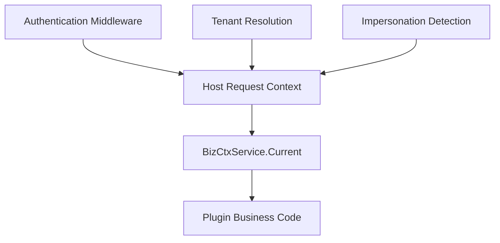

## Introduction

`services.BizCtx()` returns a read-only view of the current request's business context. Source plugins access it through `services.BizCtx()`, while dynamic plugins declare `service: bizctx` in `plugin.yaml` and access it through the `pluginbridge.Default().BizCtx()` client. It exposes a single method `Current(ctx)` that returns a `CurrentContext` struct.

This service is suitable for plugins to read the current user, tenant, and impersonation state within routes, hooks, or job callbacks.

**Capability Phase**: Runtime

**Supported Plugin Types**: Source plugins, Dynamic plugins

## Capability Design

### Context View Model

`CurrentContext` is a stable plugin view that does not contain host-internal authentication objects or database entities. View fields cover request identity, tenant scope, and impersonation state:

| Field | Description |
|-------|-------------|
| `UserID` | Current authenticated user identifier |
| `Username` | Current authenticated username |
| `TenantID` | Current request tenant identifier; `0` typically indicates a platform context |
| `ActingUserID` | The real platform user identifier in impersonation scenarios |
| `ActingAsTenant` | Whether the current request operates from a tenant perspective |
| `IsImpersonation` | Whether the current token represents an impersonation login |
| `PlatformBypass` | Whether the current request is allowed to bypass tenant filtering |

When the `TenantID` injected via `WithCurrentContext` is `0`, `PlatformBypass` is automatically set to `true`. Plugins should not modify this flag themselves but should treat it as the host's judgment about the current request scope.

### Context Injection Flow



### Read-Only Data Semantics

`BizCtxService` is read-only. Plugins cannot modify the request context through it. For tenant switching or token changes, use the authentication capability. In non-request scenarios or when context is not injected, a zero-value struct is returned. Callers should check whether critical fields are valid.

## Interface Definitions

### Source Plugin Interface

| Method | Description |
|--------|-------------|
| `Current` | Returns the current request's `CurrentContext` read-only view |

### Dynamic Plugin Interface

Dynamic plugins declare authorized methods through `hostServices.bizctx`:

| Dynamic Method | Description |
|----------------|-------------|
| `current.get` | Returns the current request's `CurrentContext` read-only view |

## Usage

### Source Plugin Usage

Source plugins read the current request context through `services.BizCtx().Current(ctx)`:

```go
current := services.BizCtx().Current(ctx)
if current.UserID == 0 {
    return errors.New("unauthenticated user")
}
if current.IsImpersonation {
    // Record impersonation audit
    log.Infof("user %d is impersonating access to tenant %d", current.ActingUserID, current.TenantID)
}
```

When adding `tenant_id` conditions to plugin-owned tables, source plugins use `TenantFilter()` and dynamic plugins use `data` service authorization.

### Dynamic Plugin Usage

Dynamic plugins declare the `bizctx` service in `plugin.yaml`:

```yaml
hostServices:
  - service: bizctx
    methods:
      - current.get
```

Dynamic plugins call through the `pluginbridge.Default().BizCtx()` client:

```go
bizCtxSvc := pluginbridge.Default().BizCtx()
current := bizCtxSvc.Current(ctx)
if current.UserID == 0 {
    return errors.New("unauthenticated user")
}
```

## Design Constraints

- **Read-only data.** Plugins cannot modify the request context through `BizCtxService`. For tenant switching or token changes, use the authentication capability.
- **Zero value indicates absence.** In non-request scenarios or when context is not injected, a zero-value struct is returned. Callers should check critical fields.
- **No host types exposed.** `CurrentContext` is a stable plugin view that does not contain host-internal authentication objects or database entities.
- **Tenant filtering is handled by a dedicated service.** When adding `tenant_id` conditions to plugin-owned tables, source plugins use `TenantFilter()` and dynamic plugins use `data` service authorization.

## Related Services

- [Auth Capability](/docs/domain-capability-auth)
- [Tenant Capability](/docs/domain-capability-tenant)
