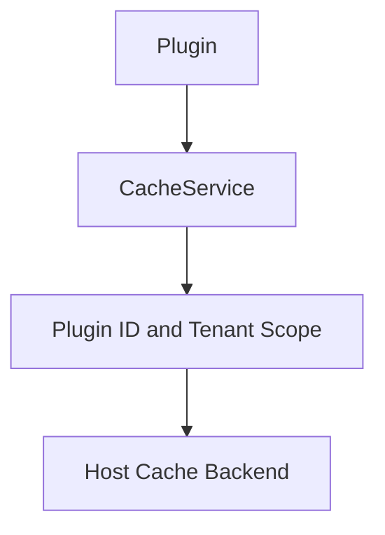

## Introduction

Source plugins use the cache capability through `services.Cache()`. Dynamic plugins declare `service: cache` in `plugin.yaml` and access it through the `pluginbridge.Default().Cache()` client.

Cache automatically binds plugin identity and tenant scope. Plugins only need to provide a business namespace and key name; they should not concatenate host cache prefixes.

**Capability Phase**: Runtime

**Supported Plugin Types**: Source plugins, Dynamic plugins

## Capability Design

### Cache Value Types

`CacheItem` supports two value types:

| Value Type | Constant | Description |
|------------|----------|-------------|
| String | `CacheValueKindString` | General-purpose text cache |
| Integer | `CacheValueKindInt` | Counters or sequence numbers |

### Scope Isolation

Cache automatically binds plugin `ID` and tenant scope. Cache entries are naturally isolated between different plugins and different tenants. Plugins only need to provide a business namespace and key name; the host handles prefix concatenation and scope binding.



### Volatile Data Semantics

Cache is volatile data that may expire, be evicted, or be lost. It must not serve as the authoritative source for permissions, tenant boundaries, configuration, plugin state, or business records. The backend is controlled by the host; plugins cannot choose memory, `Redis`, or other cache backends.

## Interface Definitions

### Source Plugin Interface

| Method | Description |
|--------|-------------|
| `Get` | Reads a non-expired cache item, returning `CacheItem` and a hit indicator |
| `Set` | Writes a string cache entry; `ttl=0` means no expiration |
| `Delete` | Deletes a cache item; a no-op if the item does not exist |
| `Incr` | Increments an integer cache entry by `delta`, suitable for counters |
| `Expire` | Updates the expiration policy; `ttl=0` clears expiration |

### Dynamic Plugin Interface

| Dynamic Method | Dynamic `SDK` Method | Description |
|----------------|---------------------|-------------|
| `get` | `Cache().Get` | Reads a non-expired cache item |
| `set` | `Cache().Set` | Writes a string cache entry |
| `delete` | `Cache().Delete` | Deletes a cache item |
| `incr` | `Cache().Incr` | Increments an integer cache entry |
| `expire` | `Cache().Expire` | Updates the expiration policy |

## Usage

### Source Plugin Usage

Source plugins operate cache through `services.Cache()`. The namespace is used for internal logical grouping within the plugin:

```go
// Write cache
item, err := services.Cache().Set(ctx, "reports", "last_generated", value, time.Hour)

// Read cache
item, hit, err := services.Cache().Get(ctx, "reports", "last_generated")

// Increment counter
countItem, err := services.Cache().Incr(ctx, "reports", "export_count", 1, time.Hour)

// Delete cache
err := services.Cache().Delete(ctx, "reports", "last_generated")
```

### Dynamic Plugin Usage

Dynamic plugins declare the cache service and authorized resources in `plugin.yaml`:

```yaml
hostServices:
  - service: cache
    methods:
      - get
      - set
      - delete
      - incr
      - expire
    resources:
      - ref: plugin:reports
```

`cache` is a resource-type service and must declare `resources[].ref`. The specific naming strategy for resource references is governed by host conventions. Plugins should use clear, stable business scenario names. Usage on the dynamic plugin side:

```go
// Write cache
item, err := pluginbridge.Default().Cache().Set(ctx, "reports", "last_generated", value, time.Hour)

// Read cache
item, hit, err := pluginbridge.Default().Cache().Get(ctx, "reports", "last_generated")
```

## Design Constraints

- **Cache is volatile data.** Cache may expire, be evicted, or be lost. It must not serve as the authoritative source for permissions, tenant boundaries, configuration, plugin state, or business records.
- **Namespace is defined by the plugin.** `namespace` is used for internal logical grouping within the plugin. The host additionally binds plugin and tenant scope.
- **`ttl=0` semantics depend on the method.** In `Set`, it means no expiration. In `Expire`, it means clearing the expiration policy.
- **Backend is controlled by the host.** Plugins cannot choose memory, `Redis`, or other cache backends.

## Related Services

- [Tenant Capability](/docs/domain-capability-tenant)
- [Plugin Configuration and Host Configuration](/docs/domain-capability-hostconfig)
- [Domain Capabilities Overview](/docs/domain-capabilities)
