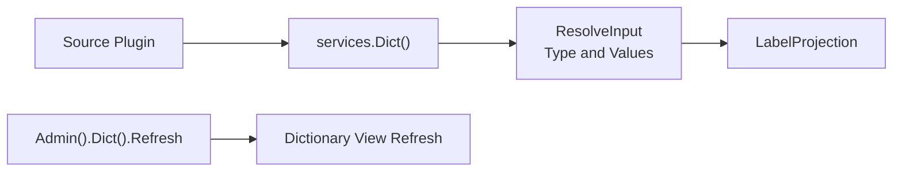

## Introduction

Source plugins resolve host dictionary values through `services.Dict()`. Dynamic plugins declare `service: dict` in `plugin.yaml` and access it through the `pluginbridge.Default().Dict()` client. This capability is suitable for displaying business status codes, type codes, and enum values as labels in the current language, without requiring plugins to directly depend on host dictionary tables or cache implementations.

**Capability Phase**: Runtime

**Supported Plugin Types**: Source plugins, Dynamic plugins

## Capability Design

### Label View Model

The `Dict` capability resolves host dictionary values into stable label views, supporting runtime translation keys and current-language labels:

| Field | Description |
|-------|-------------|
| `Type` | Dictionary type |
| `Value` | Dictionary value |
| `LabelKey` | Stable runtime translation key |
| `Label` | Optional resolved label in the current language |

`ResolveInput.IncludeLabel` controls whether `Label` is resolved. When only stable keys are needed or localization will be handled later, label text can be omitted.

### Resolution Flow



### Usage Boundaries

- **Only one dictionary type per resolution.** A single `ResolveInput` resolves multiple `Value`s for one `Type`.
- **Refresh is a management command.** Dictionary refresh may affect host cache and multi-plugin display results, and is only exposed through `Admin().Dict()`.
- **Dictionaries are not configuration.** Dictionary values are used for business enum display. Plugin runtime parameters should use the configuration management capability.
- **Dictionaries are not internationalization catalogs.** `LabelKey` can be passed to the runtime translation capability for resolution, but the dictionary capability itself does not maintain language packs.

## Interface Definitions

### Source Plugin Interface

| Entry | Method | Description |
|-------|--------|-------------|
| `Dict()` | `ResolveLabels` | Batch resolves multiple values under one dictionary type, returning label views and a missing set that does not reveal specific reasons |
| `Admin().Dict()` | `Refresh` | Refreshes the view or cache for a specific dictionary type |

### Dynamic Plugin Interface

Dynamic plugins declare authorized methods through `hostServices.dict`:

| Dynamic Method | Description |
|----------------|-------------|
| `labels.resolve` | Batch resolves multiple values under one dictionary type, returning label views |

## Usage

### Source Plugin Usage

Source plugins resolve dictionary values through `services.Dict()`:

```go
// Batch resolve dictionary value labels
result, err := services.Dict().ResolveLabels(ctx, capabilityCtx, dictcap.ResolveInput{
    Type:         "order_status",
    Values:       []dictcap.Value{"pending", "processing", "completed"},
    IncludeLabel: true,
})

// Use label views
for _, proj := range result.Projections {
    fmt.Printf("%s -> %s\n", proj.Value, proj.Label)
}
```

Trusted source plugin refreshing a dictionary view:

```go
err := services.Admin().Dict().Refresh(ctx, capabilityCtx, "order_status")
```

### Dynamic Plugin Usage

Dynamic plugins declare the `dict` service in `plugin.yaml`:

```yaml
hostServices:
  - service: dict
    methods:
      - labels.resolve
```

Dynamic plugins call through the `pluginbridge.Default().Dict()` client:

```go
dictSvc := pluginbridge.Default().Dict()

// Batch resolve dictionary value labels
result, err := dictSvc.ResolveLabels(ctx, capabilityCtx, dictcap.ResolveInput{
    Type:         "order_status",
    Values:       []dictcap.Value{"pending", "processing", "completed"},
    IncludeLabel: true,
})
```

## Design Constraints

- **No dictionary table structure exposed.** Plugins can only see `Type`, `Value`, and label views.
- **Missing results do not reveal specific reasons.** Missing values are returned without distinguishing between non-existent, invisible, or rejected.
- **Refresh requires audit context.** Trusted source plugins should provide caller source, operator, tenant, and reason when invoking the refresh command.
- **Dynamic plugins are read-only.** Dynamic plugins declare the `labels.resolve` method through `hostServices.dict` and only read label views, without involving dictionary refresh.

## Related Services

- [Internationalization Capability](/docs/domain-capability-i18n)
- [Configuration Management](/docs/domain-capability-hostconfig)
- [Domain Capabilities Overview](/docs/domain-capabilities)
