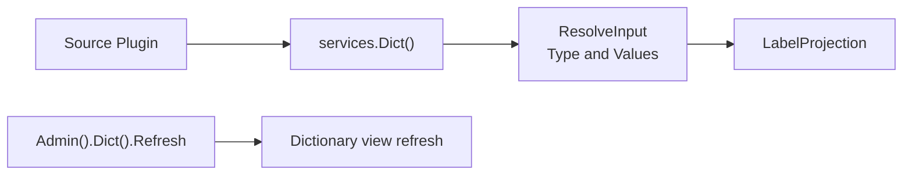

## Introduction

Source plugins resolve host dictionary values through `services.Dict()`. Dynamic plugins declare `service: dict` in `plugin.yaml` and access it through the `pluginbridge.Default().Dict()` client. This capability is suitable for displaying business status codes, type codes, and enum values as labels in the current language, without requiring plugins to directly depend on host dictionary tables or cache implementations.

**Capability Phase**: Runtime

**Supported Plugin Types**: Source plugins, Dynamic plugins

## Capability Design

### Label View Model

The `Dict` capability resolves host dictionary values into stable label views, supporting runtime translation keys and current-language labels:

| Field | Description |
|-------|-------------|
| `Type` | Dictionary type |
| `Value` | Dictionary value |
| `LabelKey` | Stable runtime translation key |
| `Label` | Optional resolved label in the current language |

`ResolveInput.IncludeLabel` controls whether `Label` is resolved. When only stable keys are needed or localization will be handled later, label text can be omitted.

### Resolution Flow



### Usage Boundaries

- **One dictionary type per resolution.** A single `ResolveInput` resolves multiple `Value`s around one `Type`.
- **Refresh is a management command.** Dictionary refresh may affect host cache and multi-plugin display results, exposed only through `Admin().Dict()`.
- **Dictionaries are not configuration.** Dictionary values are for business enum display; plugin runtime parameters should use the host config capability.
- **Dictionaries are not i18n catalogs.** `LabelKey` can be resolved by the runtime translation capability, but the dict capability itself is not responsible for maintaining language packs.

## Interface Definitions

### Source Plugin Interface

| Entry | Method | Description |
|-------|--------|-------------|
| `Dict()` | `ResolveLabels` | Batch-resolves multiple values under one dictionary type, returning label views and a missing set that doesn't reveal specific reasons |
| `Dict()` | `ListValues` | Returns a paginated list of candidate values for a specified dictionary type |
| `Dict()` | `EnsureValuesVisible` | Validates that specified dictionary values are visible in the current call context |
| `Admin().Dict()` | `Refresh` | Refreshes the view or cache for a specified dictionary type |

### Dynamic Plugin Interface

Dynamic plugins declare authorized methods through `hostServices.dict`:

| Dynamic Method | Description |
|----------------|-------------|
| `labels.resolve` | Batch-resolves multiple values under one dictionary type, returning label views |
| `labels.list` | Returns a paginated list of candidate values for a specified dictionary type |
| `labels.visible.ensure` | Validates that specified dictionary values are visible in the current call context |

## Capability Usage

### Source Plugin Usage

Source plugins resolve dictionary values through `services.Dict()`:

```go
// Batch-resolve dictionary value labels
result, err := services.Dict().ResolveLabels(ctx, capabilityCtx, dictcap.ResolveInput{
    Type:         "order_status",
    Values:       []dictcap.Value{"pending", "processing", "completed"},
    IncludeLabel: true,
})

// Use label views
for _, proj := range result.Projections {
    fmt.Printf("%s -> %s\n", proj.Value, proj.Label)
}

// Get paginated dictionary value candidates
page, err := services.Dict().ListValues(ctx, capabilityCtx, dictcap.ListValuesInput{
    Type:         "order_status",
    IncludeLabel: true,
    Page:         pageRequest,
})

// Validate dictionary value visibility
err := services.Dict().EnsureValuesVisible(ctx, capabilityCtx, dictcap.ResolveInput{
    Type:   "order_status",
    Values: []dictcap.Value{"pending", "processing"},
})
```

Trusted source plugins refreshing dictionary views:

```go
err := services.Admin().Dict().Refresh(ctx, capabilityCtx, "order_status")
```

### Dynamic Plugin Usage

Dynamic plugins declare the `dict` service in `plugin.yaml`:

```yaml
hostServices:
  - service: dict
    methods:
      - labels.resolve
      - labels.list
      - labels.visible.ensure
```

Dynamic plugins call through the `pluginbridge.Default().Dict()` client:

```go
dictSvc := pluginbridge.Default().Dict()

// Batch-resolve dictionary value labels
result, err := dictSvc.ResolveLabels(ctx, capabilityCtx, dictcap.ResolveInput{
    Type:         "order_status",
    Values:       []dictcap.Value{"pending", "processing", "completed"},
    IncludeLabel: true,
})

// Get paginated dictionary value candidates
page, err := dictSvc.ListValues(ctx, capabilityCtx, dictcap.ListValuesInput{
    Type:         "order_status",
    IncludeLabel: true,
    Page:         pageRequest,
})
```

## Design Constraints

- **No dictionary table structure exposed.** Plugins can only see `Type`, `Value`, and label views.
- **Missing results don't reveal specific reasons.** Returned missing values don't distinguish between non-existent, invisible, or rejected.
- **Refresh requires audit context.** Trusted source plugins calling the refresh command should provide call source, operator, tenant, and reason.
- **Dynamic plugins are read-only.** Dynamic plugins declare `labels.resolve` through `hostServices.dict` to read label views only; dictionary refresh is not involved.

## Related Services

- [i18n Capability](/docs/domain-capability-i18n)
- [Host Config Capability](/docs/domain-capability-hostconfig)
- [Domain Capabilities Overview](/docs/domain-capabilities)
