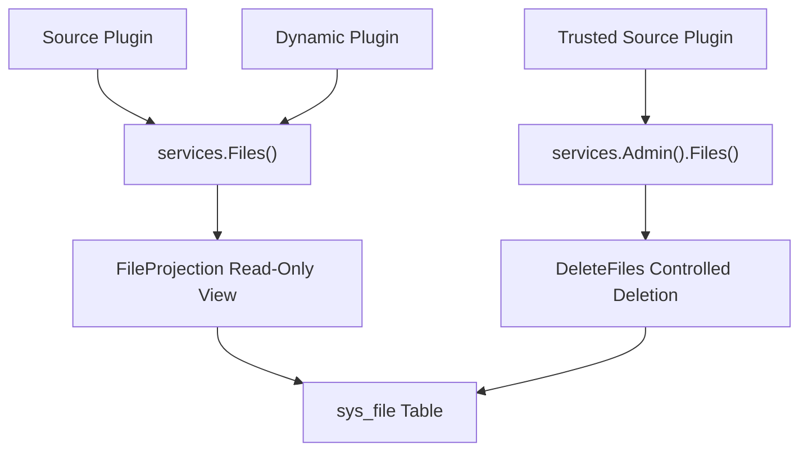

## Introduction

Source plugins read visible views of host-managed files through `services.Files()`. Dynamic plugins declare `service: files` in `plugin.yaml` and use `BatchGetFiles` and `EnsureFilesVisible`. Trusted source plugins that need to delete host files use `services.Admin().Files().DeleteFiles`.

The Files capability provides read-only access to the host file management system. Plugins cannot upload files or modify file metadata through this capability.

**Capability Phase**: Runtime

**Supported Plugin Types**: Source plugins, Dynamic plugins

## Capability Design

### Host File Management Model

Host file management is centered on the `sys_file` table, managing the full lifecycle of user-uploaded files:

| Field | Description |
|-------|-------------|
| `id` | File primary key |
| `tenant_id` | Tenant ownership |
| `name` | Stored filename |
| `original` | Original filename |
| `suffix` | File extension |
| `scene` | Business scene identifier |
| `size` | File size |
| `hash` | SHA-256 hash for deduplication |
| `url` | Access path |
| `path` | Physical storage path |
| `engine` | Storage engine identifier |
| `created_by` | Uploader |

The upload process automatically computes the SHA-256 hash, enabling file deduplication within the same tenant. Files with identical hashes reuse physical storage, with only a new metadata record created.

### Plugin-Visible View

Plugins access file information through `FileProjection`, without exposing physical storage paths, hash values, or underlying storage backends:

| Field | Description |
|-------|-------------|
| `ID` | File identifier |
| `Name` | Display filename |
| `MimeType` | Media type |
| `SizeBytes` | File size |
| `BusinessScene` | Business scene |



### Relationship with Other Resource Capabilities

| Capability | Purpose |
|------------|---------|
| `Files()` | Reads host file management views, such as user-uploaded files and business attachments |
| `Storage()` | Plugin-owned object read/write, such as export results and temporary artifacts |
| `Manifest()` | Reads read-only `manifest/` resources published with the plugin artifact |
| `AI AssetRef` | References protected input or output assets in `AI` capabilities |

## Interface Definitions

### Source Plugin Interface

| Entry | Method | Description |
|-------|--------|-------------|
| `Files()` | `BatchGetFiles` | Batch reads visible file views |
| `Files()` | `EnsureFilesVisible` | Validates that the target file set is visible to the current calling context |
| `Admin().Files()` | `DeleteFiles` | Deletes visible files, with the host performing scene and target validation |

### Dynamic Plugin Interface

Dynamic plugins can access two types of services:

**`files` service -- Host file views:**

| Dynamic Method | Capability Constant | Description |
|----------------|---------------------|-------------|
| `files.batch_get` | `host:files` | Batch reads visible file views |
| `files.visible.ensure` | `host:files` | Validates file visibility |

**`storage` service -- Plugin-scoped object storage:**

| Dynamic Method | Description |
|----------------|-------------|
| `storage.put` | Write object |
| `storage.get` | Read object |
| `storage.delete` | Delete object |
| `storage.list` | List objects |
| `storage.stat` | Query object metadata |

## Usage

### Source Plugin Usage

Source plugins read host-managed file views through `services.Files()`:

```go
// Batch read file views
result, err := services.Files().BatchGetFiles(ctx, capabilityCtx, fileIDs)

// Validate file visibility
err := services.Files().EnsureFilesVisible(ctx, capabilityCtx, fileIDs)
```

Trusted source plugin deleting files:

```go
err := services.Admin().Files().DeleteFiles(ctx, capabilityCtx, fileIDs)
```

### Dynamic Plugin Usage

Dynamic plugins declare the `files` service in `plugin.yaml`:

```yaml
hostServices:
  - service: files
    methods:
      - batch_get
      - visible.ensure
```

## Design Constraints

- **Read-only views.** Plugins cannot upload or modify files through the Files capability; they can only read and validate.
- **No physical paths exposed.** `FileProjection` does not contain storage paths, hash values, or access URLs.
- **Deletion is a governance command.** Delete operations must go through `Admin().Files()`, with the host performing scene and target validation.
- **Visibility is controlled by the host.** Whether a file is visible to the current plugin is determined by the host based on tenant and data scope.

## Related Services

- [Storage Capability](/docs/domain-capability-storage)
- [Manifest Resource Capability](/docs/domain-capability-manifest)
- [AI Capability](/docs/domain-capability-ai)
