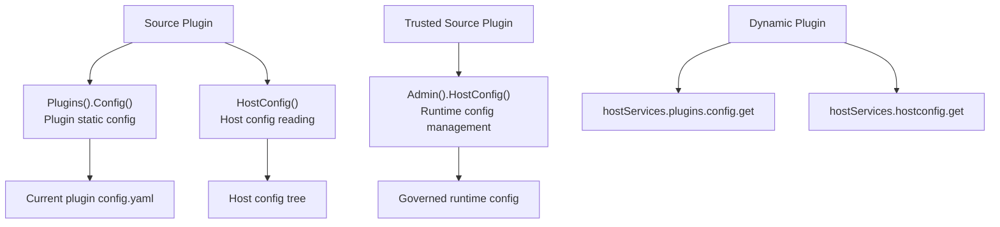

## Introduction

Configuration-related capabilities should be understood by domain boundary, not by method name:

| Config Domain | Source Plugin Entry | Dynamic Service | Description |
|---------------|--------------------|-----------------| ------------|
| <span style={{whiteSpace: 'nowrap'}}>Plugin static config</span> | `services.Plugins().Config()` | `plugins.config.get` | Read the current plugin's own `config.yaml` |
| <span style={{whiteSpace: 'nowrap'}}>Host config reading</span> | `services.HostConfig()` | `hostconfig.get` | Read host config values; dynamic plugins must declare `resources.keys` |
| <span style={{whiteSpace: 'nowrap'}}>Runtime config management</span> | `services.Admin().HostConfig()` | No standard dynamic service | Trusted source plugins write governed runtime config |

`Plugins().Config()` belongs to the plugin governance capability sub-system; `HostConfig()` is the host config reading capability in the standard capability catalog; `Admin().HostConfig()` belongs to trusted source plugin management commands. All three deal with configuration, but differ in source, scope, governance, and user.

**Capability Phase**: Runtime

**Supported Plugin Types**: Source plugins, Dynamic plugins

## Capability Design

### Configuration Domain Layering



### Plugin Static Configuration

The plugin's own static configuration is read through `Plugins().Config()`. It is bound to the current plugin `ID` and will not read other plugins' or the host's global configuration.

:::tip Configuration Priority and Override Mechanism
For detailed documentation on the four-level read priority, exclusive override mechanism, and the `plugin.<plugin-id>` config section, see [Plugin Business Configuration](/docs/plugin-configuration).
:::

### Host Config Reading

Source plugins read host config values through `services.HostConfig()`. The current source implementation uses a config reader injected at host startup and no longer applies a hardcoded public key list to source plugins.

### Runtime Config Management

Runtime config management belongs to trusted source plugin management commands, not standard read capabilities. `SetRuntimeConfigJSON` requires the caller to pass the domain-required `CapabilityContext`. The host adapter continues to handle config key visibility, tenant boundaries, audit reasons, and write validation.

## Interface Definitions

### Plugin Static Config Interface

| Method | Description |
|--------|-------------|
| `Get` | Returns the raw config value |
| `Exists` | Checks whether a config key exists |
| `Scan` | Scans a config section into the target struct |
| `String` | Reads a string value, returning default when missing or blank |
| `Bool` | Reads a boolean value, returning default when missing |
| `Int` | Reads an integer value, returning default when missing |
| `Duration` | Reads a duration value, returning default when missing or blank |

### Host Config Interface

| Method | Description |
|--------|-------------|
| `Get` | Reads the raw host config value |
| `Exists` | Checks whether a host config key exists |
| `String` | Reads a string value |
| `Bool` | Reads a boolean value |
| `Int` | Reads an integer value |
| `Duration` | Reads a duration value |

### Management Command Interface

| Entry | Method | Description |
|-------|--------|-------------|
| `Admin().HostConfig()` | `SetRuntimeConfigJSON` | Writes a governed runtime config value |

### Dynamic Plugin Interface

| Dynamic Service | Method | Description |
|-----------------|--------|-------------|
| `plugins` | `config.get` | Reads current plugin-scoped config |
| `hostconfig` | `get` | Reads host config values; authorized `resources.keys` must be declared |

## Capability Usage

### Source Plugin Usage

Source plugins choose the correct entry based on the configuration domain:

```go
// Read the plugin's own config
value, err := services.Plugins().Config().String(ctx, "api.endpoint", "https://default.example.com")
enabled, err := services.Plugins().Config().Bool(ctx, "features.export", false)

// Read host config
basePath, err := services.HostConfig().String(ctx, "workspace.basePath", "")

// Write runtime config (trusted source plugin)
err := services.Admin().HostConfig().SetRuntimeConfigJSON(ctx, capabilityCtx, "plugin.reports.maxExport", jsonValue)
```

### Dynamic Plugin Usage

Dynamic plugins declare `plugins` and `hostconfig` services separately in `plugin.yaml`:

```yaml
hostServices:
  - service: plugins
    methods:
      - config.get
  - service: hostconfig
    methods:
      - get
    resources:
      keys:
        - workspace.basePath
        - i18n.default
```

`plugins`'s `config.get` reads the current plugin config. `hostconfig`'s authorization boundary is controlled by `resources.keys`; undeclared keys should not be returned by the host (the whitelist validation flow is detailed in [Plugin Business Configuration](/docs/plugin-configuration)). Usage on the dynamic plugin side:

```go
// Read plugin config
endpoint, err := pluginbridge.Default().Plugins().Config().String(ctx, "api.endpoint", "https://default.example.com")

// Read host config
basePath, err := pluginbridge.Default().HostConfig().String(ctx, "workspace.basePath", "")
```

## Design Constraints

- **Plugin business parameters go into plugin config.** Do not use `HostConfig()` or host `g.Cfg()` to read the plugin's own parameters.
- **Host config reads should be cautious.** Although source plugins can read host config through `HostConfig()`, plugin documentation and code should only depend on explicitly agreed-upon keys.
- **Dynamic plugins must declare keys.** The `hostconfig` dynamic service's authorization comes from `resources.keys`; do not declare root configs or ambiguous keys as regular practice.
- **Runtime writes go through management commands.** Standard plugin config reads and host config reads are read-only capabilities; writing config is exposed only through `Admin().HostConfig()` to trusted source plugins.
- **Templates are not runtime config.** `config.example.yaml` is for documentation and example generation; it does not participate in runtime priority.

## Related Services

- [Plugins Capability](/docs/domain-capability-plugins)
- [Manifest Resources Capability](/docs/domain-capability-manifest)
- [Domain Capabilities Overview](/docs/domain-capabilities)
