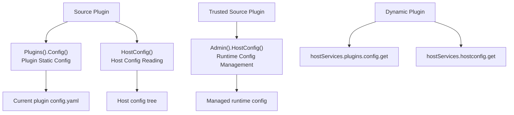

## Overview

Configuration capabilities should be understood by domain boundary, not by method name:

| Config Domain | Source Plugin Entry | Dynamic Service | Description |
|---------------|---------------------|-----------------|-------------|
| Plugin static config | `services.Plugins().Config()` | `plugins.config.get` | Reads the current plugin's own `config.yaml` |
| Host config reading | `services.HostConfig()` | `hostconfig.get` | Reads host configuration values; dynamic plugins must declare `resources.keys` |
| Runtime config management | `services.Admin().HostConfig()` | No standard dynamic service | Trusted source plugins write managed runtime configuration |

Among these, `Plugins().Config()` is a sub-capability of the plugin governance domain; `HostConfig()` is the host configuration reading capability in the general capability catalog; `Admin().HostConfig()` belongs to the trusted source plugin management commands. All three involve configuration, but they differ in source, scope, governance model, and intended user.

**Capability phase**: Runtime

**Type support**: Source plugins, dynamic plugins

## Capability Design

### Configuration Domain Layers



### Plugin Static Configuration

A plugin's own static configuration is read through `Plugins().Config()`. It is bound to the current plugin ID and will not read configuration from other plugins or the host global config.

Read priority:

| Priority | Source | Description |
|----------|--------|-------------|
| 1 | `plugins/<plugin-id>/config.yaml` under the production config root | Operations override, production environment takes precedence |
| 2 | `manifest/config/config.yaml` during development | Default config for source plugin development |
| 3 | `manifest/config/config.yaml` bound in the dynamic plugin artifact | Default config for published artifacts |

`manifest/config/config.example.yaml` is a configuration template only and does not participate in runtime default reading.

### Host Config Reading

Source plugins read host configuration values through `services.HostConfig()`. The current source implementation obtains values through a config reader injected during host startup, and no longer applies a hardcoded public key list to source plugins.

### Runtime Config Management

Runtime configuration management belongs to trusted source plugin management commands and is not a standard read capability. `SetRuntimeConfigJSON` requires the caller to pass the domain-required `CapabilityContext`. The host adapter remains responsible for config key visibility, tenant boundaries, audit reasons, and write validation.

## Interface Definitions

### Plugin Static Config Interface

| Method | Description |
|--------|-------------|
| `Get` | Returns the raw configuration value |
| `Exists` | Checks whether a config key exists |
| `Scan` | Scans a configuration section into the target struct |
| `String` | Reads a string value; returns the default when missing or blank |
| `Bool` | Reads a boolean value; returns the default when missing |
| `Int` | Reads an integer value; returns the default when missing |
| `Duration` | Reads a duration value; returns the default when missing or blank |

### Host Config Interface

| Method | Description |
|--------|-------------|
| `Get` | Reads the raw host configuration value |
| `Exists` | Checks whether a host config key exists |
| `String` | Reads a string value |
| `Bool` | Reads a boolean value |
| `Int` | Reads an integer value |
| `Duration` | Reads a duration value |

### Management Command Interface

| Entry | Method | Description |
|-------|--------|-------------|
| `Admin().HostConfig()` | `SetRuntimeConfigJSON` | Writes a managed runtime configuration value |

### Dynamic Plugin Interface

| Dynamic Service | Method | Description |
|-----------------|--------|-------------|
| `plugins` | `config.get` | Reads the current plugin-scoped configuration |
| `hostconfig` | `get` | Reads host config values; must declare authorized `resources.keys` |

## Usage

### Source Plugin Usage

Source plugins select the correct entry point based on the configuration domain:

```go
// Read the plugin's own configuration
value, err := services.Plugins().Config().String(ctx, "api.endpoint", "https://default.example.com")
enabled, err := services.Plugins().Config().Bool(ctx, "features.export", false)

// Read host configuration
basePath, err := services.HostConfig().String(ctx, "workspace.basePath", "")

// Write runtime configuration (trusted source plugin)
err := services.Admin().HostConfig().SetRuntimeConfigJSON(ctx, capabilityCtx, "plugin.reports.maxExport", jsonValue)
```

### Dynamic Plugin Usage

Dynamic plugins declare the `plugins` and `hostconfig` services separately in `plugin.yaml`:

```yaml
hostServices:
  - service: plugins
    methods:
      - config.get
  - service: hostconfig
    methods:
      - get
    resources:
      keys:
        - workspace.basePath
        - i18n.default
```

The `config.get` method on `plugins` reads the current plugin's configuration. Authorization boundaries for `hostconfig` are controlled by `resources.keys`; undeclared keys should not be returned by the host. Usage on the dynamic plugin side:

```go
// Read plugin configuration
endpoint, err := pluginbridge.Default().Plugins().Config().String(ctx, "api.endpoint", "https://default.example.com")

// Read host configuration
basePath, err := pluginbridge.Default().HostConfig().String(ctx, "workspace.basePath", "")
```

## Design Constraints

- **Put business parameters into plugin configuration.** Do not use `HostConfig()` or the host `g.Cfg()` to read a plugin's own parameters.
- **Be cautious when reading host configuration.** Although source plugins can read host config via `HostConfig()`, plugin documentation and code should only depend on explicitly agreed-upon keys.
- **Dynamic plugins must declare keys.** Authorization for the `hostconfig` dynamic service comes from `resources.keys`; do not declare root configs or ambiguous keys as a regular practice.
- **Runtime writes go through management commands.** Both plugin config reading and host config reading are read-only capabilities; writing configuration is only exposed to trusted source plugins through `Admin().HostConfig()`.
- **Templates are not runtime configuration.** `config.example.yaml` is used for documentation and example generation and does not participate in runtime priority.

## Related Services

- [Plugins Capability](/docs/domain-capability-plugins)
- [Manifest Resource Capability](/docs/domain-capability-manifest)
- [Domain Capabilities Overview](/docs/domain-capabilities)
