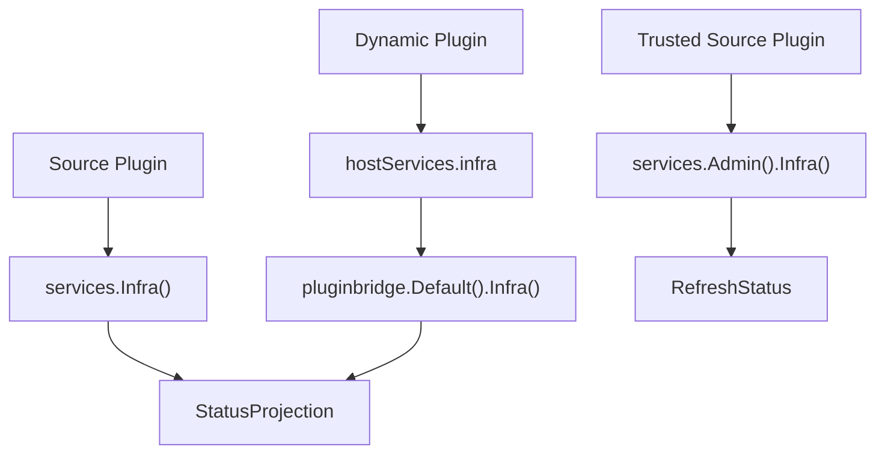

## Overview

`Infra()` is used to read the status view of host infrastructure components. It focuses on whether a component is currently serviceable, what state it is in, and what label to display. It does not expose connection pools, health check implementations, monitoring clients, or the specific runtime backends.

The infrastructure status capability has three entry points:

| Entry Point | User | Description |
|-------------|------|-------------|
| `services.Infra()` | Source plugins | Reads the visible component status view |
| `service: infra` | Dynamic plugins | Declares the dynamic host service for reading infrastructure component status |
| `services.Admin().Infra()` | Trusted source plugins | Refreshes the status cache or status snapshot of a specified component |

The dynamic plugin `Runtime()` is a separate dedicated capability for logs, plugin runtime state, host time, UUID, and node identity reads, and does not belong to the `Infra()` domain capability.

**Capability phase**: Runtime

**Type support**: Source plugins, dynamic plugins

## Design Approach

### Status View, Not Implementation Access

`Infra()` only provides an infrastructure component status view. Plugins can use it to determine whether a host component is available, but cannot use it to obtain underlying clients, connection configurations, health check tasks, or runtime cache objects.



### Boundary with `Runtime()`

Both `Infra()` and `Runtime()` may involve host runtime state, but they express different responsibilities:

| Capability | Domain Boundary | Primary Responsibility |
|------------|----------------|----------------------|
| `Infra()` | General domain capability shared by source and dynamic plugins | Reads infrastructure component status views |
| `Runtime()` | Dynamic plugin dedicated capability | Writes logs, reads/writes plugin runtime state, reads host time, generates UUID, and reads node identity |

Therefore, if a dynamic plugin needs to read component status, it should declare `service: infra`; if it needs to write runtime logs or read/write plugin-scoped state, it should declare `service: runtime`.

## Core Capabilities

### Standard Read Capability

| Entry Point | Method | Description |
|-------------|--------|-------------|
| `Infra()` | `BatchGetStatus` | Batch reads visible infrastructure component status |

`StatusProjection` contains the following fields:

| Field | Description |
|-------|-------------|
| `ID` | Component identifier |
| `Available` | Whether the component is currently serviceable |
| `Status` | The status value owned by the component |
| `LabelKey` | Stable runtime translation key |
| `Label` | Optional label in the current language |

### Management Commands

| Entry Point | Method | Description |
|-------------|--------|-------------|
| `Admin().Infra()` | `RefreshStatus` | Refreshes the status cache or status snapshot of a specified component |

`RefreshStatus` belongs to trusted source plugin management commands and is not exposed through the standard dynamic plugin `hostServices`.

## Usage

### Source Plugin Reading Status

Source plugins read component status through `services.Infra()`, passing the domain-required `CapabilityContext` explicitly:

```go
result, err := services.Infra().BatchGetStatus(ctx, capabilityCtx, componentIDs)
if err != nil {
    return err
}

for _, status := range result.Items {
    if !status.Available {
        logger.Warningf(ctx, "infra component unavailable id=%s status=%s", status.ID, status.Status)
    }
}
```

Trusted source plugin refreshing component status:

```go
err := services.Admin().Infra().RefreshStatus(ctx, capabilityCtx, componentID)
```

### Dynamic Plugin Reading Status

Dynamic plugins declare the `infra` service in `plugin.yaml`:

```yaml
hostServices:
  - service: infra
    methods:
      - status.batch_get
```

`infra` is a `none` resource type and does not declare `paths`, `tables`, `keys`, or `resources`. Read status on the dynamic plugin side through `pluginbridge.Default().Infra()`:

```go
services := pluginbridge.Default()
result, err := services.Infra().BatchGetStatus(ctx, capabilityCtx, componentIDs)
```

## Design Constraints

- **Component status is a read-only view.** `Infra()` does not expose specific runtime backends, connection pools, monitoring clients, health check implementations, or host internal objects.
- **Batch reads are preferred.** Plugins should read multiple component statuses at once through `BatchGetStatus` to avoid unnecessary overhead from individual calls.
- **Refresh is a management command.** `RefreshStatus` may trigger host status recalculation and is only available to trusted source plugins.
- **Dynamic reads use `service: infra`.** Dynamic plugins should declare `infra` when reading infrastructure component status, not misuse `runtime`.
- **Runtime primitives use `Runtime()`.** Logs, plugin runtime state, time, UUID, and node identity belong to the [Dynamic Runtime Capability](/docs/domain-capability-runtime).

## Related Services

- [Dynamic Runtime Capability](/docs/domain-capability-runtime)
- [Cache Capability](/docs/domain-capability-cache)
- [Jobs and Scheduling Capability](/docs/domain-capability-jobs)
- [Domain Capabilities Overview](/docs/domain-capabilities)
