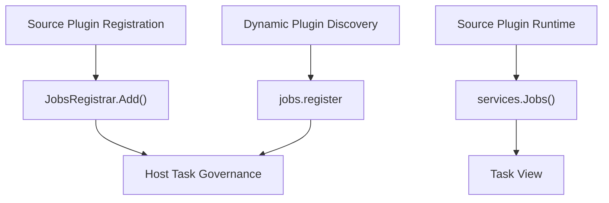

## Introduction

The task domain has three entry types:

| Entry | User | Description |
|-------|------|-------------|
| `services.Jobs()` | Source plugin | Reads visible scheduled task views |
| `services.Admin().Jobs()` | Trusted source plugin | Triggers tasks or modifies task status |
| `JobsRegistrar`, `pluginbridge.NewDeclarations().Jobs()` | Source plugin registration phase, dynamic plugin discovery phase | Declares the plugin's own scheduled tasks |

`Jobs()` focuses on task views already under host management; `JobsRegistrar` and `jobs.register` focus on declaring tasks to the host during plugin registration or discovery. The two should not be conflated into the same runtime call surface.

**Capability Phase**: Runtime

**Supported Plugin Types**: Source plugins, Dynamic plugins

## Capability Design

### Read and Registration Separation

The task capability follows a read and registration separation pattern: `Jobs()` reads task views already under host management, `JobsRegistrar` declares tasks during source plugin registration, and `pluginbridge.NewDeclarations().Jobs().Register` declares tasks through the `jobs.register` host service during dynamic plugin discovery.



### Task View Model

`Jobs()` returns a task view for reading the status of tasks already under host management:

| Field | Description |
|-------|-------------|
| `ID` | Task identifier |
| `Name` | Task display name |
| `Group` | Task group |
| `Status` | Task lifecycle status |

### Registration Timing

Source plugins declare scheduled tasks through `JobsRegistrar` during the compile-time registration process. Dynamic plugins submit `JobContract` through `jobs.register` during the discovery phase. Registration requests only take effect during the host discovery and collection phase, not as a task execution interface callable at any business time.

## Interface Definitions

### Source Plugin Interface

| Entry | Method | Description |
|-------|--------|-------------|
| `Jobs()` | `BatchGet` | Batch-reads visible task views |
| `Jobs()` | `Search` | Searches visible task candidates by keyword, group, and status |
| `Jobs()` | `EnsureVisible` | Validates that target task set is visible to the current call context |
| `Admin().Jobs()` | `Run` | Triggers execution of a visible task |
| `Admin().Jobs()` | `SetStatus` | Changes a visible task's status |

Source plugin registration interface (accessed via `JobsRegistrar` returned by `SourcePluginDefinition.GetJobRegistrars()`):

```go
// Use JobsRegistrar in the JobHandlerRegistration.Handler callback
func(ctx context.Context, registrar pluginhost.JobsRegistrar) error {
    return registrar.Add(ctx, "0 2 * * *", "daily-report", func(ctx context.Context) error {
        // Execute scheduled task logic
        return nil
    })
}
```

### Dynamic Plugin Interface

| Dynamic Method | Description |
|----------------|-------------|
| `jobs.batch_get` | Batch-reads visible scheduled task views |
| `jobs.search` | Searches visible task candidates by keyword, group, and status |
| `jobs.visible.ensure` | Validates that target task set is visible to the current call context |
| `jobs.register` | Submits scheduled task declarations during discovery phase |

## Capability Usage

### Source Plugin Usage

Source plugins read task views through `services.Jobs()`:

```go
// Batch-read task views
result, err := services.Jobs().BatchGet(ctx, capabilityCtx, jobIDs)

// Search visible task candidates
page, err := services.Jobs().Search(ctx, capabilityCtx, jobcap.SearchInput{
    Keyword: "report",
    Group:   "daily",
    Status:  "active",
    Page:    pageRequest,
})

// Validate task visibility
err := services.Jobs().EnsureVisible(ctx, capabilityCtx, jobIDs)
```

Trusted source plugins executing management commands:

```go
// Trigger task execution
err := services.Admin().Jobs().Run(ctx, capabilityCtx, jobID)

// Change task status
err := services.Admin().Jobs().SetStatus(ctx, capabilityCtx, jobID, "disabled")
```

Source plugins declaring scheduled tasks during registration:

```go
// Register in the callback returned by SourcePluginDefinition.GetJobRegistrars()
func(ctx context.Context, registrar pluginhost.JobsRegistrar) error {
    return registrar.AddWithMetadata(ctx, "0 2 * * *", "daily-report", "Daily Report", "Generate report at 2am daily",
        func(ctx context.Context) error {
            // Execute scheduled task logic
            return nil
        },
    )
}
```

### Dynamic Plugin Usage

Dynamic plugins declare the `jobs` service in `plugin.yaml`:

```yaml
hostServices:
  - service: jobs
    methods:
      - jobs.batch_get
      - jobs.register
```

`jobs` is a `none` resource type with no resource fields. Dynamic plugins submit task declarations through the declaration entry during the discovery phase:

```go
decl := pluginbridge.NewDeclarations()

// Register scheduled task through jobs.register during WASM guest discovery phase
err := decl.Jobs().Register(&protocol.JobContract{
    Name:           "cleanup-temp",
    DisplayName:    "Temp File Cleanup",
    Description:    "Clean up expired temporary files at 3am daily",
    Pattern:        "0 3 * * *",
    Timezone:       "Asia/Shanghai",
    Scope:          protocol.JobScopeAllNode,
    Concurrency:    protocol.JobConcurrencySingleton,
    TimeoutSeconds: 300,
    RequestType:    "CleanupTempReq",
})
```

Dynamic plugin registration requests only take effect during the host discovery and collection phase, not as a task execution interface callable at any business time.

## Design Constraints

- **Read and registration are separated.** `Jobs()` reads task views; `JobsRegistrar` and `jobs.register` declare task contracts. They do not take on each other's responsibilities.
- **Execution is a management command.** `RunJob` and `SetJobStatus` must go through `Admin().Jobs()` and domain governance.
- **Dynamic `jobs.register` is for discovery phase.** Dynamic plugins should not use it as a business-side instant scheduling interface.
- **Task tables are not exposed to plugins.** Plugins cannot read host task logs, scheduler internal state, or database table structures through the task capability.
- **Task status is defined by the host.** Plugins should not write status values not accepted by the host state machine.

## Related Services

- [Dynamic Runtime Capability](/docs/domain-capability-runtime)
- [Plugin Governance Capability](/docs/domain-capability-plugins)
- [Dynamic Plugins and WASM Runtime](/docs/wasm-plugins)
