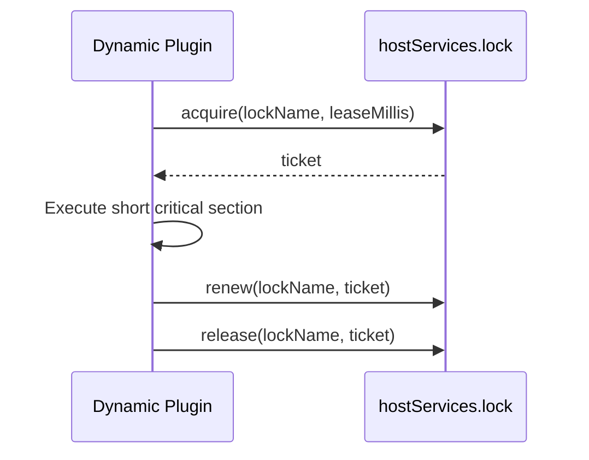

## Overview

Source plugins use the distributed lock capability through `services.Lock()`. Dynamic plugins declare `service: lock` in `plugin.yaml` and then use the `pluginbridge.Default().Lock()` client.

The lock capability is suited for protecting a plugin's short critical sections, such as preventing the same plugin task from processing the same resource simultaneously across multiple nodes. Source plugins run in the same process as the host and can also choose to handle transactions, unique constraints, and concurrency control within host domain services or the plugin's own backend logic.

**Capability phase**: Runtime

**Type support**: Source plugins, dynamic plugins

## Capability Design

### Ticket Mechanism

The lock capability uses host-issued `tickets` for renewal and release. A `ticket` cannot be forged; `renew` and `release` must use the `ticket` returned by the host.

### Lock Lifecycle



### Resource Authorization Mechanism

`lock` is a `resource` resource type and must declare `resources[].ref`. Resource references should use stable business names; do not concatenate user input, full paths, or sensitive business content directly into the resource name.

### Source Plugin Boundary

Source plugins use the distributed lock capability directly through `services.Lock()`. Source plugins can also choose to handle transactions, unique constraints, and concurrency control within host domain services or the plugin's own backend logic.

## Interface Definitions

### Source Plugin Interface

| Method | Description |
|--------|-------------|
| `Acquire` | Attempts to acquire a lock; returns a lock ticket and lease information on success |
| `Renew` | Renews a lock using the ticket |
| `Release` | Releases a lock using the ticket |

### Dynamic Plugin Interface

| Dynamic Method | Dynamic SDK Method | Description |
|----------------|-------------------|-------------|
| `acquire` | `Lock().Acquire` | Attempts to acquire a lock; returns a lock ticket and lease information on success |
| `renew` | `Lock().Renew` | Renews a lock using the ticket |
| `release` | `Lock().Release` | Releases a lock using the ticket |

## Usage

### Source Plugin Usage

Source plugins operate distributed locks through `services.Lock()`:

```go
// Acquire lock
lockResult, err := services.Lock().Acquire(ctx, lockcap.AcquireInput{
    Name:  "report-export",
    Lease: 30 * time.Second,
})
if err != nil {
    // Lock acquisition failed, defer or skip
    return
}

// Execute critical section work
doWork()

// Renew lock (if more time is needed)
_, err = services.Lock().Renew(ctx, lockcap.RenewInput{
    Name:   "report-export",
    Ticket: lockResult.Ticket,
})

// Release lock
err = services.Lock().Release(ctx, lockcap.ReleaseInput{
    Name:   "report-export",
    Ticket: lockResult.Ticket,
})
```

Source plugins can alternatively choose to use host database transactions for concurrency handling.

### Dynamic Plugin Usage

Dynamic plugins declare the `lock` service and authorized resources in `plugin.yaml`:

```yaml
hostServices:
  - service: lock
    methods:
      - acquire
      - renew
      - release
    resources:
      - ref: lock:report-export
```

Usage on the dynamic plugin side:

```go
// Acquire lock
lockResult, err := pluginbridge.Default().Lock().Acquire(ctx, lockcap.AcquireInput{
    Name:  "report-export",
    Lease: 30 * time.Second,
})
if err != nil {
    // Lock acquisition failed, defer or skip
    return
}

// Execute critical section work
doWork()

// Renew lock (if more time is needed)
_, err = pluginbridge.Default().Lock().Renew(ctx, lockcap.RenewInput{
    Name:   "report-export",
    Ticket: lockResult.Ticket,
})

// Release lock
err = pluginbridge.Default().Lock().Release(ctx, lockcap.ReleaseInput{
    Name:   "report-export",
    Ticket: lockResult.Ticket,
})
```

## Design Constraints

- **Locks are not a permission boundary.** Locks only coordinate concurrency and do not replace authorization, tenant filtering, or data visibility checks.
- **Leases must be finite.** Plugins should set a reasonable `leaseMillis` and actively release after completion.
- **Tickets cannot be forged.** `renew` and `release` must use the `ticket` returned by the host; plugins should not construct tickets on their own.
- **Lock names must be stable.** Lock names should be composed of business scenario and resource identifiers, avoiding high cardinality, sensitive information, and user-controlled raw input.
- **Failure must be retryable or degradable.** When lock acquisition fails, plugins should defer, skip, or return an explainable error rather than busy-wait.

## Related Services

- [Dynamic Runtime Capability](/docs/domain-capability-runtime)
- [Jobs and Scheduling Capability](/docs/domain-capability-jobs)
- [Record Store Capability](/docs/domain-capability-recordstore)
