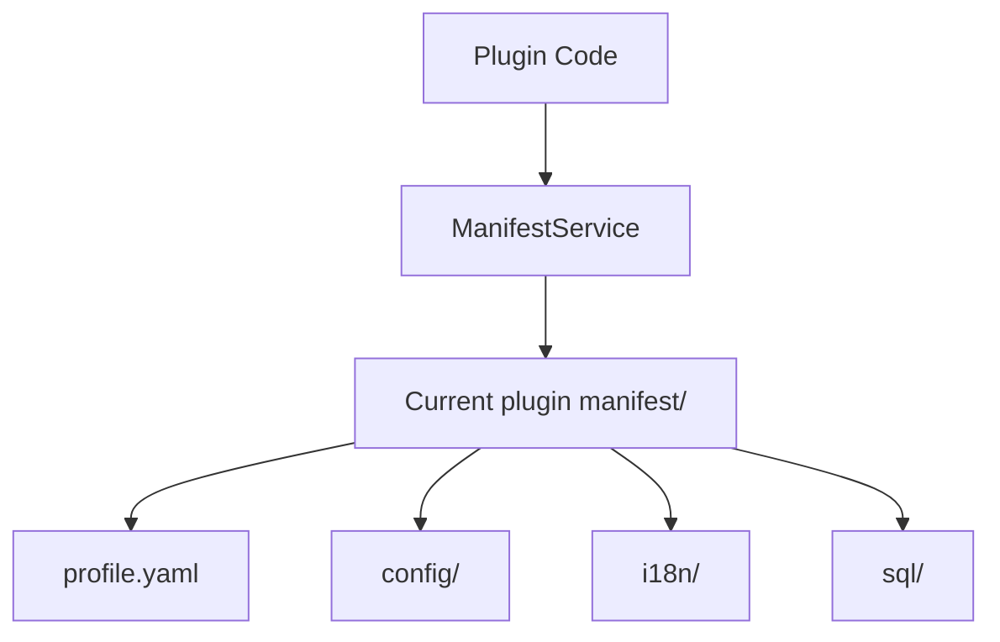

## Overview

`services.Manifest()` returns the `manifest` resource read service scoped to the current plugin. Paths are always relative to the `manifest/` directory; for example, to read `manifest/profile.yaml`, pass `profile.yaml`.

Dynamic plugins use the same semantics but must declare the `manifest` service and allowed `paths` in `plugin.yaml`.

**Capability phase**: Runtime

**Type support**: Source plugins, dynamic plugins

## Capability Design

### Resource Binding Mechanism

Resources are bound to the current plugin: source plugins come from an embedded file system, dynamic plugins from published artifacts or host-bound artifact resources. Paths must be canonical, using forward slash separators, and escaping the current plugin's `manifest/` root through relative paths is prohibited.

### Resource Types

| Path Example | Description |
|--------------|-------------|
| `profile.yaml` | Plugin summary or display metadata |
| `config/config.example.yaml` | Configuration template; does not participate in runtime default reading |
| `config/config.yaml` | One of the plugin's default configuration sources |
| `i18n/zh-CN/plugin.json` | Chinese language resource |
| `sql/install.sql` | Raw installation script resource |



### Read-Only Raw Resource Semantics

Reading a resource does not mean executing SQL, registering language packs, or applying configuration. Configuration reading has a dedicated capability; for runtime configuration values use `Plugins().Config()` or dynamic `config.get`, and do not read `config/config.yaml` directly to bypass priority.

## Interface Definitions

### Source Plugin Interface

| Method | Description |
|--------|-------------|
| `Get` | Reads the raw byte content at the specified path |
| `Exists` | Checks whether a resource exists at the specified path |
| `Scan` | Scans a YAML resource or a nested key within it into the target struct |

### Dynamic Plugin Interface

| Dynamic Method | Dynamic SDK Method | Description |
|----------------|-------------------|-------------|
| `get` | `Manifest().Get`, `Manifest().Exists`, `Manifest().Scan` | Reads raw resources under authorized paths |

## Usage

### Source Plugin Usage

Source plugins read resources shipped with the plugin through `services.Manifest()`:

```go
// Read plugin summary
content, err := services.Manifest().Get(ctx, "profile.yaml")

// Check if a resource exists
exists, err := services.Manifest().Exists(ctx, "i18n/zh-CN/plugin.json")

// Scan YAML resource into struct
var config PluginConfig
err := services.Manifest().Scan(ctx, "config/config.yaml", "", &config)
```

### Dynamic Plugin Usage

Dynamic plugins declare the `manifest` service and authorized paths in `plugin.yaml`:

```yaml
hostServices:
  - service: manifest
    methods:
      - get
    resources:
      paths:
        - profile.yaml
        - i18n/zh-CN/plugin.json
```

When `manifest` omits `methods`, it defaults to `get`. `resources.paths` must be paths relative to `manifest/`, not written as `manifest/profile.yaml`. Usage on the dynamic plugin side:

```go
// Read plugin summary
content, err := pluginbridge.Default().Manifest().Get(ctx, "profile.yaml")

// Check if a resource exists
exists, err := pluginbridge.Default().Manifest().Exists(ctx, "i18n/zh-CN/plugin.json")
```

## Design Constraints

- **Read-only raw resources.** Reading a resource does not mean executing SQL, registering language packs, or applying configuration.
- **Configuration reading has a dedicated capability.** For runtime configuration values use `Plugins().Config()` or dynamic `config.get`, and do not read `config/config.yaml` directly to bypass priority.
- **Resources are bound to the current plugin.** Source plugins come from an embedded file system, dynamic plugins from published artifacts or host-bound artifact resources.
- **Paths must be canonical.** Use forward slash separators; escaping the current plugin's `manifest/` root through relative paths is prohibited.

## Related Services

- [HostConfig Capability](/docs/domain-capability-hostconfig)
- [I18n Capability](/docs/domain-capability-i18n)
- [Domain Capabilities Overview](/docs/domain-capabilities)
