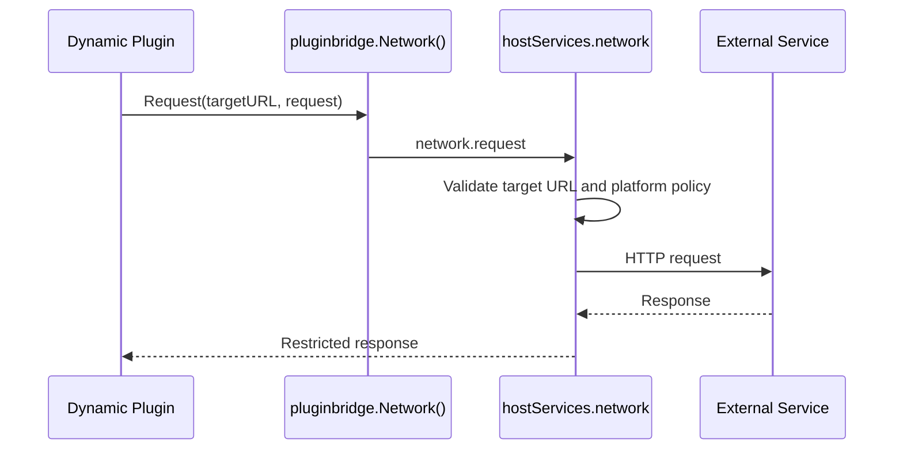

## Overview

Dynamic plugins declare outbound network access through `service: network` and then use `pluginbridge.Default().Network().Request` to make managed HTTP requests. Source plugins run in the same process as the host and currently have no standard `Services.Network()` entry point. When source plugins need external access, they should handle it through their own domain adapters and host security specifications.

`network` is not a general-purpose proxy service. It only allows access to HTTP/HTTPS URL patterns authorized in the manifest, and the host continues to apply platform-level networking and audit policies when executing requests.

**Capability phase**: Runtime

**Type support**: Dynamic plugins

## Capability Design

### Resource Authorization Mechanism

`network` is a `resource` resource type and must declare `resources[].url`. Resource values express allowed domain and path patterns, for example `https://api.example.com/v1/*`.

### Request Governance Flow



### Source Plugin Boundary

Source plugins do not use the dynamic `network` service. Source plugins should connect to external systems through their own backend code and host security specifications. `secret`, `event`, and `queue` are currently reserved governance entries in the descriptor and are not published dynamic host services.

## Interface Definitions

### Source Plugin Interface

Source plugins currently have no standard `Services.Network()` entry point. When source plugins need external access, they should handle it through their own domain adapters and host security specifications.

### Dynamic Plugin Interface

| Dynamic Method | `pluginbridge` Method | Description |
|----------------|----------------------|-------------|
| `request` | `Network().Request` | Makes a managed outbound HTTP request through the host |

Resource declaration:

| Field | Description |
|-------|-------------|
| `resources[].url` | Allowed HTTP/HTTPS URL pattern, for example `https://api.example.com/v1/*` |

## Usage

### Source Plugin Usage

Source plugins do not use the dynamic `network` service. When external access is needed, handle it through your own backend code and host security specifications:

```go
// Source plugins use the host HTTP client directly
client := g.Client()
response, err := client.Get(ctx, "https://api.example.com/data")
```

### Dynamic Plugin Usage

Dynamic plugins declare the `network` service and authorized resources in `plugin.yaml`:

```yaml
hostServices:
  - service: network
    methods:
      - request
    resources:
      - url: https://api.example.com/v1/*
```

Usage on the dynamic plugin side:

```go
response, err := pluginbridge.Default().Network().Request(
    "https://api.example.com/v1/users",
    &protocol.HostServiceNetworkRequest{
        Method: "GET",
        Headers: map[string]string{
            "Authorization": "Bearer " + token,
        },
    },
)
```

## Design Constraints

- **Resources must be explicitly authorized.** Undeclared target addresses should not be forwarded by the host.
- **Do not pass host secrets.** Plugins should not request the host to expose platform-level secrets directly to dynamic code; secrets should be proxied by the host adapter when needed.
- **Response size is limited.** The network capability is suited for business API calls, not for downloading large files; large objects should use the file or storage capability.
- **Source plugins do not use dynamic `network`.** Source plugins should connect to external systems through their own backend code and host security specifications.
- **Reserved services are not available network capabilities.** `secret`, `event`, and `queue` are currently reserved governance entries in the descriptor and are not published dynamic host services.

## Related Services

- [File and Storage Capability](/docs/domain-capability-storage)
- [AI Capability](/docs/domain-capability-ai)
- [Domain Capabilities Overview](/docs/domain-capabilities)
