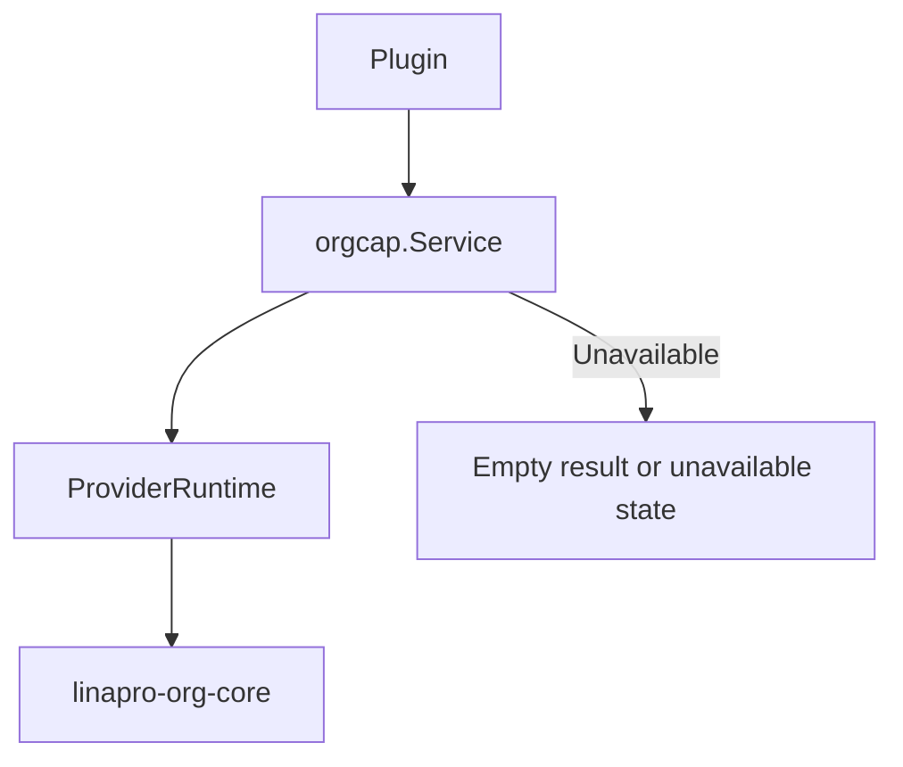

## Introduction

Source plugins consume org capability through `services.Org()`. Org is an optional framework capability whose official provider plugin is identified as `linapro-org-core`. When no provider is available, the service returns a gracefully degraded result. Callers should use `Available()` or `Status()` to determine whether to display organization-related features.

Dynamic plugins can declare `service: org` to invoke published read-only organization methods.

**Capability Phase**: Runtime

**Supported Plugin Types**: Source plugins, Dynamic plugins

## Capability Design

### SPI Pattern

The `Org` capability uses an SPI pattern where the actual organization logic is implemented by a provider plugin. Providers register via `orgcap.Provide(pluginID, factory)`. The host only constructs the provider when the org capability is first used, passing a `ProviderEnv` that contains the plugin `ID`, source-plugin-specific `TenantFilter`, and user view capabilities.



### Provider Boundary

`orgcap.Provider` contains the full set of capabilities that org plugins must implement, including department views, position views, department scope filtering, user-org membership writes, and workspace views. The standard `Org()` only exposes the read-only consumption surface. Interfaces involving `gdb.Model` data scopes, user membership writes, and workspace adapters remain within the host or provider boundary.

### Graceful Degradation

The capability is optional, and callers must handle empty results or unavailable states when org capability is not available. Providers are lazily constructed — the host only instantiates a provider when the capability is actually used, avoiding hard dependencies on optional plugins during startup.

## Interface Definitions

### Source Plugin Interface

| Method | Description |
|--------|-------------|
| `Available` | Check whether the org capability has an available provider |
| `Status` | Return capability status, active provider, and conflict reasons |
| `ListUserDeptAssignments` | Batch-read user department assignment views |
| `BatchGetUserOrgProfiles` | Batch-read user org profiles, including department and position info |
| `GetUserDeptInfo` | Read a single user's department ID and name |
| `GetUserDeptName` | Read a single user's department name |
| `GetUserDeptIDs` | Read a single user's department ID set |
| `GetUserPostIDs` | Read a single user's position ID set |
| `ListDeptTree` | Return a department tree projection with a node limit |
| `SearchDepartments` | Return paginated department candidate projections |
| `ListPostOptionsPage` | Return paginated position candidate projections |
| `EnsureDepartmentsVisible` | Verify department references are visible within the current tenant and org provider boundary |
| `EnsurePostsVisible` | Verify position references are visible within the current tenant and org provider boundary |

### Dynamic Plugin Interface

| Dynamic Method | Description |
|----------------|-------------|
| `capability.available` | Check whether the org capability has an available provider |
| `capability.status` | Return capability status and active provider |
| `users.dept_assignments.list` | Batch-read user department assignment views |
| `users.org_profiles.batch_get` | Batch-read user org profiles |
| `users.dept_info.get` | Read a single user's department ID and name |
| `users.dept_name.get` | Read a single user's department name |
| `users.dept_ids.get` | Read a single user's department ID set |
| `users.post_ids.get` | Read a single user's position ID set |
| `departments.tree.list` | Return a department tree projection with a node limit |
| `departments.search` | Return paginated department candidate projections |
| `departments.visible.ensure` | Verify department reference visibility |
| `posts.options.list` | Return paginated position candidate projections |
| `posts.visible.ensure` | Verify position reference visibility |

## Capability Usage

### Source Plugin Usage

Source plugins read org views through `services.Org()`:

```go
// Check if org capability is available
if !services.Org().Available(ctx) {
    // Handle degradation
    return
}

// Read user department info
deptInfo, err := services.Org().GetUserDeptInfo(ctx, userID)

// Batch-read user department assignments
result, err := services.Org().ListUserDeptAssignments(ctx, userIDs)

// Batch-read user org profiles
profiles, err := services.Org().BatchGetUserOrgProfiles(ctx, userIDs)

// Read user positions
postIDs, err := services.Org().GetUserPostIDs(ctx, userID)

// Get department tree
tree, err := services.Org().ListDeptTree(ctx, orgcap.DeptTreeInput{MaxNodes: 100})

// Search department candidates
deptPage, err := services.Org().SearchDepartments(ctx, orgcap.DeptSearchInput{
    Keyword: "Engineering",
    Page:    pageRequest,
})

// Search position candidates
postPage, err := services.Org().ListPostOptionsPage(ctx, orgcap.PostOptionsInput{
    DeptID:  &deptID,
    Keyword: "Engineer",
    Page:    pageRequest,
})

// Verify department visibility
err := services.Org().EnsureDepartmentsVisible(ctx, deptIDs)

// Verify position visibility
err := services.Org().EnsurePostsVisible(ctx, postIDs)
```

### Dynamic Plugin Usage

Dynamic plugins declare the `org` service and authorized methods in `plugin.yaml`:

```yaml
hostServices:
  - service: org
    methods:
      - capability.available
      - users.dept_name.get
      - users.post_ids.get
      - departments.tree.list
      - departments.search
      - posts.options.list
```

`org` is a `none` resource type — no `paths`, `tables`, `keys`, or `resources` are declared. Usage on the dynamic plugin side:

```go
orgSvc := pluginbridge.Default().Org()

// Check if org capability is available
available := orgSvc.Available(ctx)

// Read user department name
deptName, err := orgSvc.GetUserDeptName(ctx, userID)

// Get department tree
tree, err := orgSvc.ListDeptTree(ctx, orgcap.DeptTreeInput{MaxNodes: 100})

// Search department candidates
deptPage, err := orgSvc.SearchDepartments(ctx, orgcap.DeptSearchInput{
    Keyword: "Engineering",
    Page:    pageRequest,
})
```

## Design Constraints

- **Standard consumption surface is read-only.** Plugins cannot maintain departments, positions, or user-org membership through `Org()`.
- **Data scopes are not exposed to standard plugins.** Org data scopes require database query builders and belong to the host's internal `ScopeService`.
- **Capability is optional.** Callers must handle empty results or unavailable states when org capability is not available.
- **Providers are lazily constructed.** The host only instantiates a provider when the capability is actually used, avoiding hard dependencies on optional plugins during startup.

## Related Services

- [Users Capability](/docs/domain-capability-users)
- [Tenant Capability](/docs/domain-capability-tenant)
- [Plugins Capability](/docs/domain-capability-plugins)
- [Sessions Capability](/docs/domain-capability-sessions)
