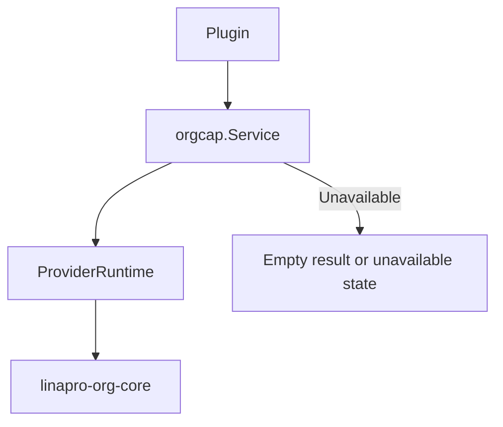

## Overview

Source plugins consume org capability through `services.Org()`. Org is an optional framework capability whose official provider plugin is identified as `linapro-org-core`. When no provider is available, the service returns a gracefully degraded result. Callers should use `Available()` or `Status()` to determine whether to display organization-related features.

Dynamic plugins can declare `service: org` to invoke published read-only organization methods.

**Capability Phase**: Runtime

**Supported Types**: Source plugins, dynamic plugins

## Capability Design

### SPI Pattern

The `Org` capability uses an SPI pattern where the actual organization logic is implemented by a provider plugin. Providers register via `orgcap.Provide(pluginID, factory)`. The host only constructs the provider when the org capability is first used, passing a `ProviderEnv` that contains the plugin `ID`, source-plugin-specific `TenantFilter`, and user view capabilities.



### Provider Boundary

`orgcap.Provider` contains the full set of capabilities that org plugins must implement, including department views, position views, department scope filtering, user-org membership writes, and workspace views. The standard `Org()` only exposes the read-only consumption surface. Interfaces involving `gdb.Model` data scopes, user membership writes, and workspace adapters remain within the host or provider boundary.

### Graceful Degradation

The capability is optional, and callers must handle empty results or unavailable states when org capability is not available. Providers are lazily constructed -- the host only instantiates a provider when the capability is actually used, avoiding hard dependencies on optional plugins during startup.

## Interface Definitions

### Source Plugin Interface

| Method | Description |
|--------|-------------|
| `Available` | Checks whether the org capability has an available provider |
| `Status` | Returns capability status, active provider, and conflict reasons |
| `ListUserDeptAssignments` | Batch-reads user department assignment views |
| `GetUserDeptInfo` | Reads a single user's department ID and name |
| `GetUserDeptName` | Reads a single user's department name |
| `GetUserDeptIDs` | Reads a single user's set of department IDs |
| `GetUserPostIDs` | Reads a single user's set of position IDs |

### Dynamic Plugin Interface

| Dynamic Method | Description |
|----------------|-------------|
| `capability.available` | Checks whether the org capability has an available provider |
| `capability.status` | Returns capability status and active provider |
| `users.dept_assignments.list` | Batch-reads user department assignment views |
| `users.dept_info.get` | Reads a single user's department ID and name |
| `users.dept_name.get` | Reads a single user's department name |
| `users.dept_ids.get` | Reads a single user's set of department IDs |
| `users.post_ids.get` | Reads a single user's set of position IDs |

## Usage

### Source Plugin Usage

Source plugins read org views through `services.Org()`:

```go
// Check whether org capability is available
if !services.Org().Available(ctx) {
    // Handle degradation
    return
}

// Read user department info
deptInfo, err := services.Org().GetUserDeptInfo(ctx, userID)

// Batch-read user department assignments
result, err := services.Org().ListUserDeptAssignments(ctx, userIDs)

// Read user positions
postIDs, err := services.Org().GetUserPostIDs(ctx, userID)
```

### Dynamic Plugin Usage

Dynamic plugins declare the `org` service and authorized methods in `plugin.yaml`:

```yaml
hostServices:
  - service: org
    methods:
      - capability.available
      - users.dept_name.get
      - users.post_ids.get
```

`org` is a `none` resource type and does not declare `paths`, `tables`, `keys`, or `resources`. Usage on the dynamic plugin side:

```go
orgSvc := pluginbridge.Default().Org()

// Check whether org capability is available
available := orgSvc.Available(ctx)

// Read user department name
deptName, err := orgSvc.GetUserDeptName(ctx, userID)
```

## Design Constraints

- **Standard consumption surface is read-only.** Plugins cannot maintain departments, positions, or user-org membership through `Org()`.
- **Data scopes are not exposed to standard plugins.** Organization data scopes require database query builders and belong to the host-internal `ScopeService`.
- **Capability is optional.** Callers must handle empty results or unavailable states when org capability is not available.
- **Providers are lazily constructed.** The host only instantiates a provider when the capability is actually used, avoiding hard dependencies on optional plugins during startup.

## Related Services

- [Users](/docs/domain-capability-users)
- [Tenant](/docs/domain-capability-tenant)
- [Plugins](/docs/domain-capability-plugins)
- [Sessions](/docs/domain-capability-sessions)
