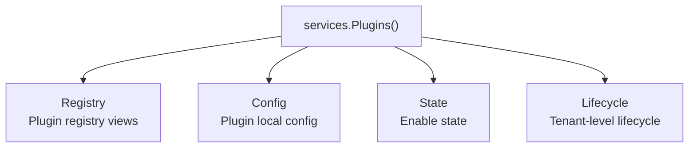
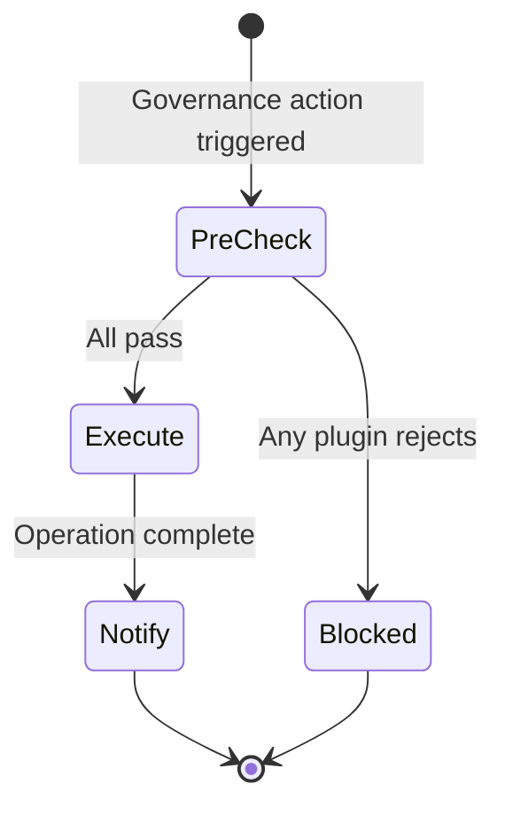

## Overview

`services.Plugins()` returns the plugin governance domain capability namespace. Source plugins access it through `services.Plugins()`, while dynamic plugins declare `service: plugins` in `plugin.yaml` and access it via `pluginbridge.Default().Plugins()`. It is not a single method set but an aggregation of multiple plugin governance sub-capabilities:

| Sub-capability | Description |
|----------------|-------------|
| `Registry()` | Reads plugin governance views, such as plugin version, installation status, enable state, and tenant-controllable plugin list |
| `Config()` | Reads the current plugin's own static configuration |
| `State()` | Queries plugin enable state, authoritative enable state, and capability provider status |
| `Lifecycle()` | Orchestrates pre-checks and post-notifications for tenant-level plugin disabling and tenant deletion |

`Plugins()` also implements registry read methods, so callers can use `services.Plugins().BatchGetPlugins` and `services.Plugins().ListTenantPlugins` to read plugin views directly, or use `Registry()` to express dependency intent explicitly.

**Capability Phase**: Runtime

**Supported Types**: Source plugins, dynamic plugins

## Capability Design

### Sub-capability Architecture



### Registry Sub-capability

The registry capability reads plugin governance views without exposing the host's `sys_plugin` table or internal runtime cache state. Plugin views typically include plugin `ID`, version, installation status, enable state, and lifecycle status. Tenant views additionally include name, type, description, installation mode, scope nature, and tenant-level enable state.

### Config Sub-capability

`Plugins().Config()` reads the current plugin's own static configuration. Its responsibility differs from `HostConfig()`:

| Capability | Read Scope |
|------------|------------|
| `Plugins().Config()` | `config.yaml` under the current plugin's scope |
| `HostConfig()` | Host configuration values; dynamic plugins must declare authorized `keys` to read |

Plugin configuration read priority:

| Priority | Source | Description |
|----------|--------|-------------|
| 1 | `plugins/<plugin-id>/config.yaml` under the production config root | Ops override, production environment takes precedence |
| 2 | `manifest/config/config.yaml` during development | Default config for source plugin development |
| 3 | `manifest/config/config.yaml` bundled in dynamic plugin artifacts | Default config from published artifacts |

`manifest/config/config.example.yaml` is only a configuration template and does not participate in runtime default reads.

### State Sub-capability

`Plugins().State()` provides three query semantics, each serving different consistency and performance requirements:

| Method | Data Source and Semantics | Use Case |
|--------|---------------------------|----------|
| `IsEnabled` | Reads the in-process local enable cache state, preserving tenant, request scope, and runtime gates | High-frequency checks such as menu filtering, route visibility, and permission filtering |
| `IsEnabledAuthoritative` | Bypasses local cache state, forces a read of persisted plugin governance state | Global middleware, write protection, controls that need immediate response to admin state changes |
| `IsProviderEnabled` | Checks whether the plugin is platform-enabled and can accept framework capability provider calls | Pre-checks before calling AI, org, tenant, and other capability providers |


### Lifecycle Sub-capability

`Plugins().Lifecycle()` targets governance modules such as tenant management and plugin management. It is used to ask registered plugins whether an operation may proceed before governance actions, and to notify plugins to perform cleanup or observation logic after operations complete.

It differs from `pluginhost.SourcePlugin.Lifecycle()`:

| Entry Point | Purpose |
|-------------|---------|
| `pluginhost.SourcePlugin.Lifecycle()` | A single source plugin registers its own callbacks for install, upgrade, disable, uninstall, tenant disable, tenant delete, and installation mode changes |
| `services.Plugins().Lifecycle()` | Governance modules orchestrate cross-plugin tenant-level pre-checks and post-notifications |



## Interface Definitions

### Registry Sub-capability Interface

| Method | Description |
|--------|-------------|
| `BatchGetPlugins` | Batch-reads visible plugin views; missing results do not reveal specific reasons |
| `ListTenantPlugins` | Reads the current tenant's controllable plugin list, including global and tenant-level enable states |
| `Registry` | Returns the same registry read interface, useful for dependency injection to expose only registry capability |

### Config Sub-capability Interface

| Method | Description |
|--------|-------------|
| `Get` | Returns the raw configuration value |
| `Exists` | Checks whether a configuration key exists |
| `Scan` | Scans a configuration section into a target struct |
| `String` | Reads a string value, returning the default if missing or blank |
| `Bool` | Reads a boolean value, returning the default if missing |
| `Int` | Reads an integer value, returning the default if missing |
| `Duration` | Reads a duration value, returning the default if missing or blank |

### State Sub-capability Interface

| Method | Description |
|--------|-------------|
| `IsEnabled` | Reads the in-process local enable cache state, suitable for high-frequency checks |
| `IsEnabledAuthoritative` | Forces a read of persisted state, suitable for global controls |
| `IsProviderEnabled` | Checks whether a capability provider is available |

### Lifecycle Sub-capability Interface

| Method | Description |
|--------|-------------|
| `EnsureTenantPluginDisableAllowed` | Runs a pre-check before disabling a plugin for a tenant; blocks if any plugin rejects |
| `NotifyTenantPluginDisabled` | Best-effort notification after a tenant disables a plugin |
| `EnsureTenantDeleteAllowed` | Runs a pre-check before tenant deletion |
| `NotifyTenantDeleted` | Best-effort notification after tenant deletion |

### Admin Command Interface

| Entry Point | Method | Description |
|-------------|--------|-------------|
| `Admin().Plugins()` | `SetPluginEnabled` | Changes plugin enable state, subject to tenant, lifecycle, and state machine checks |
| `Admin().Plugins()` | `ProvisionTenantDefaults` | Backfills default plugin provisioning state for a specified tenant |

### Dynamic Plugin Interface

| Dynamic Method | Description |
|----------------|-------------|
| `plugins.batch_get` | Batch-reads visible plugin views |
| `plugins.tenant.list` | Reads the current tenant's controllable plugin list |
| `plugins.enabled.check` | Checks whether a plugin is enabled |
| `plugins.provider_enabled.check` | Checks whether a capability provider is available |
| `plugins.enabled_authoritative.check` | Forces a read of persisted enable state |
| `config.get` | Reads the current plugin-scope configuration |
| `lifecycle.tenant_plugin_disable.ensure` | Pre-check for tenant-level plugin disabling |
| `lifecycle.tenant_plugin_disabled.notify` | Post-notification for tenant-level plugin disabling |
| `lifecycle.tenant_delete.ensure` | Pre-check for tenant deletion |
| `lifecycle.tenant_deleted.notify` | Post-notification for tenant deletion |

Dynamic plugin lifecycle is orchestrated through the `lifecycle` methods listed above in the bridge contract.

## Usage

### Source Plugin Usage

Source plugins access sub-capabilities through `services.Plugins()` and explicitly pass the domain-required `CapabilityContext` when reading plugin views:

```go
// Read plugin views
result, err := services.Plugins().BatchGetPlugins(ctx, capabilityCtx, pluginIDs)

// Read the current tenant's controllable plugin list
tenantPlugins, err := services.Plugins().ListTenantPlugins(ctx, capabilityCtx)

// Read plugin configuration
endpoint, err := services.Plugins().Config().String(ctx, "api.endpoint", "")

// High-frequency check for plugin enable state
if !services.Plugins().State().IsEnabled(ctx, pluginID) {
    return errors.New("plugin is not enabled")
}

// Global control using authoritative read
if !services.Plugins().State().IsEnabledAuthoritative(ctx, pluginID) {
    return errors.New("plugin is disabled")
}

// Capability provider check
if services.Plugins().State().IsProviderEnabled(ctx, "linapro-ai-core") {
    // Use AI capability
}
```

Trusted source plugins execute admin commands:

```go
err := services.Admin().Plugins().SetPluginEnabled(ctx, capabilityCtx, pluginID, true)
err := services.Admin().Plugins().ProvisionTenantDefaults(ctx, capabilityCtx, tenantID)
```

### Dynamic Plugin Usage

Dynamic plugins declare plugin governance capabilities through `hostServices.plugins`:

```yaml
hostServices:
  - service: plugins
    methods:
      - config.get
      - plugins.batch_get
      - plugins.enabled.check
```

Dynamic plugin lifecycle is managed through the bridge contract, including callback registration for install, upgrade, disable, and uninstall phases. Usage on the dynamic plugin side:

```go
// Read plugin configuration
value, err := pluginbridge.Default().Plugins().Config().String(ctx, "api.endpoint", "")
```

## Design Constraints

- **Prefer `IsEnabled` for high-frequency checks.** It is designed for menu, route, and permission filtering to avoid frequent access to persisted state.
- **Use `IsEnabledAuthoritative` for global controls.** When stale cache state could cause security or governance errors, use the authoritative read.
- **Provider status is independent of business entry visibility.** Some plugin business entries may not be visible to the current tenant but may still be available as platform capability providers.
- **`Ensure*` can block.** When a lifecycle pre-check returns an error, the governance operation should not proceed.
- **`Notify*` is best-effort.** Post-notifications do not return errors; plugin callback failures should only be logged and not roll back completed governance operations.
- **Dynamic plugin lifecycle uses the bridge contract.** The lifecycle contract for dynamic plugin artifacts resides in `pluginbridge/contract` and is not exposed as a standard callable service through dynamic `hostServices`.

## Related Services

- [Domain Capability Overview](/docs/domain-capabilities)
- [HostConfig Capability](/docs/domain-capability-hostconfig)
- [AI Capability](/docs/domain-capability-ai)
- [Tenant Capability](/docs/domain-capability-tenant)
