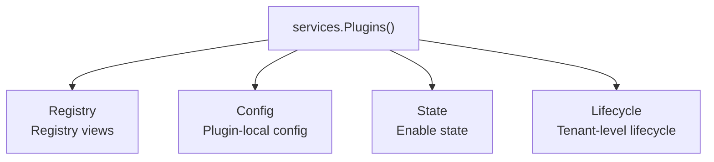
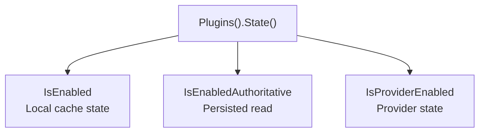
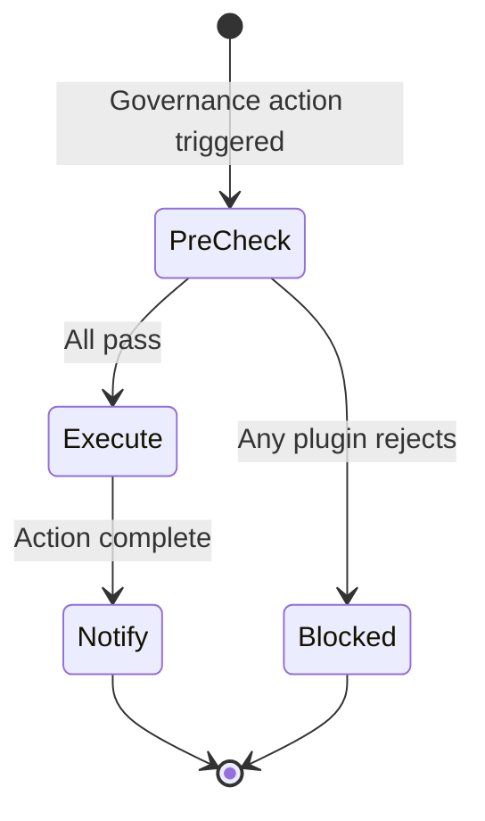

## Introduction

`services.Plugins()` returns the plugin governance domain capability namespace. Source plugins access it through `services.Plugins()`, while dynamic plugins declare `service: plugins` in `plugin.yaml` and access it through the `pluginbridge.Default().Plugins()` client. It is not a single method collection but aggregates multiple plugin governance sub-capabilities:

| Sub-Capability | Description |
|----------------|-------------|
| `Registry()` | Reads plugin governance views, such as plugin versions, install status, enable state, and tenant-controllable plugin lists |
| `Config()` | Reads the current plugin's own static configuration |
| `State()` | Queries plugin enable state, authoritative enable state, and capability provider status |
| `Lifecycle()` | Orchestrates tenant-level plugin disable and tenant deletion pre-checks and post-notifications |

`Plugins()` also implements registry read methods, so callers can directly use `services.Plugins().BatchGetPlugins` and `services.Plugins().ListTenantPlugins` to read plugin views, or explicitly express dependency intent through `Registry()`.

**Capability Phase**: Runtime

**Supported Plugin Types**: Source plugins, Dynamic plugins

## Capability Design

### Sub-Capability System



### Registry Sub-Capability

The registry capability is for reading plugin governance views and does not expose the host `sys_plugin` table or runtime internal cache state. Plugin views typically contain plugin `ID`, version, install status, enable state, and lifecycle status. Tenant views additionally contain name, type, description, install mode, scope nature, and tenant-level enable state.

### Config Sub-Capability

`Plugins().Config()` reads the current plugin's own static configuration. Its responsibility differs from `HostConfig()`:

| Capability | Read Scope |
|------------|------------|
| `Plugins().Config()` | Current plugin-scoped `config.yaml` |
| `HostConfig()` | Host config values; dynamic plugins must declare authorized `keys` |

The plugin configuration read priority is:

| Priority | Source | Description |
|----------|--------|-------------|
| 1 | `plugin.<plugin-id>` section in host `config.yaml` | Deployment-level unified override, exclusive priority |
| 2 | `plugins/<plugin-id>/config.yaml` under production config root | Ops override, production priority |
| 3 | Development-time `manifest/config/config.yaml` | Source plugin development default config |
| 4 | `manifest/config/config.yaml` bound to dynamic plugin artifact | Published artifact default config |

When a `plugin.<plugin-id>` section exists in the host `config.yaml`, that section is the sole source for that plugin's config — file-level config no longer participates in resolution. See [Plugin Business Configuration](/docs/plugin-configuration) for details.

`manifest/config/config.example.yaml` is only a config template and does not participate in runtime default reads.

### State Sub-Capability

`Plugins().State()` provides three query semantics, each serving different consistency and performance needs:

| Method | Data Source and Semantics | Use Case |
|--------|--------------------------|----------|
| `IsEnabled` | Reads process-local enable cache state, preserving tenant, request scope, and runtime gates | High-frequency checks like menu filtering, route visibility, permission filtering |
| `IsEnabledAuthoritative` | Bypasses local cache state, forces reading persisted plugin governance state | Global middleware, write protection, controls that need immediate response to admin state changes |
| `IsProviderEnabled` | Checks whether the plugin is platform-enabled and can serve as a framework capability provider | Pre-check before `AI`, Org, Tenant capability provider calls |



### Lifecycle Sub-Capability

`Plugins().Lifecycle()` targets governance modules like tenant management and plugin management. It is used to ask registered plugins whether an operation may proceed before a governance action, and to notify plugins to execute cleanup or observation logic after the operation completes.

It differs from `pluginhost.SourcePlugin.Lifecycle()`:

| Entry | Role |
|-------|------|
| `pluginhost.SourcePlugin.Lifecycle()` | A single source plugin registers its own install, upgrade, disable, uninstall, tenant disable, tenant delete, and install mode change callbacks |
| `services.Plugins().Lifecycle()` | Governance modules orchestrate cross-plugin tenant-level pre-checks and post-notifications |



## Interface Definitions

### Registry Sub-Capability Interface

| Method | Description |
|--------|-------------|
| `BatchGetPlugins` | Batch-reads visible plugin views; missing results don't reveal specific reasons |
| `ListTenantPlugins` | Reads current tenant-controllable plugin list, including global enable state and tenant enable state |
| `Registry` | Returns the same registry read interface, convenient for dependency injection to expose only registry capability |

### Config Sub-Capability Interface

| Method | Description |
|--------|-------------|
| `Get` | Returns the raw config value |
| `Exists` | Checks whether a config key exists |
| `Scan` | Scans a config section into the target struct |
| `String` | Reads a string value, returning default when missing or blank |
| `Bool` | Reads a boolean value, returning default when missing |
| `Int` | Reads an integer value, returning default when missing |
| `Duration` | Reads a duration value, returning default when missing or blank |

### State Sub-Capability Interface

| Method | Description |
|--------|-------------|
| `IsEnabled` | Reads process-local enable cache state, suitable for high-frequency checks |
| `IsEnabledAuthoritative` | Forces reading persisted state, suitable for global control |
| `IsProviderEnabled` | Checks whether capability provider is available |

### Lifecycle Sub-Capability Interface

| Method | Description |
|--------|-------------|
| `EnsureTenantPluginDisableAllowed` | Pre-check before tenant disables a plugin; any plugin rejection blocks the operation |
| `NotifyTenantPluginDisabled` | Best-effort notification after tenant disables a plugin |
| `EnsureTenantDeleteAllowed` | Pre-check before tenant deletion |
| `NotifyTenantDeleted` | Best-effort notification after tenant deletion |

### Management Command Interface

| Entry | Method | Description |
|-------|--------|-------------|
| `Admin().Plugins()` | `SetPluginEnabled` | Changes plugin enable state, with tenant, lifecycle, and state machine checks |
| `Admin().Plugins()` | `ProvisionTenantDefaults` | Fills default plugin supply state for a specified tenant |

### Dynamic Plugin Interface

| Dynamic Method | Description |
|----------------|-------------|
| `plugins.batch_get` | Batch-reads visible plugin views |
| `plugins.tenant.list` | Reads current tenant-controllable plugin list |
| `plugins.enabled.check` | Checks whether a plugin is enabled |
| `plugins.provider_enabled.check` | Checks whether capability provider is available |
| `plugins.enabled_authoritative.check` | Forces reading persisted enable state |
| `config.get` | Reads current plugin-scoped config |
| `lifecycle.tenant_plugin_disable.ensure` | Tenant plugin disable pre-check |
| `lifecycle.tenant_plugin_disabled.notify` | Tenant plugin disable post-notification |
| `lifecycle.tenant_delete.ensure` | Tenant deletion pre-check |
| `lifecycle.tenant_deleted.notify` | Tenant deletion post-notification |

Dynamic plugin lifecycles are orchestrated through the above `lifecycle` methods in the bridge contract.

## Capability Usage

### Source Plugin Usage

Source plugins access sub-capabilities through `services.Plugins()`, explicitly passing the domain-required `CapabilityContext` when reading plugin views:

```go
// Read plugin views
result, err := services.Plugins().BatchGetPlugins(ctx, capabilityCtx, pluginIDs)

// Read current tenant-controllable plugin list
tenantPlugins, err := services.Plugins().ListTenantPlugins(ctx, capabilityCtx)

// Read plugin config
endpoint, err := services.Plugins().Config().String(ctx, "api.endpoint", "")

// High-frequency check if plugin is enabled
if !services.Plugins().State().IsEnabled(ctx, pluginID) {
    return errors.New("plugin not enabled")
}

// Global control uses authoritative read
if !services.Plugins().State().IsEnabledAuthoritative(ctx, pluginID) {
    return errors.New("plugin disabled")
}

// Capability provider check
if services.Plugins().State().IsProviderEnabled(ctx, "linapro-ai-core") {
    // Use AI capability
}
```

Trusted source plugins executing management commands:

```go
err := services.Admin().Plugins().SetPluginEnabled(ctx, capabilityCtx, pluginID, true)
err := services.Admin().Plugins().ProvisionTenantDefaults(ctx, capabilityCtx, tenantID)
```

### Dynamic Plugin Usage

Dynamic plugins declare plugin governance capabilities through `hostServices.plugins`:

```yaml
hostServices:
  - service: plugins
    methods:
      - config.get
      - plugins.batch_get
      - plugins.enabled.check
```

Dynamic plugin lifecycles are managed through bridge contracts, including callback registration for install, upgrade, disable, and uninstall phases. Usage on the dynamic plugin side:

```go
// Read plugin config
value, err := pluginbridge.Default().Plugins().Config().String(ctx, "api.endpoint", "")
```

## Design Constraints

- **High-frequency checks prefer `IsEnabled`.** It is designed for menu, route, and permission filtering, avoiding frequent access to persisted state.
- **Global control uses `IsEnabledAuthoritative`.** When stale cache state would cause security or governance errors, use the authoritative read.
- **Provider state is independent of business entry visibility.** Some plugin business entries may be invisible to the current tenant but still available as platform capability providers.
- **`Ensure*` can block.** When lifecycle pre-checks return errors, governance operations should not proceed.
- **`Notify*` is best-effort.** Post-notifications don't return errors; plugin callback failures should only be logged, not roll back completed governance operations.
- **Dynamic plugin lifecycles go through bridge contracts.** Dynamic plugin artifact lifecycle contracts are in `pluginbridge/contract` and are not exposed as standard callable services through dynamic `hostServices`.

## Related Services

- [Domain Capabilities Overview](/docs/domain-capabilities)
- [Host Config Capability](/docs/domain-capability-hostconfig)
- [AI Capability](/docs/domain-capability-ai)
- [Tenant Capability](/docs/domain-capability-tenant)
