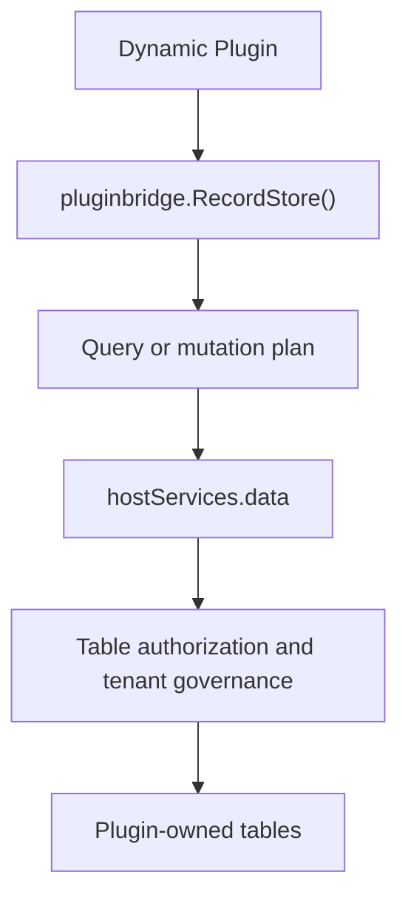

## Overview

Dynamic plugins declare `service: data` in `plugin.yaml` and then use `pluginbridge.Default().RecordStore()` to access authorized tables. This capability targets plugin-owned tables rather than host core tables.

Source plugins do not have a standard `Services.Data()` entry. Since source plugins run in the same process as the host, they typically access plugin-owned tables through the host `dao` package within their own domain services. When plugin-owned tables carry a `tenant_id` column, they should use `TenantFilter()` from the tenant capability.

**Capability Phase**: Runtime

**Supported Types**: Dynamic plugins

## Capability Design

### Dual-mode Architecture

RecordStore uses a dual-mode architecture: dynamic plugins access authorized tables through `hostServices.data`, while source plugins access plugin-owned tables through the host `dao` package. The two use different mechanisms for tenant isolation:

| Plugin Type | Recommended Approach |
|-------------|---------------------|
| Source plugins | Access plugin-owned tables through the host `dao` package, calling `tenantFilter.Apply` when tenant isolation is needed |
| Dynamic plugins | Declare `data` service and `resources.tables`; the host data service enforces table name, method, and tenant boundary governance |



### Table Authorization

`data` is a `table` resource type and must declare `resources.tables`. Production validation requires that table names belong to the plugin's own namespace; dynamic plugins must not declare host core tables such as `sys_*`.

### Transaction Semantics

`transaction` submits a governed operation plan, not arbitrary SQL. Plugin code should not treat it as a direct database connection.

## Interface Definitions

### Source Plugin Interface

Source plugins do not have a standard `Services.Data()` entry. They access plugin-owned tables through the host `dao` package:

```go
// Source plugins access plugin-owned tables via the dao package
model := s.tenantFilter.Apply(ctx, dao.Record.Ctx(ctx), "")
result, err := model.Where(dao.Record.Columns().Status, "active").All()
```

### Dynamic Plugin Interface

| Dynamic Method | Capability Constant | Description |
|----------------|---------------------|-------------|
| `list` | `host:data:read` | Executes a bounded single-table list query |
| `get` | `host:data:read` | Reads a single authorized table record by key |
| `create` | `host:data:mutate` | Creates a single authorized table record |
| `update` | `host:data:mutate` | Updates a single authorized table record |
| `delete` | `host:data:mutate` | Deletes a single authorized table record |
| `transaction` | `host:data:mutate` | Executes a structured multi-operation transaction |

## Usage

### Source Plugin Usage

Source plugins access plugin-owned tables through the host `dao` package, combined with `TenantFilter()` for tenant isolation:

```go
// Query a plugin-owned table with tenant filtering
model := s.tenantFilter.Apply(ctx, dao.Record.Ctx(ctx), "")

// Execute the query
result, err := model.Where(dao.Record.Columns().Status, "active").Page(1, 20).All()

// Create a record
id, err := dao.Record.Ctx(ctx).Data(do.Record{
    Title:    title,
    Status:   "active",
    TenantId: tenantID,
}).InsertAndGetId()
```

The third parameter of `TenantFilter().Apply` is a table name or alias qualifier:

| `qualifier` | Result |
|-------------|--------|
| Empty string | Uses `tenant_id` |
| `plugin_record` | Uses `plugin_record.tenant_id` |
| `r` | Uses `r.tenant_id` |

### Dynamic Plugin Usage

Dynamic plugins declare the `data` service and authorized tables in `plugin.yaml`:

```yaml
hostServices:
  - service: data
    methods:
      - list
      - get
      - create
      - update
      - delete
      - transaction
    resources:
      tables:
        - plugin_demo_reports
        - plugin_demo_report_items
```

`RecordStore()` provides an ORM-like wrapper, but it still translates to `data` host service calls. Usage on the dynamic plugin side:

```go
store := pluginbridge.Default().RecordStore()

// List query
records, total, err := store.Table("plugin_demo_reports").
    WhereEq("status", "active").
    OrderDesc("id").
    Page(1, 20).
    All()

// Create a record
result, err := store.Table("plugin_demo_reports").Insert(data)

// Single-table transaction
err := store.Transaction(func(tx *recordstore.Tx) error {
    if _, err := tx.Table("plugin_demo_reports").Insert(reportData); err != nil {
        return err
    }
    if _, err := tx.Table("plugin_demo_reports").Insert(auditData); err != nil {
        return err
    }
    return nil
})
```

## Design Constraints

- **Only access plugin-owned tables.** `data` is not a host backend data API and cannot read or write host core tables.
- **Declare before calling.** Tables and methods not declared in `plugin.yaml` will be rejected by the host.
- **Queries must be bounded.** List queries should include pagination or limits to prevent dynamic plugins from exporting unbounded datasets.
- **Transactions are structured plans.** `transaction` submits a governed operation plan, not arbitrary SQL.
- **Transactions only support single tables.** `RecordStore().Transaction` currently only allows operating on the same table within a single transaction; cross-table transactions are not supported.
- **Tenant boundaries are handled uniformly by the host.** Plugins should not hand-write cross-tenant rules in dynamic calls that conflict with host policies.

## Related Services

- [Tenant Capability](/docs/domain-capability-tenant)
- [Storage Capability](/docs/domain-capability-storage)
- [Domain Capability Overview](/docs/domain-capabilities)
