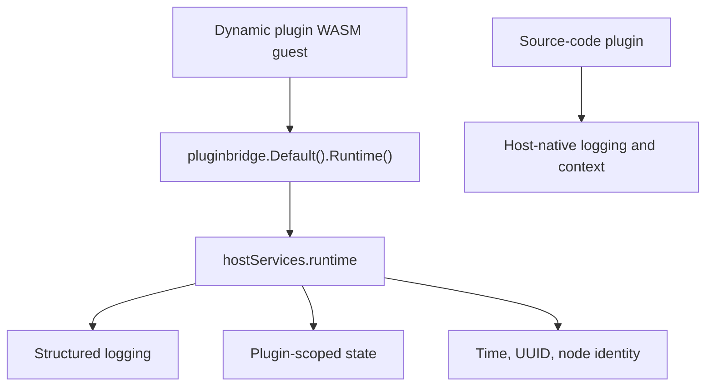

## Overview

`Runtime()` is a capability exclusive to dynamic plugins. Dynamic plugins run within the `WASM` guest boundary and cannot directly access host-process logging, time, node identity, or local state implementations. They therefore need to call host-provided runtime primitives through `service: runtime`.

Source-code plugins already run inside the host process and typically use host-native logging, request context, and injected domain services directly -- they do not need the `Runtime()` wrapper.

**Capability Phase**: Runtime

**Supported Types**: Dynamic plugins

## Design Rationale

### Dynamic Plugin Exclusive Entry Point

`Runtime()` resides in `pluginbridge.Services` and is not part of the `capability.Services` general domain capability catalog. It serves the dynamic plugin bridge runtime environment, not business domain data access.



## Key Capabilities

| Dynamic Method | Dynamic `SDK` Method | Description |
|----------|-------------|------|
| `log.write` | `Runtime().Log` | Writes a structured runtime log entry |
| `state.get` | `Runtime().StateGet`, `Runtime().StateGetInt` | Reads plugin-scoped runtime state |
| `state.set` | `Runtime().StateSet`, `Runtime().StateSetInt` | Writes plugin-scoped runtime state |
| `state.delete` | `Runtime().StateDelete` | Deletes plugin-scoped runtime state |
| `info.now` | `Runtime().Now` | Reads the host time string |
| `info.uuid` | `Runtime().UUID` | Generates a host-side unique identifier |
| `info.node` | `Runtime().Node` | Reads the current host node identity |

`runtime` is a `none` resource type and does not declare `paths`, `tables`, `keys`, or `resources`. Authorization boundaries are controlled by `service + method`.

## Usage

Dynamic plugins declare the `runtime` service in `plugin.yaml`:

```yaml
hostServices:
  - service: runtime
    methods:
      - log.write
      - state.get
      - state.set
      - state.delete
      - info.now
      - info.uuid
      - info.node
```

Invocations on the dynamic plugin side through `pluginbridge.Default().Runtime()`:

```go
runtime := pluginbridge.Default().Runtime()

err := runtime.Log(protocol.LogLevelInfo, "export started", map[string]string{
    "taskID": taskID,
})
if err != nil {
    return err
}

now, err := runtime.Now()
if err != nil {
    return err
}

err = runtime.StateSet("last_export_time", now)
if err != nil {
    return err
}

lastExport, found, err := runtime.StateGet("last_export_time")
if err != nil {
    return err
}

id, err := runtime.UUID()
if err != nil {
    return err
}

node, err := runtime.Node()
```

## Design Constraints

- **Dynamic plugin exclusive.** `Runtime()` only exists in the `pluginbridge` dynamic `SDK` and is not included in the source-code plugin `capability.Services` catalog.
- **Runtime state is not a cache substitute.** `runtime.state.*` is suitable for storing a small amount of plugin-scoped state; for cross-plugin sharing, counters, and expiration policies, use the [Cache Capability](/docs/domain-capability-cache).
- **Log fields should be short and stable.** Dynamic plugins should not put large payloads, secrets, tokens, or personally identifiable information into log fields.
- **Information reads are not health checks.** `info.now`, `info.uuid`, and `info.node` only provide basic runtime information and do not express component availability.

## Related Services

- [Cache Capability](/docs/domain-capability-cache)
- [Dynamic Plugins and WASM Runtime](/docs/wasm-plugins)
- [Plugin Available Domain Capabilities Overview](/docs/domain-capabilities)
