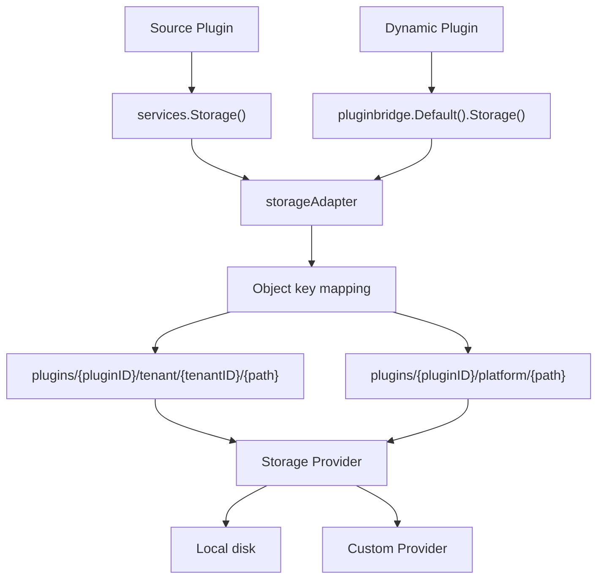

## Overview

Source plugins use the object storage capability through `services.Storage()`. Dynamic plugins declare `service: storage` in `plugin.yaml` and access it via `pluginbridge.Default().Storage()`.

The `Storage` capability provides each plugin with an isolated object storage sandbox. Plugins read and write objects under declared authorized path prefixes, while the host handles path validation, plugin isolation, and storage backend management.

**Capability Phase**: Runtime

**Supported Types**: Source plugins, dynamic plugins

## Capability Design

### Sandbox Isolation Model

`Storage` uses dual plugin + tenant isolation. Each plugin's objects are automatically scoped under the `plugins/{pluginID}/` prefix, and tenant data is further isolated within the `tenant/{tenantID}/` sub-path. Platform-level data uses the `platform/` sub-path:



### Object Key Mapping

Logical paths used by plugins are automatically mapped to physical storage object keys by `storageAdapter`. The mapping rules are as follows:

| Scope | Object Key Format |
|-------|-------------------|
| Tenant-level | `plugins/{pluginID}/tenant/{tenantID}/{logicalPath}` |
| Platform-level | `plugins/{pluginID}/platform/{logicalPath}` |

Plugins only need to work with logical paths (e.g. `exports/report.csv`) and do not need to worry about the underlying object key structure.

### Object Metadata

Object metadata visible to plugins does not expose physical storage paths, Provider keys, or host file management IDs:

| Field | Description |
|-------|-------------|
| `Path` | Logical path |
| `Size` | Object size |
| `ContentType` | Content type |
| `ETag` | Entity tag, computed as `SHA-1(key + size + modtime)` |
| `UpdatedAt` | Last update time |
| `Visibility` | Visibility identifier, `private` or `public` |

Object visibility is controlled by the host. The `Visibility` field indicates whether an object can be publicly served. Plugins should not assume that a written object is automatically publicly accessible; the specific access policy is determined by the host's service layer.

### Content Type Detection

When writing an object, `storageAdapter` detects the content type in the following priority order:

1. `contentType` explicitly specified in the request
2. Body sniffing (reads the first 512 bytes for detection)
3. File extension inference
4. Fallback to `application/octet-stream`

### Storage Provider Architecture

`Storage` supports a pluggable storage Provider architecture:

| Provider | Description |
|----------|-------------|
| `local` | Built-in local disk Provider, stored under the `.capability-storage/` directory |
| Custom | Plugin Providers registered via `Provide()`, supporting OSS, S3, MinIO, etc. |

The active Provider is selected through the `plugin.storage.activeProviderPluginId` configuration. When unconfigured, the local Provider is used. In cluster mode, the local Provider refuses service by default; `allowLocalProviderInCluster` must be explicitly set.

#### Provider Registration

Providers are managed through a process-level global registry. Source plugins call `storagecap.Provide(pluginID, factory)` to register a `ProviderFactory` function. The host resolves the currently active Provider at runtime via `ResolveProvider`:

- When `activeProviderPluginId` is not configured, the built-in local Provider is used
- When `activeProviderPluginId` is configured, it must match a registered and available plugin Provider; silent fallback does not occur

### Difference from Files Capability

| Dimension | Files | Storage |
|-----------|-------|---------|
| Purpose | Read-only view of the host file management system | Plugin-scoped object storage sandbox |
| Database | `sys_file` table with full metadata | No database, pure object storage |
| Isolation | Tenant + data scope | Plugin + tenant path isolation |
| Operations | Read-only view + controlled deletion | Full CRUD |
| Size limit | Configured by `upload.maxSize` | Unlimited |
| Provider | Built-in local storage | Pluggable Provider registration |

## Interface Definitions

### Source Plugin Interface

| Method | Description |
|--------|-------------|
| `Put` | Writes an object, with `ContentType` and `Overwrite` control |
| `Get` | Reads object content and metadata |
| `Delete` | Deletes an object under an authorized path |
| `List` | Lists objects by prefix |
| `Stat` | Reads object metadata without returning content |
| `ProviderStatuses` | Queries the status of all registered Providers (source plugins only) |

The `Overwrite` parameter of `Put` controls overwrite behavior: when set to `false`, a `PLUGIN_STORAGE_OBJECT_EXISTS` error is returned if the object already exists.

### Dynamic Plugin Interface

| Dynamic Method | Dynamic SDK Method | Description |
|----------------|-------------------|-------------|
| `put` | `Storage().Put` | Writes an object, with `ContentType` and `Overwrite` control |
| `put.init` | -- | Initializes a multipart upload session, returns an upload ID |
| `put.chunk` | -- | Writes chunk data in sequential offset order |
| `put.commit` | -- | Commits the multipart upload, merging into the final object |
| `put.abort` | -- | Cancels the multipart upload, cleans up temporary files |
| `get` | `Storage().Get` | Reads object content and metadata |
| `delete` | `Storage().Delete` | Deletes an object under an authorized path |
| `list` | `Storage().List` | Lists objects by prefix |
| `stat` | `Storage().Stat` | Reads object metadata without returning content |

The Guest SDK automatically selects the upload mode at write time: objects not exceeding 1 MB use direct upload (single call), while objects exceeding 1 MB or of unknown size automatically switch to multipart upload (1 MB chunks). The host-side maximum chunk size for multipart upload is 4 MB, with a session validity of 15 minutes. On chunk failure, the SDK automatically attempts `abort` to clean up temporary files.

`ProviderStatuses` is not available through the dynamic plugin transport protocol.

## Usage

### Source Plugin Usage

Source plugins operate on objects directly through `services.Storage()`:

```go
// Write an object
_, err := services.Storage().Put(ctx, storagecap.PutInput{
    Path:        "exports/report.csv",
    Body:        reader,
    ContentType: "text/csv",
    Overwrite:   true,
})

// Read an object
output, err := services.Storage().Get(ctx, storagecap.GetInput{
    Path: "exports/report.csv",
})

// List objects
list, err := services.Storage().List(ctx, storagecap.ListInput{
    Prefix: "exports/",
    Limit:  100,
})

// Query Provider status
statuses, err := services.Storage().ProviderStatuses(ctx)
```

### Dynamic Plugin Usage

Dynamic plugins declare the `storage` service and authorized paths in `plugin.yaml`:

```yaml
hostServices:
  - service: storage
    methods:
      - put
      - get
      - delete
      - list
      - stat
    resources:
      paths:
        - exports/
        - temp/reports/
```

Authorization granularity is at the logical path prefix level. All request paths are normalized and authorized at the WASM host service layer, ensuring plugins can only access declared path ranges.

Usage on the dynamic plugin side:

```go
storageSvc := pluginbridge.Default().Storage()

// Write an object (direct upload for small objects)
_, err := storageSvc.Put(ctx, storagecap.PutInput{
    Path:        "exports/report-2024.csv",
    Body:        data,
    ContentType: "text/csv",
})

// Read an object
output, err := storageSvc.Get(ctx, storagecap.GetInput{
    Path: "exports/report-2024.csv",
})

// List objects
list, err := storageSvc.List(ctx, storagecap.ListInput{
    Prefix: "exports/",
})
```

## System Constraints

| Constraint | Limit |
|------------|-------|
| Single object size | Unlimited |
| Logical path length | 512 bytes |
| List default limit | 100 items |
| List maximum limit | 1,000 items |
| Direct upload threshold | 1 MB (Guest SDK auto-switches to multipart) |
| Chunk size (Guest) | 1 MB |
| Chunk size (Host) | 4 MB |
| Multipart session validity | 15 minutes |

## Design Constraints

- **Paths are not physical paths.** `paths` are logical authorization scopes; plugins cannot escape authorized prefixes through relative paths. The WASM host service layer normalizes and authorizes every request path.
- **Object visibility is controlled by the host.** Whether an object can be publicly served is determined by host metadata and subsequent service policies; plugins should not assume that written objects are automatically publicly accessible.
- **Underlying details are not exposed.** Object metadata does not include physical paths, Provider keys, or host file management IDs.
- **Plugin uninstall triggers automatic cleanup.** When a plugin is uninstalled, the host enumerates and bulk-deletes all objects under authorized path prefixes.
- **Providers have no silent fallback.** Once a custom Provider is configured, if that Provider is unavailable, operations fail directly rather than falling back to the local Provider.

## Related Services

- [Files Capability](/docs/domain-capability-files)
- [Manifest Capability](/docs/domain-capability-manifest)
- [RecordStore Capability](/docs/domain-capability-recordstore)
