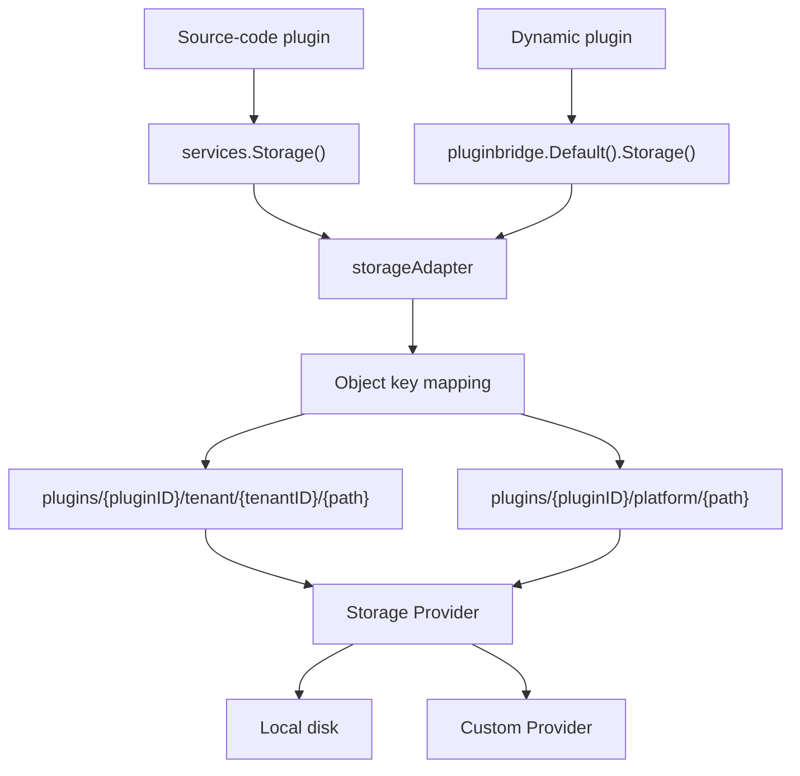
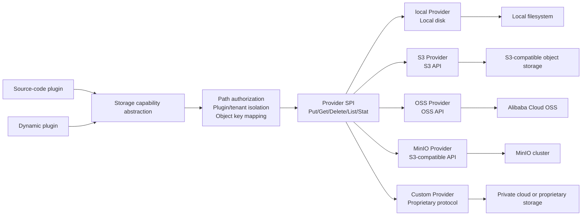

## Overview

The `Storage` capability provides each plugin with an isolated object storage sandbox. Plugins read and write objects under their declared authorized path prefixes, while the host handles path validation, plugin isolation, and storage backend management.

- Source-code plugins use object storage through `services.Storage()`.
- Dynamic plugins declare `service: storage` in `plugin.yaml` and use the `pluginbridge.Default().Storage()` client.

**Capability Phase**: Runtime

**Supported Types**: Source-code plugins, dynamic plugins

## Capability Design

### Sandbox Isolation Model

`Storage` uses dual isolation by plugin and tenant. Each plugin's objects are automatically scoped under the `plugins/{pluginID}/` prefix, with tenant data further isolated in the `tenant/{tenantID}/` sub-path. Platform-level data uses the `platform/` sub-path:



### Object Key Mapping

Logical paths used by plugins are automatically mapped to physical storage object keys by `storageAdapter`. The mapping rules are:

| Scope | Object Key Format |
|------|-----------|
| Tenant-level | `plugins/{pluginID}/tenant/{tenantID}/{logicalPath}` |
| Platform-level | `plugins/{pluginID}/platform/{logicalPath}` |

Plugins only need to work with logical paths (e.g. `exports/report.csv`) and do not need to worry about the underlying object key structure.

### Object Metadata

Object metadata visible to plugins does not expose physical storage paths, `Provider` keys, or host file management IDs:

| Field | Description |
|------|------|
| `Path` | Logical path |
| `Size` | Object size |
| `ContentType` | Content type |
| `ETag` | Entity tag, computed as `SHA-1(key + size + modtime)` |
| `UpdatedAt` | Last update time |
| `Visibility` | Visibility flag: `private` or `public` |

Object visibility is controlled by the host. The `Visibility` field indicates whether an object can be served publicly. Plugins cannot assume that objects written will be publicly accessible -- the actual access policy is determined by the host's service layer.

### Content Type Detection

When writing objects, `storageAdapter` detects the content type in the following priority order:

1. Explicitly specified `contentType` in the request
2. Body sniffing (reads the first `512` bytes for detection)
3. File extension inference
4. Fallback to `application/octet-stream`

### Storage Provider Architecture

`Storage` supports a pluggable storage `Provider` architecture:

From the plugin's perspective, `Storage` is a stable object storage abstraction. Plugins depend only on logical paths and unified object operations, without directly coupling to `S3`, `OSS`, `MinIO`, local disk, or proprietary storage protocols. Different protocol implementations are plugged in through `Provider`, and the host continues to handle path authorization, plugin/tenant isolation, and object key mapping before delegating to the backend.



| Provider | Description |
|--------|------|
| `local` | Built-in local disk `Provider`, stores data under the `.capability-storage/` directory |
| Custom | Plugin `Provider` registered via `Provide()`, supporting `OSS`, `S3`, `MinIO`, etc. |

The active `Provider` is selected via the `plugin.storage.activeProviderPluginId` configuration. When unconfigured, the local `Provider` is used. In cluster mode, the local `Provider` refuses service by default; `allowLocalProviderInCluster` must be explicitly set.

#### Provider Registration Mechanism

`Provider` instances are managed through a process-level global registry. Source-code plugins register a `ProviderFactory` function by calling `storagecap.Provide(pluginID, factory)`, and the host resolves the currently active `Provider` at runtime via `ResolveProvider`:

- When `activeProviderPluginId` is not configured, the built-in local `Provider` is used
- When `activeProviderPluginId` is configured, it must match a registered and available plugin `Provider`; there is no silent fallback

### Difference from Files Capability

| Dimension | Files | Storage |
|:------:|-------|---------|
| **Purpose** | Read-only view of the host file management system | Plugin-scoped object storage sandbox |
| **Database** | `sys_file` table with full metadata | No database; pure object storage |
| **Isolation** | Tenant + data scope | Plugin + tenant path isolation |
| **Operations** | Read-only view + controlled deletion | Full `CRUD` |
| **Size limit** | Configured via `upload.maxSize` | No limit |
| **Provider** | Built-in local storage | Pluggable `Provider` registration |

## Interface Definitions

### Source-Code Plugin Interface

| Method | Description |
|------|------|
| `Put` | Writes an object, with `ContentType` and `Overwrite` control |
| `Get` | Reads object content and metadata |
| `Delete` | Deletes an object under an authorized path |
| `DeleteMany` | Batch-deletes objects under authorized paths |
| `List` | Lists objects by prefix |
| `ListCursor` | Lists objects by prefix with cursor-based pagination |
| `Stat` | Reads object metadata without returning content |
| `BatchStat` | Batch-reads object metadata |
| `ProviderStatuses` | Queries the status of all registered `Provider` instances (source-code plugins only) |

The `Overwrite` parameter in `Put` controls overwrite behavior: when set to `false`, a `PLUGIN_STORAGE_OBJECT_EXISTS` error is returned if the object already exists.

### Dynamic Plugin Interface

| Dynamic Method | Dynamic `SDK` Method | Description |
|----------|-------------|------|
| `put` | `Storage().Put` | Writes an object, with `ContentType` and `Overwrite` control |
| `put.init` | -- | Initializes a multipart upload session, returns an upload ID |
| `put.chunk` | -- | Writes chunk data sequentially by offset |
| `put.commit` | -- | Commits the multipart upload, merging into the final object |
| `put.abort` | -- | Cancels the multipart upload and cleans up temporary files |
| `get` | `Storage().Get` | Reads object content and metadata |
| `delete` | `Storage().Delete` | Deletes an object under an authorized path |
| `delete_many` | `Storage().DeleteMany` | Batch-deletes objects under authorized paths |
| `list` | `Storage().List` | Lists objects by prefix |
| `list_cursor` | `Storage().ListCursor` | Lists objects by prefix with cursor-based pagination |
| `stat` | `Storage().Stat` | Reads object metadata without returning content |
| `batch_stat` | `Storage().BatchStat` | Batch-reads object metadata |

The dynamic plugin `Guest SDK` automatically selects the upload mode: objects not exceeding `1 MB` use direct upload (single call), while those exceeding `1 MB` or of unknown size automatically switch to multipart upload (`1 MB` chunks). The host-side maximum chunk size for multipart uploads is `4 MB`, with a session validity of `15` minutes. On chunk failure, the SDK automatically attempts `abort` to clean up temporary files.

`ProviderStatuses` is not available through the dynamic plugin transport protocol.

## Usage

### Source-Code Plugin Usage

Source-code plugins operate on objects directly through `services.Storage()`:

```go
// Write an object
_, err := services.Storage().Put(ctx, storagecap.PutInput{
    Path:        "exports/report.csv",
    Body:        reader,
    ContentType: "text/csv",
    Overwrite:   true,
})

// Read an object
output, err := services.Storage().Get(ctx, storagecap.GetInput{
    Path: "exports/report.csv",
})

// Delete an object
err := services.Storage().Delete(ctx, storagecap.DeleteInput{
    Path: "exports/report.csv",
})

// Batch-delete objects
err := services.Storage().DeleteMany(ctx, storagecap.DeleteManyInput{
    Paths: []string{"exports/report1.csv", "exports/report2.csv"},
})

// List objects
list, err := services.Storage().List(ctx, storagecap.ListInput{
    Prefix: "exports/",
    Limit:  100,
})

// List objects with cursor-based pagination
cursorList, err := services.Storage().ListCursor(ctx, storagecap.ListCursorInput{
    Prefix: "exports/",
    Cursor: lastCursor,
    Limit:  100,
})

// Query object metadata
stat, err := services.Storage().Stat(ctx, storagecap.StatInput{
    Path: "exports/report.csv",
})

// Batch-query object metadata
batchStat, err := services.Storage().BatchStat(ctx, storagecap.BatchStatInput{
    Paths: []string{"exports/report1.csv", "exports/report2.csv"},
})

// Query Provider status
statuses, err := services.Storage().ProviderStatuses(ctx)
```

### Dynamic Plugin Usage

Dynamic plugins declare the `storage` service and authorized paths in `plugin.yaml`:

```yaml
hostServices:
  - service: storage
    methods:
      - put
      - get
      - delete
      - delete_many
      - list
      - list_cursor
      - stat
      - batch_stat
    resources:
      paths:
        - exports/
        - temp/reports/
```

Authorization granularity is at the logical path prefix level. All request paths are normalized and authorized at the `WASM` host service layer, ensuring plugins can only access their declared path scopes.

Usage on the dynamic plugin side:

```go
storageSvc := pluginbridge.Default().Storage()

// Write an object (small object, direct upload)
_, err := storageSvc.Put(ctx, storagecap.PutInput{
    Path:        "exports/report-2024.csv",
    Body:        data,
    ContentType: "text/csv",
})

// Read an object
output, err := storageSvc.Get(ctx, storagecap.GetInput{
    Path: "exports/report-2024.csv",
})

// Delete an object
err := storageSvc.Delete(ctx, storagecap.DeleteInput{
    Path: "exports/report-2024.csv",
})

// Batch-delete objects
err := storageSvc.DeleteMany(ctx, storagecap.DeleteManyInput{
    Paths: []string{"exports/report1.csv", "exports/report2.csv"},
})

// List objects
list, err := storageSvc.List(ctx, storagecap.ListInput{
    Prefix: "exports/",
})

// List objects with cursor-based pagination
cursorList, err := storageSvc.ListCursor(ctx, storagecap.ListCursorInput{
    Prefix: "exports/",
    Cursor: lastCursor,
    Limit:  100,
})

// Query object metadata
stat, err := storageSvc.Stat(ctx, storagecap.StatInput{
    Path: "exports/report-2024.csv",
})

// Batch-query object metadata
batchStat, err := storageSvc.BatchStat(ctx, storagecap.BatchStatInput{
    Paths: []string{"exports/report1.csv", "exports/report2.csv"},
})
```

## System Constraints

| Constraint | Limit |
|--------|------|
| Single object size | No limit |
| Logical path length | `512` bytes |
| List default limit | `100` items |
| List maximum limit | `1000` items |
| Direct upload threshold | `1 MB` (Guest SDK auto-switches to multipart) |
| Chunk size (Guest) | `1 MB` |
| Chunk size (Host) | `4 MB` |
| Multipart session validity | `15` minutes |

## Design Constraints

- **Paths are not physical paths.** `paths` are logical authorization scopes; plugins cannot escape the authorized prefix through relative paths. The `WASM` host service layer normalizes and authorizes each request path.
- **Object visibility is controlled by the host.** Whether an object can be served publicly is determined by host metadata and downstream service policies; plugins cannot assume objects written will be publicly accessible.
- **No underlying details are exposed.** Object metadata does not contain physical paths, `Provider` keys, or host file management IDs.
- **Plugin uninstall triggers automatic cleanup.** When a plugin is uninstalled, the host enumerates and batch-deletes all objects under the authorized path prefix.
- **No silent Provider fallback.** Once a custom `Provider` is configured, if that `Provider` is unavailable, operations fail directly rather than falling back to the local `Provider`.

## Related Services

- [Files Capability](/docs/domain-capability-files)
- [Manifest Resource Capability](/docs/domain-capability-manifest)
- [Record Store Capability](/docs/domain-capability-recordstore)
