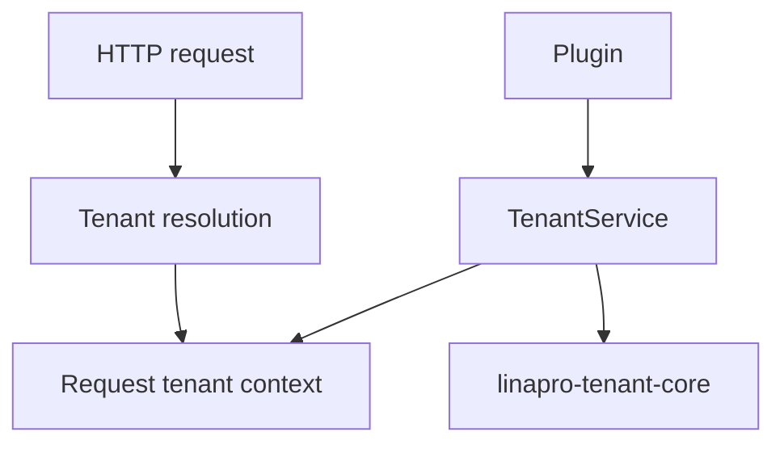
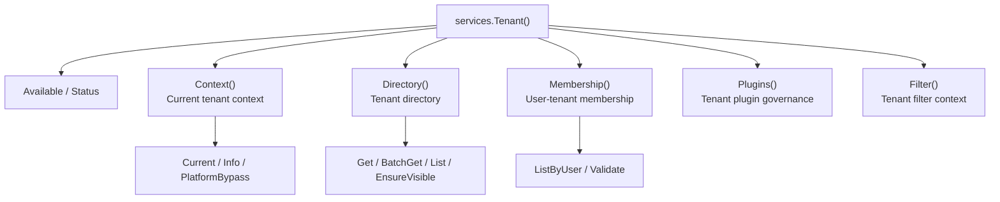

## Overview

Source-code plugins consume the tenant capability through `services.Tenant()`. The tenant capability is an optional framework capability, with the official provider plugin identified as `linapro-tenant-core`. When no active provider is available, the service degrades to single-tenant semantics under platform tenant `0`.

The `Tenant` capability uses a sub-service model, aggregating `Context()` (current tenant context), `Directory()` (tenant directory), `Membership()` (user-tenant membership), `Plugins()` (tenant plugin governance), and `Filter()` (tenant filter context).

Dynamic plugins can declare `service: tenant` to call published tenant capability methods.

**Capability Phase**: Runtime

**Supported Types**: Source-code plugins, dynamic plugins

## Capability Design

### SPI Pattern

The `Tenant` capability uses an SPI pattern, where the specific multi-tenant strategy is implemented by the provider plugin. `tenantcap.Provider` is responsible for tenant resolution, user-tenant relationship validation, user-visible tenant lists, and tenant-switch validation. `tenantcap.Resolver` resolves tenant identity from `HTTP` requests and can form a chain of responsibility based on request headers, domains, paths, tokens, or other strategies.



### Sub-Service Architecture

The `Tenant` capability uses a sub-service model, handling different tenant domain operations separately:



### Graceful Degradation

When no tenant provider is available, the system degrades to single-tenant mode under the platform tenant. `Tenant()` does not expose `RequestResolver`, `ScopeService`, user-tenant membership writes, or startup consistency checks -- these belong to the host's internal middleware, database filtering, or governance processes.

## Interface Definitions

### Source-Code Plugin Interface

**`Tenant()` root methods:**

| Method | Description |
|------|------|
| `Available` | Checks whether the tenant capability has an available provider |
| `Status` | Returns capability status, active provider, and conflict reason |
| `Context()` | Returns the current tenant context sub-service |
| `Directory()` | Returns the tenant directory sub-service |
| `Membership()` | Returns the user-tenant membership sub-service |
| `Plugins()` | Returns the tenant plugin governance sub-service |
| `Filter()` | Returns the tenant filter context sub-service |

**`Tenant().Context()` sub-service:**

| Method | Description |
|------|------|
| `Current` | Returns the current request tenant identifier; falls back to platform tenant when absent |
| `Info` | Returns current request tenant information, including `ID`, `Code`, `Name`, and `Status` |
| `PlatformBypass` | Checks whether the current request is allowed to bypass tenant filtering |

**`Tenant().Directory()` sub-service:**

| Method | Description |
|------|------|
| `Get` | Retrieves a single visible tenant's information |
| `BatchGet` | Batch-retrieves visible tenant information, returning `BatchResult` |
| `List` | Searches visible tenant candidates by keyword |
| `EnsureVisible` | Validates whether the current user can access the specified tenant set |

**`Tenant().Membership()` sub-service:**

| Method | Description |
|------|------|
| `ListByUser` | Lists the active tenants visible to a user |
| `Validate` | Validates whether a specified user belongs to a specified tenant |

**`Tenant().Plugins()` sub-service:**

| Method | Description |
|------|------|
| `SetTenantPluginEnabled` | Updates tenant plugin enabled status, subject to caller and tenant policy validation |
| `ProvisionTenantPluginDefaults` | Creates missing default plugin rows for a tenant |

**`Tenant().Filter()` sub-service (source-code plugins only):**

| Method | Description |
|------|------|
| `Context` | Returns the current request's tenant, user, real actor, impersonation state, and platform bypass information |

Source-code plugin exclusive interface (accessed via `pluginhost.Services.TenantFilter()`):

| Method | Description |
|------|------|
| `Context` | Returns the current request's tenant context information |
| `Apply` | Appends `tenant_id` conditions to the query model |

### Dynamic Plugin Interface

| Dynamic Method | Description |
|----------|------|
| `capability.available` | Checks whether the tenant capability has an available provider |
| `capability.status` | Returns capability status and active provider |
| `tenants.current` | Returns the current request tenant identifier |
| `tenants.current_info` | Returns the current request tenant information |
| `tenants.platform_bypass` | Checks whether tenant filtering can be bypassed |
| `tenants.visible.ensure` | Validates whether the current user can access the specified tenant |
| `tenants.batch_get` | Batch-retrieves visible tenant information |
| `tenants.search` | Searches visible tenant candidates by keyword |
| `tenants.visible.batch_ensure` | Batch-validates whether the current user can access the specified tenants |
| `users.tenant_membership.validate` | Validates whether a specified user belongs to a specified tenant |
| `users.tenants.list` | Lists the active tenants visible to a user |
| `users.tenants.batch_list` | Batch-retrieves user-accessible tenant lists |
| `tenants.switch.validate` | Validates whether a tenant-switch target is valid |

## Usage

### Source-Code Plugin Usage

Source-code plugins access general tenant capabilities through `services.Tenant()`:

```go
// Check if tenant capability is available
if !services.Tenant().Available(ctx) {
    // Handle degradation
    return
}

// Get the current tenant identifier
tenantID := services.Tenant().Context().Current(ctx)

// Get the current tenant information
tenantInfo, err := services.Tenant().Context().Info(ctx)

// Check platform bypass
bypass := services.Tenant().Context().PlatformBypass(ctx)

// Validate tenant visibility
err := services.Tenant().Directory().EnsureVisible(ctx, []tenantcap.TenantID{targetTenantID})

// List user-visible tenants
tenants, err := services.Tenant().Membership().ListByUser(ctx, userID)

// Batch-retrieve tenant information
batchResult, err := services.Tenant().Directory().BatchGet(ctx, tenantIDs)

// Search tenant candidates
page, err := services.Tenant().Directory().List(ctx, tenantcap.ListInput{
    Keyword: "tech",
    Page:    pageRequest,
})

// Validate user-tenant membership
err := services.Tenant().Membership().Validate(ctx, userID, targetTenantID)
```

Source-code plugins obtain the tenant filter context through `Filter().Context()` to build their own query conditions:

```go
filterCtx := services.Tenant().Filter().Context(ctx)
if filterCtx.TenantID > 0 {
    model = model.Where("tenant_id", filterCtx.TenantID)
}
if filterCtx.IsImpersonation {
    // Log impersonation audit
    log.Infof("Impersonated user %d accessing tenant %d", filterCtx.ActingUserID, filterCtx.TenantID)
}
```

### Dynamic Plugin Usage

Dynamic plugins declare the `tenant` service and authorized methods in `plugin.yaml`:

```yaml
hostServices:
  - service: tenant
    methods:
      - tenants.current
      - tenants.current_info
      - tenants.visible.ensure
      - tenants.batch_get
      - tenants.search
      - users.tenants.list
      - users.tenants.batch_list
```

`tenant` is a `none` resource type and does not declare `paths`, `tables`, `keys`, or `resources`. Usage on the dynamic plugin side:

```go
tenantSvc := pluginbridge.Default().Tenant()

// Get the current tenant identifier
tenantID := tenantSvc.Context().Current(ctx)

// Get the current tenant information
tenantInfo, err := tenantSvc.Context().Info(ctx)

// Validate tenant visibility
err := tenantSvc.Directory().EnsureVisible(ctx, []tenantcap.TenantID{targetTenantID})

// List user-visible tenants
tenants, err := tenantSvc.Membership().ListByUser(ctx, userID)

// Batch-retrieve tenant information
batchResult, err := tenantSvc.Directory().BatchGet(ctx, tenantIDs)

// Search tenant candidates
page, err := tenantSvc.Directory().List(ctx, tenantcap.ListInput{
    Keyword: "tech",
    Page:    pageRequest,
})
```

When dynamic plugins access plugin-owned tables, they should declare `service: data` and authorized `resources.tables`, with the host data service enforcing tenant boundary governance.

## Design Constraints

- **Capability is optional.** When no tenant provider is available, the system degrades to single-tenant mode under the platform tenant.
- **Query filtering is not in the general service.** Tenant-scoped capabilities that require a database query builder belong to the host's internal `ScopeService`.
- **`Filter().Context()` returns a read-only context.** Plugins build their own query conditions based on the returned `TenantFilterContext` and should not use it to manipulate host core tables.
- **Tenant switching is validation only.** `Membership().Validate` validates the target's legitimacy; re-issuing tokens is still handled by `Auth().Token().SwitchTenant`.
- **Platform bypass is determined by the host.** Plugins should not construct cross-tenant access states on their own.

## Related Services

- [Auth Capability](/docs/domain-capability-auth)
- [Org Capability](/docs/domain-capability-org)
- [Record Store Capability](/docs/domain-capability-recordstore)
