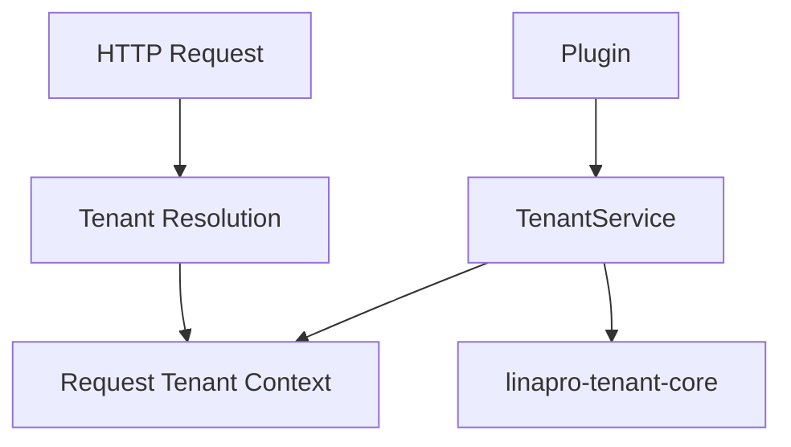
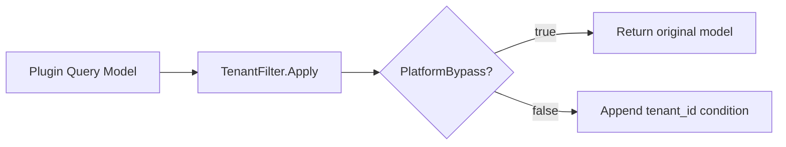

## Introduction

Source plugins consume standard tenant capability through `services.Tenant()`. Tenant is an optional framework capability whose official provider plugin is identified as `linapro-tenant-core`. When no active provider exists, the service degrades to single-tenant semantics for platform tenant `0`.

Dynamic plugins can declare `service: tenant` to invoke published tenant capability methods.

**Capability Phase**: Runtime

**Supported Plugin Types**: Source plugins, Dynamic plugins

## Capability Design

### SPI Pattern

The `Tenant` capability uses an SPI pattern where the actual multi-tenancy strategy is implemented by a provider plugin. `tenantcap.Provider` handles tenant resolution, user-tenant relationship validation, user-visible tenant lists, and tenant-switch validation. `tenantcap.Resolver` handles tenant identity resolution from `HTTP` requests, composing a chain of responsibility based on request headers, domains, paths, tokens, or other strategies.



### Graceful Degradation

When no tenant provider exists, the system degrades to single-tenant mode for the platform tenant. The standard `Tenant()` does not expose `RequestResolver`, `ScopeService`, user-tenant membership writes, or startup consistency checks — these belong to the host's internal middleware, database filtering, or governance processes.

### Source Plugin Exclusive: TenantFilter

Source plugins that need to query plugin-owned tables can obtain `tenantcap.PluginTableFilterService` through `pluginhost.Services.TenantFilter()`. It belongs to the tenant domain capability but is not part of the standard `capability.Services.Tenant()`. The reason is that it directly accepts and returns `*gdb.Model` query builders, making it suitable only for source plugins running within the host process.

| Method | Description |
|--------|-------------|
| `Context` | Return the current request's tenant, user, real operator, impersonation state, and platform bypass info |
| `Apply` | Append a `tenant_id` condition to the query model; returns the original model when the current request allows platform bypass |

`TenantFilterContext` contains `UserID`, `TenantID`, `ActingUserID`, `OnBehalfOfTenantID`, `ActingAsTenant`, `IsImpersonation`, and `PlatformBypass`. Among these, `ActingUserID` is suitable for writing audit records, and `PlatformBypass` is determined by host policy — plugins should not construct it themselves.



Dynamic plugins do not use `TenantFilter()`. When dynamic plugins need to access plugin-owned tables, they should declare `service: data` and authorized `resources.tables`, letting the host `data` service handle tenant, authorization, and table namespace governance.

## Interface Definitions

### Source Plugin Interface

| Method | Description |
|--------|-------------|
| `Available` | Check whether the tenant capability has an available provider |
| `Status` | Return capability status, active provider, and conflict reasons |
| `Current` | Return the current request tenant; returns platform tenant when missing |
| `CurrentTenantInfo` | Return the current request tenant projection, including `ID`, `Code`, `Name`, and `Status` |
| `PlatformBypass` | Check whether the current request allows bypassing tenant filtering |
| `EnsureTenantVisible` | Verify the current user can access the specified tenant |
| `ValidateUserInTenant` | Verify the specified user belongs to the specified tenant |
| `ListUserTenants` | List the user's visible active tenants |
| `BatchGetTenants` | Batch-read visible tenant projections |
| `SearchTenants` | Search visible tenant candidates by keyword |
| `BatchListUserTenants` | Batch-read user-accessible tenant lists |
| `EnsureTenantsVisible` | Batch-verify the current user can access the specified tenants |
| `SwitchTenant` | Validate the tenant-switch target |

Source plugin exclusive interfaces (accessed via `pluginhost.Services.TenantFilter()`):

| Method | Description |
|--------|-------------|
| `Context` | Return the current request's tenant context info |
| `Apply` | Append a `tenant_id` condition to the query model |

### Dynamic Plugin Interface

| Dynamic Method | Description |
|----------------|-------------|
| `capability.available` | Check whether the tenant capability has an available provider |
| `capability.status` | Return capability status and active provider |
| `tenants.current` | Return the current request tenant |
| `tenants.current_info` | Return the current request tenant projection |
| `tenants.platform_bypass` | Check whether tenant filtering can be bypassed |
| `tenants.visible.ensure` | Verify the current user can access the specified tenant |
| `tenants.batch_get` | Batch-read visible tenant projections |
| `tenants.search` | Search visible tenant candidates by keyword |
| `tenants.visible.batch_ensure` | Batch-verify the current user can access the specified tenants |
| `users.tenant_membership.validate` | Verify the specified user belongs to the specified tenant |
| `users.tenants.list` | List the user's visible active tenants |
| `users.tenants.batch_list` | Batch-read user-accessible tenant lists |
| `tenants.switch.validate` | Validate the tenant-switch target |

## Capability Usage

### Source Plugin Usage

Source plugins access standard tenant capability through `services.Tenant()`:

```go
// Check if tenant capability is available
if !services.Tenant().Available(ctx) {
    // Handle degradation
    return
}

// Get current tenant
tenant := services.Tenant().Current(ctx)

// Get current tenant projection
tenantInfo, err := services.Tenant().CurrentTenantInfo(ctx)

// Verify tenant visibility
err := services.Tenant().EnsureTenantVisible(ctx, targetTenantID)

// List user's visible tenants
tenants, err := services.Tenant().ListUserTenants(ctx, userID)

// Batch-read tenant projections
batchResult, err := services.Tenant().BatchGetTenants(ctx, tenantIDs)

// Search tenant candidates
page, err := services.Tenant().SearchTenants(ctx, tenantcap.SearchInput{
    Keyword: "Tech",
    Page:    pageRequest,
})

// Batch-read user-accessible tenants
userTenants, err := services.Tenant().BatchListUserTenants(ctx, userIDs)

// Batch-verify tenant visibility
err := services.Tenant().EnsureTenantsVisible(ctx, tenantIDs)
```

Source plugins use `TenantFilter()` to append tenant filtering to plugin-owned tables:

```go
model := g.DB().Model("plugin_record")
model = services.TenantFilter().Apply(ctx, model, "")
result, err := model.Where("status", "active").All()
```

The third parameter of `Apply` is a table name or alias qualifier:

| `qualifier` | Result |
|-------------|--------|
| Empty string | Uses `tenant_id` |
| `plugin_record` | Uses `plugin_record.tenant_id` |
| `r` | Uses `r.tenant_id` |

### Dynamic Plugin Usage

Dynamic plugins declare the `tenant` service and authorized methods in `plugin.yaml`:

```yaml
hostServices:
  - service: tenant
    methods:
      - tenants.current
      - tenants.current_info
      - tenants.visible.ensure
      - tenants.batch_get
      - tenants.search
      - users.tenants.list
      - users.tenants.batch_list
```

`tenant` is a `none` resource type — no `paths`, `tables`, `keys`, or `resources` are declared. Usage on the dynamic plugin side:

```go
tenantSvc := pluginbridge.Default().Tenant()

// Get current tenant
tenant := tenantSvc.Current(ctx)

// Get current tenant projection
tenantInfo, err := tenantSvc.CurrentTenantInfo(ctx)

// Verify tenant visibility
err := tenantSvc.EnsureTenantVisible(ctx, targetTenantID)

// List user's visible tenants
tenants, err := tenantSvc.ListUserTenants(ctx, userID)

// Batch-read tenant projections
batchResult, err := tenantSvc.BatchGetTenants(ctx, tenantIDs)

// Search tenant candidates
page, err := tenantSvc.SearchTenants(ctx, tenantcap.SearchInput{
    Keyword: "Tech",
    Page:    pageRequest,
})

// Batch-read user-accessible tenants
userTenants, err := tenantSvc.BatchListUserTenants(ctx, userIDs)
```

When dynamic plugins need to access plugin-owned tables, they should declare `service: data` and authorized `resources.tables`, letting the host data service handle tenant boundary governance.

## Design Constraints

- **Capability is optional.** When no tenant provider exists, the system degrades to single-tenant mode for the platform tenant.
- **Query filtering is not in the standard service.** Tenant scope capabilities requiring database query builders belong to the host's internal `ScopeService` or the source-plugin-exclusive `TenantFilter()`.
- **`TenantFilter()` is only for plugin-owned tables.** Do not use it on host core tables, and do not write inconsistent tenant conditions in plugin code.
- **Pass qualifiers for joins.** When multiple tables contain `tenant_id`, pass the table name or alias to avoid column ambiguity.
- **Tenant switching only validates.** `SwitchTenant` validates target legitimacy; re-issuing tokens is still handled by `Auth().Token().SwitchTenant`.
- **Platform bypass is determined by the host.** Plugins should not construct cross-tenant access states themselves.

## Related Services

- [Auth Capability](/docs/domain-capability-auth)
- [Org Capability](/docs/domain-capability-org)
- [Record Store Capability](/docs/domain-capability-recordstore)
