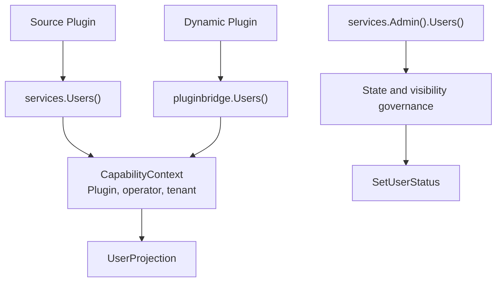

## Introduction

Source plugins read user domain views through `services.Users()`. Dynamic plugins declare `service: users` in `plugin.yaml` and access it through the `pluginbridge.Default().Users()` client. This capability only returns plugin-visible display fields and does not expose the `sys_user` table, user entities, password fields, role relationships, or host `DAO`.

When user lifecycle state changes are needed, trusted source plugins execute governed management commands through `services.Admin().Users().SetUserStatus`. Standard `Users()` remains read-only.

**Capability Phase**: Runtime

**Supported Plugin Types**: Source plugins, Dynamic plugins

## Capability Design

### User View Model

User views are for display, candidate selection, and audit context — they are not host user entities. Missing results don't reveal whether the target user doesn't exist, is invisible, or is rejected:

| Field | Description |
|-------|-------------|
| `ID` | User domain identifier |
| `Username` | Stable login name |
| `Nickname` | Display name |
| `Avatar` | Avatar `URL` or protected file reference |
| `Status` | User lifecycle state |
| `TenantID` | User's tenant identifier |
| `LabelKey`, `Label` | Optional localized labels for synthetic or special users |

### Read-Write Separation Design

The user capability follows a read-write separation pattern: standard `Users()` provides read-only view capabilities, while `Admin().Users()` provides governed write commands. Organization information is not maintained in the user capability — optional org views like departments and positions come from the `Org` capability.



## Interface Definitions

### Source Plugin Interface

| Entry | Method | Description |
|-------|--------|-------------|
| `Users()` | `Current` | Returns the current operator's visible user view |
| `Users()` | `BatchGet` | Batch-reads visible user views, returns `BatchResult` |
| `Users()` | `BatchResolve` | Batch-resolves visible users by user `ID`, username, email, or phone number |
| `Users()` | `Search` | Searches visible user candidates by keyword and pagination |
| `Users()` | `EnsureVisible` | Validates that target user set is visible to the current call context |
| `Admin().Users()` | `SetStatus` | Changes a visible user's lifecycle state |

### Dynamic Plugin Interface

Dynamic plugins declare authorized read-only methods through `hostServices.users`:

| Dynamic Method | Description |
|----------------|-------------|
| `users.current` | Returns the current operator's visible user view |
| `users.batch_get` | Batch-reads visible user views |
| `users.batch_resolve` | Batch-resolves visible users by user `ID`, username, email, or phone number |
| `users.search` | Searches visible user candidates by keyword and pagination |
| `users.visible.ensure` | Validates that target user set is visible to the current call context |

## Capability Usage

### Source Plugin Usage

Source plugins read user views through `services.Users()`, explicitly passing the domain-required `CapabilityContext`:

```go
// Get current operator user view
current, err := services.Users().Current(ctx, capabilityCtx)

// Batch-read user views
result, err := services.Users().BatchGet(ctx, capabilityCtx, userIDs)

// Batch-resolve users by multiple dimensions
resolveResult, err := services.Users().BatchResolve(ctx, capabilityCtx, usercap.BatchResolveInput{
    IDs:       userIDs,
    Usernames: usernames,
    Contacts:  emails,
})

// Search visible user candidates
page, err := services.Users().Search(ctx, capabilityCtx, usercap.SearchInput{
    Keyword: keyword,
    Page:    pageRequest,
})

// Validate user visibility
err := services.Users().EnsureVisible(ctx, capabilityCtx, userIDs)
```

Trusted source plugins executing user status management:

```go
err := services.Admin().Users().SetStatus(ctx, capabilityCtx, userID, newStatus)
```

### Dynamic Plugin Usage

Dynamic plugins declare the required `users` read-only methods in `plugin.yaml`:

```yaml
hostServices:
  - service: users
    methods:
      - users.current
      - users.batch_get
      - users.batch_resolve
      - users.search
```

Dynamic plugins call through the `pluginbridge.Default().Users()` client:

```go
usersSvc := pluginbridge.Default().Users()

// Get current operator user view
current, err := usersSvc.Current(ctx, capabilityCtx)

// Batch-read user views
result, err := usersSvc.BatchGet(ctx, capabilityCtx, userIDs)

// Batch-resolve users by multiple dimensions
resolveResult, err := usersSvc.BatchResolve(ctx, capabilityCtx, usercap.BatchResolveInput{
    IDs:       userIDs,
    Usernames: usernames,
    Contacts:  emails,
})

// Search visible user candidates
page, err := usersSvc.Search(ctx, capabilityCtx, usercap.SearchInput{
    Keyword: keyword,
    Page:    pageRequest,
})
```

## Design Constraints

- **No host storage exposed.** Plugins cannot access passwords, salts, role tables, menu tables, or raw `sys_user` records through the user capability.
- **Searches must be bounded.** `SearchUsers` uses `PageRequest` to limit result size, preventing plugins from pulling the entire user table.
- **Visibility failures don't reveal specific reasons.** `EnsureUsersVisible` only expresses that the current call cannot proceed, without exposing specific rejection reasons to standard plugins.
- **Status values are defined by the host domain.** Plugins should not invent user states not accepted by the host state machine.

## Related Services

- [Auth Capability](/docs/domain-capability-auth)
- [Org Capability](/docs/domain-capability-org)
- [Tenant Capability](/docs/domain-capability-tenant)
