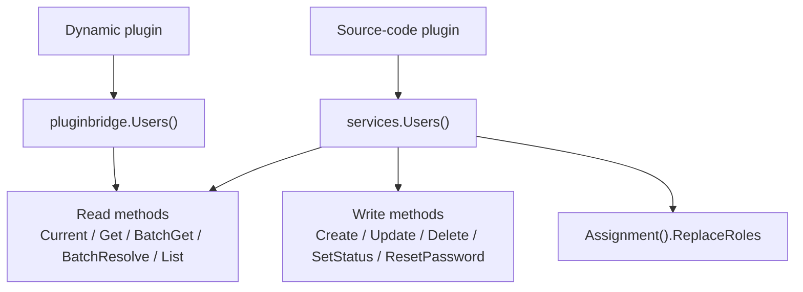

## Overview

Source-code plugins access user-domain capabilities through `services.Users()`. Dynamic plugins declare `service: users` in `plugin.yaml` and use the `pluginbridge.Default().Users()` client to access capabilities. This capability only returns display fields visible to the plugin and does not expose the `sys_user` table, user entities, password fields, role relationships, or host `DAO`.

**Capability Phase**: Runtime

**Supported Types**: Source-code plugins, dynamic plugins

## Capability Design

### User View Model

The user view is designed for display, candidate selection, and audit contexts -- it is not the host user entity. Missing results do not reveal whether the target user does not exist, is invisible, or is denied:

| Field | Description |
|------|------|
| `ID` | User domain identifier |
| `Username` | Stable login name |
| `Nickname` | Display name |
| `Avatar` | Avatar `URL` or protected file reference |
| `Status` | User lifecycle status |
| `TenantID` | Identifier of the tenant the user belongs to |
| `LabelKey`, `Label` | Optional localized label for synthetic or special users |

### Read and Write Capability Design

The user capability provides both read and write methods: read methods (`Current`, `Get`, `BatchGet`, `BatchResolve`, `List`) return protected views; write methods (`Create`, `Update`, `Delete`, `SetStatus`, `ResetPassword`, `Assignment().ReplaceRoles`) are executed after visibility, tenant boundary, state machine, and audit validation. Organization information is not maintained in the user capability; optional organization views such as departments and positions come from the `Org` capability.



## Interface Definitions

### Source-Code Plugin Interface

| Method | Description |
|------|------|
| `Current` | Returns the current actor's visible user view |
| `Get` | Retrieves a single visible user view |
| `BatchGet` | Batch-retrieves visible user views, returning `BatchResult` |
| `BatchResolve` | Batch-resolves visible users by user `ID`, username, email, or phone number |
| `List` | Searches visible user candidates by keyword and pagination |
| `EnsureVisible` | Validates that a target user set is visible to the current caller |
| `Create` | Creates a user, subject to username uniqueness, tenant boundary, and role validation |
| `Update` | Updates a visible user's information, subject to target visibility and tenant boundary validation |
| `Delete` | Deletes a visible user, subject to target visibility and tenant boundary validation |
| `SetStatus` | Changes a visible user's lifecycle status |
| `ResetPassword` | Resets a visible user's password |
| `Assignment().ReplaceRoles` | Replaces a visible user's role associations |

### Dynamic Plugin Interface

Dynamic plugins declare authorized read-only methods through `hostServices.users`:

| Dynamic Method | Description |
|----------|------|
| `users.current` | Returns the current actor's visible user view |
| `users.batch_get` | Batch-retrieves visible user views |
| `users.batch_resolve` | Batch-resolves visible users by user `ID`, username, email, or phone number |
| `users.list` | Searches visible user candidates by keyword and pagination |
| `users.visible.ensure` | Validates that a target user set is visible to the current caller |

## Usage

### Source-Code Plugin Usage

Source-code plugins access user capabilities through `services.Users()`:

```go
// Get the current actor's user view
current, err := services.Users().Current(ctx)

// Batch-retrieve user views
result, err := services.Users().BatchGet(ctx, userIDs)

// Batch-resolve users across multiple dimensions
resolveResult, err := services.Users().BatchResolve(ctx, usercap.BatchResolveInput{
    IDs:       userIDs,
    Usernames: usernames,
    Contacts:  emails,
})

// Search visible user candidates
page, err := services.Users().List(ctx, usercap.ListInput{
    Keyword: keyword,
    Page:    pageRequest,
})

// Validate user visibility
err := services.Users().EnsureVisible(ctx, userIDs)

// Create a user
userID, err := services.Users().Create(ctx, usercap.CreateInput{
    Username: "newuser",
    Password: "hashed",
    Nickname: "New User",
})

// Update a user
err := services.Users().Update(ctx, usercap.UpdateInput{
    ID:       userID,
    Nickname: ptr("New Nickname"),
})

// Change user status
err := services.Users().SetStatus(ctx, userID, statusflag.EnabledTrue)

// Reset password
err := services.Users().ResetPassword(ctx, userID, "newHashedPassword")

// Replace role associations
err := services.Users().Assignment().ReplaceRoles(ctx, userID, roleIDs)
```

### Dynamic Plugin Usage

Dynamic plugins declare the required `users` read-only methods in `plugin.yaml`:

```yaml
hostServices:
  - service: users
    methods:
      - users.current
      - users.batch_get
      - users.batch_resolve
      - users.search
```

Dynamic plugins invoke through the `pluginbridge.Default().Users()` client:

```go
usersSvc := pluginbridge.Default().Users()

// Get the current actor's user view
current, err := usersSvc.Current(ctx)

// Batch-retrieve user views
result, err := usersSvc.BatchGet(ctx, userIDs)

// Batch-resolve users across multiple dimensions
resolveResult, err := usersSvc.BatchResolve(ctx, usercap.BatchResolveInput{
    IDs:       userIDs,
    Usernames: usernames,
    Contacts:  emails,
})

// Search visible user candidates
page, err := usersSvc.List(ctx, usercap.ListInput{
    Keyword: keyword,
    Page:    pageRequest,
})
```

## Design Constraints

- **Host storage is not exposed.** Plugins cannot access passwords, salt values, role tables, menu tables, or raw `sys_user` records through the user capability.
- **Searches must be bounded.** `SearchUsers` uses `PageRequest` to limit result size, preventing plugins from pulling the entire user table.
- **Visibility failures do not reveal specific reasons.** `EnsureUsersVisible` only indicates that the current call cannot proceed; it does not expose specific denial reasons to ordinary plugins.
- **Status values are defined by the host domain.** Plugins should not invent user statuses not accepted by the host state machine.

## Related Services

- [Auth Capability](/docs/domain-capability-auth)
- [Org Capability](/docs/domain-capability-org)
- [Tenant Capability](/docs/domain-capability-tenant)
