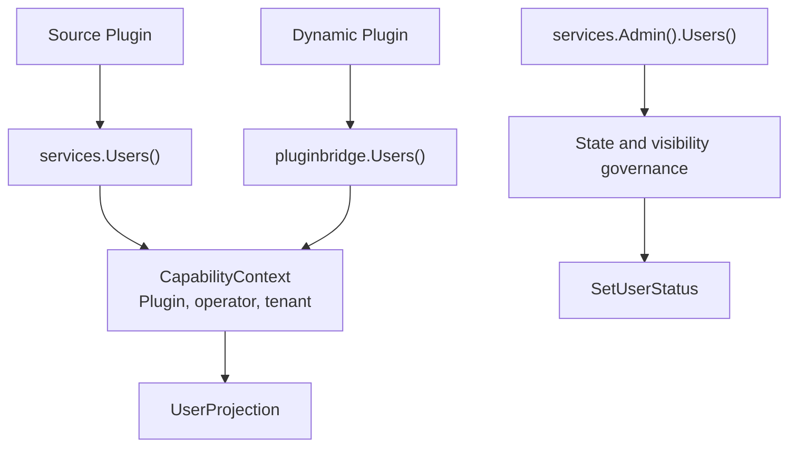

## Overview

Source plugins read user domain views through `services.Users()`, while dynamic plugins declare `service: users` in `plugin.yaml` and access it via `pluginbridge.Default().Users()`. This capability only returns display fields visible to the plugin and does not expose the `sys_user` table, user entities, password fields, role relationships, or the host DAO.

When changes to user lifecycle state are needed, trusted source plugins execute the governed admin command through `services.Admin().Users().SetUserStatus`. The standard `Users()` remains read-only.

**Capability Phase**: Runtime

**Supported Types**: Source plugins, dynamic plugins

## Capability Design

### User View Model

User views are designed for display, candidate selection, and audit context. They are not the host user entity. Missing results do not reveal whether the target user does not exist, is not visible, or is denied:

| Field | Description |
|-------|-------------|
| `ID` | User domain identifier |
| `Username` | Stable login name |
| `Nickname` | Display name |
| `Avatar` | Avatar URL or protected file reference |
| `Status` | User lifecycle state |
| `TenantID` | Identifier of the tenant the user belongs to |
| `LabelKey`, `Label` | Optional localized label for synthetic or special users |

### Read-write Separation Design

The user capability follows a read-write separation pattern: the standard `Users()` provides read-only view capability, while `Admin().Users()` provides governed write commands. Organization information is not maintained in the user capability; optional organization views such as departments and positions come from the Org capability.



## Interface Definitions

### Source Plugin Interface

| Entry Point | Method | Description |
|-------------|--------|-------------|
| `Users()` | `BatchGetUsers` | Batch-reads visible user views, returns `BatchResult` |
| `Users()` | `SearchUsers` | Searches visible user candidates by keyword and pagination |
| `Users()` | `EnsureUsersVisible` | Validates that a target user set is visible to the current call context |
| `Admin().Users()` | `SetUserStatus` | Changes a visible user's lifecycle state |

### Dynamic Plugin Interface

Dynamic plugins declare authorized read-only methods through `hostServices.users`:

| Dynamic Method | Description |
|----------------|-------------|
| `users.batch_get` | Batch-reads visible user views |
| `users.search` | Searches visible user candidates by keyword and pagination |
| `users.visible.ensure` | Validates that a target user set is visible to the current call context |

## Usage

### Source Plugin Usage

Source plugins read user views through `services.Users()`, explicitly passing the domain-required `CapabilityContext`:

```go
// Batch-read user views
result, err := services.Users().BatchGetUsers(ctx, capabilityCtx, userIDs)

// Search visible user candidates
page, err := services.Users().SearchUsers(ctx, capabilityCtx, usercap.SearchInput{
    Keyword: keyword,
    Page:    pageRequest,
})

// Validate user visibility
err := services.Users().EnsureUsersVisible(ctx, capabilityCtx, userIDs)
```

Trusted source plugins execute user status management:

```go
err := services.Admin().Users().SetUserStatus(ctx, capabilityCtx, userID, newStatus)
```

### Dynamic Plugin Usage

Dynamic plugins declare the required `users` read-only methods in `plugin.yaml`:

```yaml
hostServices:
  - service: users
    methods:
      - users.batch_get
      - users.search
```

Dynamic plugins call through `pluginbridge.Default().Users()`:

```go
usersSvc := pluginbridge.Default().Users()

// Batch-read user views
result, err := usersSvc.BatchGetUsers(ctx, capabilityCtx, userIDs)

// Search visible user candidates
page, err := usersSvc.SearchUsers(ctx, capabilityCtx, usercap.SearchInput{
    Keyword: keyword,
    Page:    pageRequest,
})
```

## Design Constraints

- **Host storage is not exposed.** Plugins cannot access passwords, salts, role tables, menu tables, or raw `sys_user` records through the user capability.
- **Searches must be bounded.** `SearchUsers` uses `PageRequest` to limit result size, preventing plugins from pulling the entire user table.
- **Visibility failures do not reveal specific reasons.** `EnsureUsersVisible` only expresses that the current call cannot proceed; it does not expose specific rejection reasons to standard plugins.
- **Status values are defined by the host domain.** Plugins should not invent user states not accepted by the host state machine.

## Related Services

- [Auth Capability](/docs/domain-capability-auth)
- [Org Capability](/docs/domain-capability-org)
- [Tenant Capability](/docs/domain-capability-tenant)
