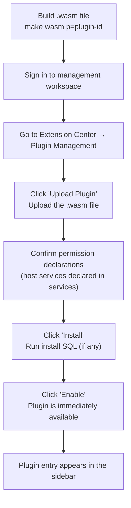

## Overview

`WASM` dynamic plugins are `LinaPro`'s runtime extension capability — plugins compiled to `WebAssembly` format that can be uploaded, installed, enabled, disabled, and uninstalled while the host is running, with no downtime or restart required.

Dynamic plugins run inside a full `WASM` sandbox. All access to host resources (filesystem, database, network) must go through the governed bridge interfaces provided by the host.

## Directory Structure

Dynamic plugins and source plugins share the same directory structure. The only difference is that a dynamic plugin's `main.go` implements the `WASM` plugin protocol:

```text
apps/lina-plugins/<plugin-id>/
├── main.go                     # WASM plugin entry point (func main)
├── plugin_embed.go             # Embedded resource registration
├── plugin.yaml                 # Plugin manifest (with host service permission declarations)
├── backend/
│   └── internal/
│       └── service/            # Business logic (accesses host capabilities through bridge interfaces)
├── frontend/
│   └── pages/                  # Plugin frontend pages (standalone static assets)
└── manifest/
    └── sql/                    # Install SQL (optional — dynamic plugins rarely create tables)
        └── uninstall/          # Uninstall SQL (optional)
```

## Plugin Manifest (Host Service Declarations)

Dynamic plugins must declare the required host services in `plugin.yaml`. The host validates permissions at install and enable time:

```yaml
# Unique plugin identifier (kebab-case), globally unique
id: my-dynamic-plugin
# Display name
name: Dynamic Plugin Example
# Semantic version (semver format)
version: v0.1.0
# Plugin type: dynamic means a WASM dynamic plugin
type: dynamic
# Description
description: A sample plugin demonstrating dynamic plugin capabilities

# Declare required host service permissions
# Administrators must confirm these declarations at install time
services:
  - runtime   # Access runtime information (framework version, node ID, etc.)
  - storage   # File storage access (limited to the plugin's namespace)
  - network   # Restricted HTTP network requests
  - data      # Database access (limited to the plugin's namespace)

# Menu declarations
menus:
  - key: plugin:my-dynamic-plugin:main     # Menu key, format: plugin:<plugin-id>:<feature>
    name: Dynamic Plugin Example           # Display name
    path: my-dynamic-plugin-main           # Frontend route path, globally unique
    component: system/plugin/dynamic-page  # Dynamic plugin pages always use this component
    type: M                                # Menu type: M=menu, C=directory, B=button
    sort: 1                                # Sort order; lower numbers appear first
```

Host service permission reference:

| Service | Description | Typical use |
|---------|-------------|-------------|
| `runtime` | Access runtime metadata | Display framework version, node info |
| `storage` | Read/write files in the plugin's namespace | Upload attachments, generate report files |
| `network` | Make outbound `HTTP` requests | Call third-party APIs, webhooks |
| `data` | Access database data in the plugin's namespace | Read/write the plugin's own data |

## Building a Dynamic Plugin

### Environment setup

`WASM` plugins are built with the standard `Go` toolchain (`Go 1.22+`) targeting `GOOS=wasip1 GOARCH=wasm`. No extra tools like `TinyGo` are needed — the `hack/tools/build-wasm` utility provided by the host wraps all build parameters.

### Build commands

```bash
# Run from the project root to build all dynamic plugins
make wasm

# Build a specific plugin only
make wasm p=my-dynamic-plugin
```

Build output is written to `temp/output/my-dynamic-plugin.wasm`.

### Build tool (hack/tools/build-wasm)

The host ships a unified `WASM` build tool that automatically handles compile flags, asset embedding, and output packaging — no manual configuration needed.

## Developing a Dynamic Plugin

### Plugin entry point

A `WASM` plugin's entry is `main.go`, which implements the `LinaPro` plugin protocol:

```go
// main.go
package main

import (
    bridge "github.com/linaproai/linapro/apps/lina-core/pkg/pluginbridge"
)

func main() {
    // Register plugin route handlers
    bridge.RegisterRoutes(func(router bridge.Router) {
        router.GET("/hello", handleHello)
    })
}

func handleHello(ctx bridge.Context) {
    // Access host capabilities through bridge interfaces
    info, _ := ctx.Runtime().GetFrameworkInfo()
    ctx.JSON(200, map[string]string{
        "message": "Hello from WASM plugin!",
        "version": info.Version,
    })
}
```

### Accessing host services

Dynamic plugins access host capabilities through bridge interfaces. All access is sandbox-constrained:

**File storage (storage):**

```go
// Write a file to the plugin's namespace
err := ctx.Storage().Write("reports/2024-01.csv", csvData)

// Read a file from the plugin's namespace
data, err := ctx.Storage().Read("reports/2024-01.csv")

// List files under the plugin's directory
files, err := ctx.Storage().List("reports/")
```

**Database access (data):**

```go
// Query data in the plugin's namespace
// The plugin can only access tables prefixed with its plugin ID
rows, err := ctx.Data().Query("SELECT * FROM my_dynamic_plugin_records WHERE status = ?", 1)

// Execute a write operation
affected, err := ctx.Data().Exec("INSERT INTO my_dynamic_plugin_records (title) VALUES (?)", "Test")
```

**HTTP network requests (network):**

```go
// Make an outbound HTTP request (subject to domain allowlist constraints)
resp, err := ctx.Network().GET("https://api.example.com/data")
body, _ := io.ReadAll(resp.Body)
```

**Runtime information (runtime):**

```go
// Get framework runtime information
info, err := ctx.Runtime().GetFrameworkInfo()
// info.Version, info.NodeID, info.StartedAt
```

## Frontend Pages

A dynamic plugin's frontend pages are **standalone static files** — they do not depend on the host's `Vue` framework. They are presented in the management workspace via `iframe` or direct embedding:

```html
<!-- frontend/pages/main.html -->
<!DOCTYPE html>
<html>
<head>
    <meta charset="UTF-8" />
    <title>Dynamic Plugin Example</title>
    <!-- Any frontend framework or vanilla HTML works here -->
</head>
<body>
    <div id="app">
        <h1>Dynamic Plugin Example</h1>
        <button onclick="fetchData()">Load data</button>
        <div id="result"></div>
    </div>
    <script>
    async function fetchData() {
        const res = await fetch('/plugin/my-dynamic-plugin/hello')
        const data = await res.json()
        document.getElementById('result').textContent = JSON.stringify(data)
    }
    </script>
</body>
</html>
```

## Installation and Usage

The complete flow for using a dynamic plugin:



## Version Upgrades

Dynamic plugins support independent version upgrades without redeploying the host:

1. Build a new version `.wasm` file (update the `version` field in `plugin.yaml`)
2. Upload the new version file from the Plugin Management page
3. The host automatically detects the version change and presents an upgrade option
4. After confirmation, the new version takes effect immediately

## Key Differences from Source Plugins

| Feature | Source plugin | `WASM` dynamic plugin |
|---------|---------------|----------------------|
| Load on startup | ✅ Enabled plugins load automatically at startup | ✅ Installed and enabled plugins load at startup |
| Hot-loading | ❌ | ✅ Immediately available after upload |
| Frontend framework | Shares host `Vue 3` ecosystem | Standalone static pages, any tech stack |
| Database access | Uses `GoFrame ORM` directly | Via bridge interface, limited to namespace |
| Debug tools | Standard `Go` debug tools | Limited debugging capabilities |

Reference source implementation: `apps/lina-plugins/plugin-demo-dynamic/`
