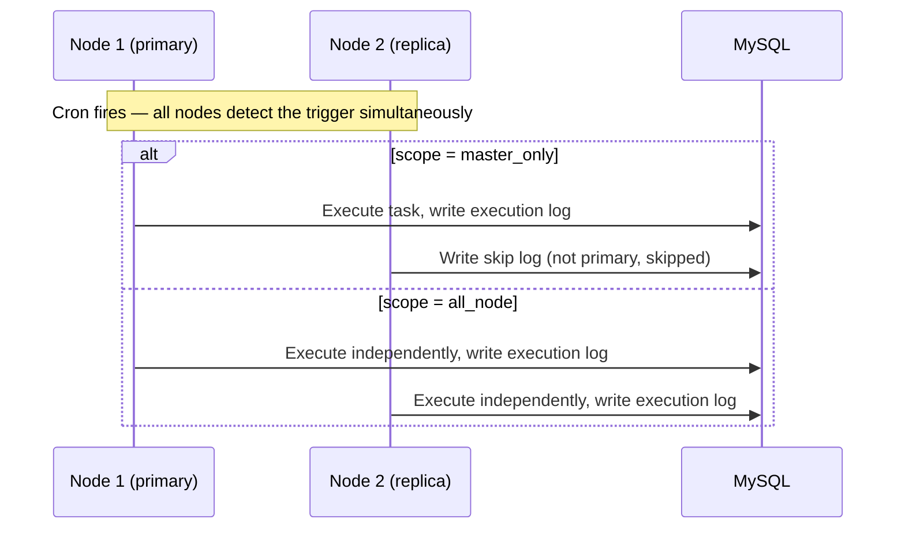

## Overview

LinaPro ships with a fully persistent task scheduling subsystem. Task configurations are stored in the database and can be created and managed through the management workspace UI. In cluster mode, scheduled tasks automatically prevent duplicate execution across nodes.

## Task Types

LinaPro supports two execution types for scheduled tasks:

| Type | Description | Use Cases |
|------|-------------|-----------|
| `Go` handler | Calls a Go function registered in the host | Tasks that need access to host capabilities (database, APIs, etc.) |
| `Shell` command | Executes a system shell command | Script tasks, file processing, system maintenance |

## Creating Tasks in the Management Workspace

Navigate to **Task Scheduling → Task Management** and click **New Task**:

| Field | Description |
|-------|-------------|
| Task Name | Display name for the task |
| Task Group | Group assignment for organizational filtering |
| Invocation Target | The name of the Go handler, or the shell command to run |
| Cron Expression | The trigger schedule (supports live preview of upcoming fire times) |
| Timeout | Maximum execution duration; the task is forcibly terminated if exceeded |
| Concurrency Policy | Whether to allow a new trigger while the previous execution is still running |
| Status | Active (enabled) or paused |

**Cron expression examples:**

| Expression | Description |
|------------|-------------|
| `0 * * * *` | Every hour, on the hour |
| `0 2 * * *` | Daily at 2:00 AM |
| `*/5 * * * *` | Every 5 minutes |
| `0 9 * * 1-5` | Weekdays at 9:00 AM |
| `0 0 1 * *` | First day of each month at midnight |

The management workspace provides a live cron preview: after entering an expression, you can immediately see the next several scheduled fire times.

## Manual Trigger

Tasks can be triggered manually from the management workspace for debugging and testing:

1. Locate the target task in the task list
2. Click **Run Now**
3. Check the **Execution Logs** to see the result

## Task Groups

Scheduled tasks can be organized into groups by business domain — each task belongs to one group. Groups make it easy to:

- Filter and view tasks by business module
- Pause or resume all tasks in a module at once
- Apply access controls (per-group authorization planned for a future release)

Go to **Task Scheduling → Group Management** to create and manage groups.

## Execution Logs

Every task execution produces a complete log entry:

| Field | Description |
|-------|-------------|
| Task Name | Which task ran |
| Start Time | When execution began |
| Duration | Elapsed time from start to finish |
| Result | Success or failure |
| Log Output | Task output (`stdout`/`stderr` for shell commands) |
| Error Details | If the task failed, the full error message is recorded |

Go to **Task Scheduling → Execution Logs** to browse execution history. Logs can be filtered by task name and time range.

## Registering Custom Cron Handlers in Plugins

Source plugins can register their own Go handlers via the `cron.register` extension point. Once registered, those handlers become available as invocation targets when creating tasks in the management workspace:

```go
// backend/plugin.go
import "github.com/linaproai/linapro/apps/lina-core/pkg/pluginhost"

func Register(p pluginhost.SourcePlugin) {
    // Register a cron handler
    p.Cron().RegisterCron(
        pluginhost.ExtensionPointCronRegister,
        pluginhost.CallbackExecutionModeBlocking,
        func(registry CronRegistry) {
            // Register the handler under the name "content-article:cleanup"
            registry.Register("content-article:cleanup", cleanupExpiredArticles)
        },
    )
}

// Cron handler implementation
func cleanupExpiredArticles(ctx context.Context) error {
    // Delete draft articles older than 90 days
    _, err := dao.ContentArticleRecord.Ctx(ctx).
        Where("status = ? AND created_at < ?", 0, time.Now().AddDate(0, 0, -90)).
        Delete()
    return err
}
```

After registration, `content-article:cleanup` will appear as an available invocation target when creating a new task in the management workspace.

## Distributed Scheduling in Cluster Mode

In cluster mode, LinaPro uses a task **execution scope** field to control which nodes run a given task, rather than relying on distributed lock contention. Each task is assigned one of the following scopes at creation time:

| Scope | Description | Use Cases |
|-------|-------------|-----------|
| `master_only` | Runs only on the current primary node; replica nodes detect the cron trigger but skip execution and write a skip log | Maintenance tasks requiring a single global execution, such as data archival or aggregated reporting |
| `all_node` | Each node executes independently | Tasks that should run locally on every node, such as local cache refresh or per-node health checks |



Every execution result is written to the shared database, so all nodes can review execution history from the management workspace.

## Shell Task Security

Shell-type scheduled tasks run system commands in the context of the host service process, with the same filesystem permissions as that process. Keep the following in mind:

- Only users with administrator privileges should be allowed to create or modify shell-type tasks
- Avoid commands with destructive side effects (e.g., `rm -rf`) in shell tasks
- Set a reasonable timeout for long-running shell tasks
- Shell task `stdout`/`stderr` output is truncated before storage (default maximum: `1 MB`) to prevent runaway log sizes

## Built-in Scheduled Tasks

The host registers several built-in scheduled tasks automatically at startup — no manual configuration required:

| Task | Frequency | Description |
|------|-----------|-------------|
| Session cleanup | Per `session.cleanupInterval` config | Removes expired online session records |
| Task log cleanup | Daily at midnight | Purges execution log entries older than the configured retention period |
