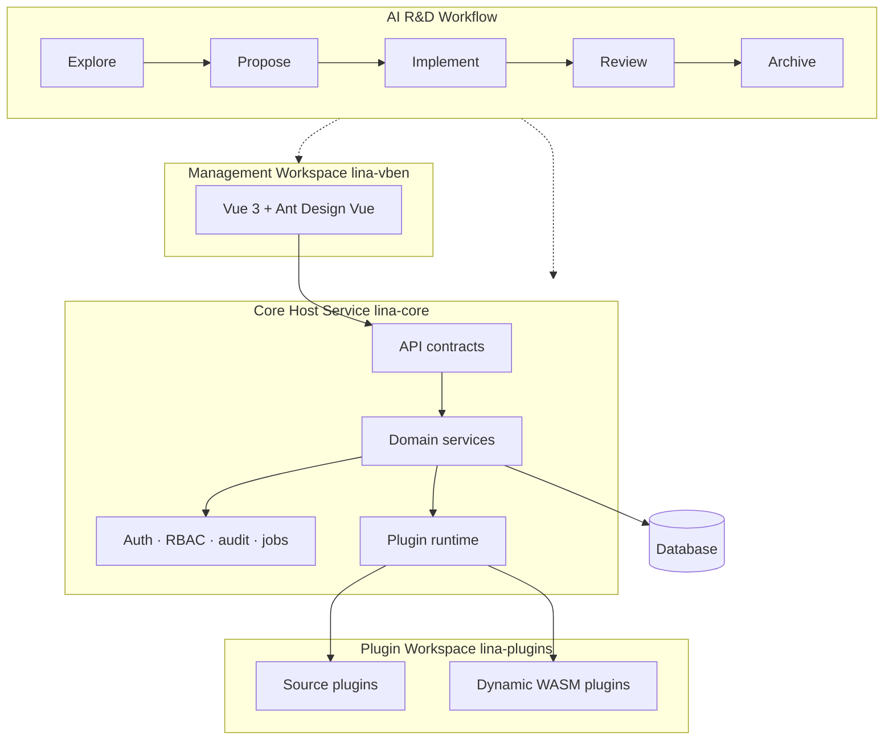

The runtime architecture keeps the host generic, the workspace contract-driven, and plugins independently owned.

## Runtime Contracts

| Contract | Owner |
| --- | --- |
| Backend routes and DTOs | `apps/lina-core/api` and plugin-local `backend/api`. |
| Management pages | `apps/lina-vben` and plugin-local `frontend/pages`. |
| Permissions and menus | Host governance data plus plugin manifests. |
| Database resources | Host SQL manifests or plugin-local `manifest/sql`. |
| Change intent | `openspec/changes` before implementation and `openspec/specs` after archive. |

## Design Rule

Do not make the host depend on plugin internals. Plugins should integrate through manifests, public host packages, lifecycle hooks, and published extension points.
