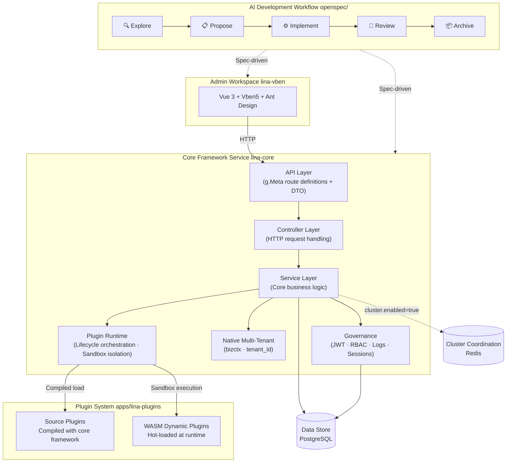

## Project Overview

`LinaPro` is an **AI-native full-stack framework built for sustainable delivery**. It unifies a spec-driven AI development workflow, a lifecycle-spanning AI skill set, a complete plugin runtime, and an integrated full-stack design — all backed by enterprise-grade building blocks like permission management, system configuration, and task scheduling. The result is a complete AI-native delivery foundation that teams can start building on from day one, with AI as the primary driver of business development and continuous delivery.


## Quick Links

| Resource | URL |
|----------|-----|
| **Open-source repository** | https://github.com/linaproai/linapro |
| **Live demo** | http://demo.linapro.ai/admin <br/>Username: `admin` <br/>Password: `admin123` |
| **Official website** | https://linapro.ai/ |

:::info Tip
The demo site is read-only, so data cannot be modified, but you can still explore the full `LinaPro` feature set and the admin workspace flow. To try full read/write capabilities locally, use the official demo image to deploy a complete environment quickly.
:::

## Demo Container Image


Run the following commands locally to start the complete demo image:

```bash
# Create a temporary directory
mkdir linapro-demo && cd linapro-demo
# Download the config file and Docker Compose file
curl -o config.yaml https://raw.githubusercontent.com/linaproai/linapro/refs/heads/main/hack/deploy/config.yaml
curl -o docker-compose.yaml https://raw.githubusercontent.com/linaproai/linapro/refs/heads/main/hack/deploy/docker-compose.yaml
# Start the service
docker compose up
```

Then visit the admin workspace address shown in the image startup logs and sign in with `admin/admin123`. In a source development environment, the default workspace address is `http://localhost:5666/admin`, and the core framework API address is `http://localhost:9120`.

:::info Tip
The `nightly` image is a daily build intended mainly for testing. You can also switch it to a stable version tag such as `v0.2.0`.
:::

## Who LinaPro Is For

`LinaPro` is designed for independent developers, engineering teams, and enterprises. Its core capabilities include:

- **AI-native development workflow**: A built-in spec-driven AI development workflow with first-class support for the optional-but-recommended `OpenSpec`, putting AI in charge of analysis, design, and implementation. Every change is anchored to incremental specs and mandatory E2E tests, so the team stays focused on direction and decisions
- **Rich AI skill ecosystem**: Over a dozen AI skills covering the full development lifecycle — backend development, frontend design, test authoring, code review, performance auditing, version upgrades, and more — embedded as domain knowledge in the framework's AI collaboration specs, so AI can make professionally grounded decisions in each context without needing re-briefed every session
- **Rapid business development**: A ready-to-use admin workspace and rich built-in modules that dramatically shorten time from zero to production
- **Integrated full stack**: Frontend and backend designed as a unified system — API contracts, permission models, and design conventions fully aligned without the overhead of integrating two separate frameworks
- **Complete API documentation**: Automatically aggregates core framework and plugin APIs with an interactive online browser and debugger
- **Plugin ecosystem**: A dual-mode plugin system (source plugins + `WASM` dynamic plugins) — any capability can be extended or replaced via plugins. Official plugins are maintained as `submodule`s independently, pulled on demand without bloating the core framework
- **Multi-tenant support**: Native multi-tenant capabilities built into the framework, with an official multi-tenant management plugin. Automatically falls back to single-tenant mode when disabled, with zero migration cost
- **Enterprise governance**: `JWT` authentication paired with declarative `RBAC`, with permissions declared at the API definition layer for natural auditability. Built-in operation logs, login logs, and session management
- **Native distributed architecture**: Built-in distributed locks, key-value cache, and horizontal scaling. Cluster mode uses a `Redis` coordinator for high availability — no changes to business code required

## Architecture



## Core Features

### AI-Native Development Workflow

`LinaPro`'s built-in spec-driven AI development workflow has first-class support for `OpenSpec`. `OpenSpec` is not a runtime dependency — the project runs fine without it. However, for team collaboration and continuous iteration, it is strongly recommended for a complete spec-driven closed loop:

- Explore → Propose → Implement → Review → Archive — every iteration goes through the full five-stage loop
- Every change is anchored to incremental spec files and mandatory E2E tests, preventing architectural drift and coverage gaps
- AI always builds on verified foundations rather than generating code from thin air
- Developers act as direction-setters and key decision-makers; requirements analysis, design, implementation, and testing are driven by AI within spec-defined constraints

### Rich AI Skill Ecosystem

`LinaPro` ships with over a dozen AI skills covering the full development lifecycle — backend development, frontend design, testing, code review, performance auditing, and version management. These skills are embedded as domain knowledge in the framework's AI collaboration specs. No installation required — AI tools activate them automatically in the right contexts, making accurate, framework-aware decisions without requiring the developer to re-explain project conventions in every session.

### Decoupled Core Framework and UI

- The core framework service (`lina-core`) is a pure backend runtime, completely decoupled from any frontend implementation
- The built-in admin workspace (`lina-vben`) is a reference UI for core framework capabilities and can be replaced by any frontend — including mobile apps, mini-programs, or custom admin systems
- The core framework exposes all capabilities through a stable `RESTful API` contract, independent of any frontend
- Multiple frontends can connect to the same core framework instance simultaneously

### Core Framework Service

`lina-core` is the stable foundation of the entire framework, providing:

- **API contract layer**: Complete `RESTful API` definitions covering system management, plugin governance, and shared platform capabilities
- **Service layer**: Unified implementations of core services including authentication, permissions, users, roles, menus, dictionaries, configuration, and file management
- **Plugin runtime**: Loads source plugins and `WASM` dynamic plugins, coordinates their full lifecycle, and provides stable extension interfaces
- **Governance capabilities**: Built-in `JWT` authentication, declarative `RBAC`, operation auditing, session management, and other enterprise-grade governance features
- **Task scheduling**: A built-in `Cron` subsystem with task groups, execution records, and error tracking
- **Infrastructure**: Distributed locks, key-value cache, `i18n`, database migrations, and other foundational capabilities

### Dual-Mode Plugin System

Plugins are `LinaPro`'s primary extension mechanism — each plugin is a self-contained module package:

- **Source plugins**: Compiled and deployed alongside the core framework at build time. Ideal for long-lived core business modules with no runtime overhead
- **`WASM` dynamic plugins**: Hot-loaded at runtime, supporting online install, enable, disable, and uninstall — all without restarting the core framework service
- Plugins run in isolated sandboxes; database and file access are namespace-isolated so plugins cannot interfere with each other
- Each plugin independently declares its API routes, business logic, database schema, frontend pages, and menus — fully self-contained and non-intrusive

Official source plugins live in `apps/lina-plugins/`, mounted as a `Git submodule`. When the submodule is not initialized, the core framework still runs independently. Pull official plugin content on demand with `git submodule update --init --recursive`.

### Enterprise-Level Permission Governance

- `JWT` authentication paired with declarative `RBAC`: permissions are declared as tags in the API definition layer, making them naturally visible and auditable
- Permission granularity down to the button level, with three-tier control over menus, pages, and actions
- Permission topology changes take effect quickly — immediately on single-node, within 3 seconds in a cluster — no service restart required
- Session management supports forced sign-out
- Login logs capture full IP address, device information, and login result

### Built-in Admin Workspace

`lina-vben` is the framework's built-in, fully functional admin workspace. Developers can build business applications directly on top of it. Built-in modules include permission management (users, roles, menus), organization management (departments, positions), system settings (dictionaries, parameters, files), announcements, task scheduling, system monitoring (online users, service monitoring, operation and login logs), plugin management, live API documentation, and — after installing the official `multi-tenant` plugin — tenant management and tenant plugin governance, covering the common foundational scenarios of enterprise applications.

### Native Multi-Tenant Support

`LinaPro` has native multi-tenant capabilities built into the framework, with an official `multi-tenant` management plugin:

- The core framework includes built-in tenant middleware and a `bizctx` tenant identity foundation as a stable capability
- The `multi-tenant` plugin provides complete tenant management: lifecycle management, user membership, and tenant resolution strategies
- When the plugin is not installed or not enabled, the core framework automatically falls back to single-tenant mode where `tenant_id = 0` — the out-of-box experience is unaffected
- Supports a pool-shared database model based on the `tenant_id` column; a single user can belong to multiple tenants

### Native Distributed Architecture

- Supports both single-node and distributed cluster deployments; horizontal scaling requires no changes to business code
- Single-node mode relies only on `PostgreSQL` with no additional components; cluster mode uses a distributed coordinator (`Redis` by default) for leader election, distributed locks, and cluster-aware caching
- The scheduled task subsystem is cluster-aware and automatically prevents duplicate execution across nodes


## Technology Stack

| Category | Technology | Notes |
|----------|------------|-------|
| **Backend language** | `Go` | `v1.25.0` |
| **Backend framework** | `GoFrame` | `v2.10.1` — routing, ORM, configuration, and more |
| **Frontend framework** | `Vue 3` | Based on the Vben 5 admin template |
| **Frontend UI** | `Ant Design Vue` | Enterprise-grade `UI` component library |
| **Data storage** | `PostgreSQL` | `PostgreSQL 14+` is the default data store |
| **Plugin runtime** | `WebAssembly` | `tetratelabs/wazero`, powers `WASM` dynamic plugins |
