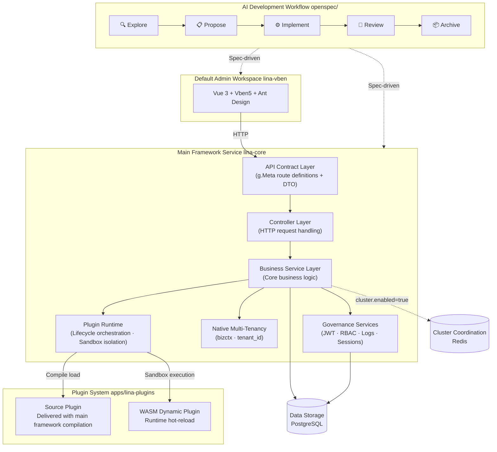

## Project Introduction

`LinaPro` is an **AI-native full-stack framework for sustainable delivery**. It integrates a spec-driven AI development workflow, a full-lifecycle AI skill system, a complete plugin runtime, and a frontend-backend unified full-stack design, while bundling enterprise-grade foundational capabilities such as permission management, system configuration, and task scheduling — building a complete AI-native delivery foundation for teams. Teams don't need to build infrastructure from scratch; from day one, they can use `AI` as the primary driver for business development and continuous delivery.

### Quick Links

| Resource | URL |
|----------|-----|
| **Open Source Repository** | https://github.com/linaproai/linapro |
| **Admin Demo** | https://demo.linapro.ai/admin <br/>Account: `admin` <br/>Password: `admin123`|
| **Official Website** | https://linapro.ai/ |

:::info Note
The demo site is read-only and cannot modify data, but you can fully experience `LinaPro`'s features and the admin workspace workflow. If you need to experience full read-write functionality locally, you can use the official demo image to quickly deploy a complete environment.
:::

### Demo Image

You can run the complete demo image locally with the following commands:

```bash
# Create temporary directory
mkdir linapro-demo && cd linapro-demo
# Download config file and Docker Compose file
curl -o config.yaml https://raw.githubusercontent.com/linaproai/linapro/refs/heads/main/hack/deploy/config.yaml
curl -o docker-compose.yaml https://raw.githubusercontent.com/linaproai/linapro/refs/heads/main/hack/deploy/docker-compose.yaml
# Start services
docker compose up
```

Then access the `LinaPro` default workspace at the admin workspace address shown in the image startup logs. Account/password: `admin/admin123`. The default workspace address for the source development environment is `http://localhost:5666/admin`, and the main framework API address is `http://localhost:9120`.

:::info Note
The image version `nightly` indicates a daily build image, primarily for testing. You can also change it to a stable version tag like `v0.2.0`.
:::

## Project Positioning

`LinaPro` targets independent developers, development teams, and enterprises, providing the following core capabilities:

| Capability | Description |
|------------|-------------|
| **AI-Native Development Workflow** | Built-in spec-driven AI development workflow, letting `AI` lead analysis, design, and implementation while teams focus on direction decisions |
| **Rich AI Skill System** | Over a dozen built-in AI skills covering the full development lifecycle, spanning backend development, frontend design, test writing, code review, and more |
| **Rapid Business Development** | Out-of-the-box admin workspace and rich built-in modules, significantly shortening time from zero to production |
| **Full-Stack Integration** | Unified frontend-backend design, with API contracts, permission models, and design specs fully aligned — no need to integrate two separate frameworks |
| **Complete API Documentation** | Automatically aggregates main framework and all plugin interfaces, supporting online browsing and debugging |
| **Plugin Ecosystem** | Dual-mode plugin system (source plugins + WASM dynamic plugins), any capability can be extended or replaced through plugins |
| **Multi-Tenant Support** | Framework-native multi-tenant capability with an official multi-tenant management plugin; automatically falls back to single-tenant mode when unenabled, zero migration cost |
| **Enterprise Governance** | JWT authentication with declarative RBAC permission system, built-in operation logs, login logs, session management, and other audit capabilities |
| **Native Distributed** | Underlying support for distributed locks, key-value caching, horizontal scaling; cluster mode achieves high availability through a coordinator without modifying business code |

## Technical Architecture



## Core Features

### AI-Native Development Workflow

`LinaPro` has a built-in spec-driven AI development workflow with solid support for `OpenSpec`. `OpenSpec` is not a runtime dependency — projects can run without it; but for team collaboration and continuous iteration, it is strongly recommended for the complete spec-driven loop:

- Explore → Propose → Implement → Review → Archive, each iteration goes through the complete five-stage loop
- Every change is anchored in incremental spec files and mandatory `E2E` tests, preventing architectural drift and test gaps
- `AI` always advances from a verified foundation rather than generating code from scratch
- Developers play the role of direction-setters and key decision-makers; requirements analysis, design, implementation, and testing are completed by `AI` under spec constraints

### Rich AI Skill System

`LinaPro` ships over a dozen built-in AI skills covering the full development lifecycle, spanning backend development, frontend design, test assurance, code review, performance auditing, version management, and more. These skills are embedded in the framework's AI collaboration specs as domain knowledge, require no additional installation, and are automatically activated by AI tools when handling corresponding scenarios. This lets `AI` make framework-compliant professional decisions at every work stage without repeatedly explaining project conventions in each conversation.

### Main Framework and Workspace Decoupling

- The main framework service (`lina-core`) is a pure backend runtime, completely decoupled from any frontend implementation
- The default admin workspace (`lina-vben`) is a reference `UI` implementation of main framework capabilities, replaceable with any frontend including mobile, mini-programs, or custom admin systems
- The main framework exposes all capabilities through stable `RESTful API` contracts, with interface definitions independent of the frontend
- Supports multiple frontends simultaneously connecting to the same main framework service, meeting different scenario UI needs

### Main Framework Service

`lina-core` is the stable foundation of the entire framework, providing:

- **API Contract Layer**: Complete `RESTful API` interface definitions covering system management, plugin governance, and shared platform capabilities
- **Business Service Layer**: Unified implementation of core services including authentication, permissions, users, roles, menus, dictionaries, configuration, files, and more
- **Plugin Runtime**: Loads source plugins and `WASM` dynamic plugins, coordinates their complete lifecycle, and provides stable extension interfaces
- **Governance Capabilities**: Built-in JWT authentication, declarative RBAC permissions, operation auditing, session management, and other enterprise governance capabilities
- **Task Scheduling**: Built-in `Cron` scheduled task subsystem with task grouping, execution records, and exception tracking
- **Infrastructure**: Distributed locks, key-value caching, `i18n` internationalization, database migration, and other underlying capabilities

### Dual-Mode Plugin System

Plugins are `LinaPro`'s primary extension point. Each plugin is a self-contained module package:

- **Source Plugins**: Compiled and deployed with the main framework, suitable for long-term maintained core business modules, zero performance overhead
- **WASM Dynamic Plugins**: Runtime hot-reload, supporting online install, enable, disable, and uninstall — all without restarting the main framework
- Plugins run in independently isolated sandboxes; database and file access are namespace-isolated, plugins don't interfere with each other
- Each plugin can independently declare `API` routes, business logic, database table structures, frontend pages, and menus — self-contained and zero-intrusion

Official source plugins reside in `apps/lina-plugins/`, mounted to the main repository as `Git submodule`s. When submodules are not initialized, the main framework can still run independently; when official plugin content is needed, execute `git submodule update --init --recursive` to pull on demand.

### Enterprise Permission Governance

- JWT authentication with declarative RBAC permission system; permissions are declared through tags in the API definition layer, naturally visible and auditable
- Permission granularity down to button level, supporting three-tier fine-grained control: menu, page, and operation
- Permission topology changes take effect quickly — instant on standalone, max 3 seconds on cluster, no service restart required
- Session management supports forced logout
- Login logs fully record IP address, device info, and login results

### Default Admin Workspace

`lina-vben` is the framework's built-in fully-featured admin workspace. Developers can build business applications directly on top of it. Built-in modules include permission management (users, roles, menus), organization management (departments, positions), system settings (dictionaries, parameters, files), announcements, task scheduling, system monitoring (online users, service monitoring, operation and login logs), plugin management, online API documentation, and — after installing the official `multi-tenant` plugin — tenant management and tenant plugin governance modules, covering common foundational scenarios for enterprise applications.

### Native Multi-Tenant Support

`LinaPro` framework natively includes multi-tenant capability, with an official `multi-tenant` management plugin:

- The main framework natively includes tenant middleware and the `bizctx` tenant identity foundation as a stable base capability
- The `multi-tenant` plugin provides complete tenant management: tenant lifecycle management, user membership, and tenant resolution strategies
- When the plugin is not installed or not enabled, the main framework automatically falls back to single-tenant mode with `tenant_id = 0` — out-of-the-box experience is unaffected
- Supports pool-shared database model based on `tenant_id` columns; a single user can join multiple tenants

### Native Distributed Architecture

- Supports both standalone and distributed cluster deployment modes; horizontal scaling requires no business code changes
- Standalone mode depends only on `PostgreSQL`, no additional components needed; cluster mode achieves leader election, distributed locks, and cluster-aware caching through a distributed coordinator (default `Redis`)
- The scheduled task scheduling subsystem has distributed awareness, automatically avoiding duplicate execution in cluster environments

## Main Technology Stack

| Category | Technology | Description |
|----------|------------|-------------|
| **Backend Language** | `Go` | `v1.25.0` |
| **Backend Framework** | `GoFrame` | `v2.10.1`, providing routing, `ORM`, configuration, and other complete capabilities |
| **Frontend Framework** | `Vue 3` | Based on `Vben 5` admin template |
| **Frontend UI** | `Ant Design Vue` | Enterprise-grade `UI` component library |
| **Data Storage** | `PostgreSQL` | `PostgreSQL 14+` as default data storage |
| **Plugin Runtime** | `WebAssembly` | `tetratelabs/wazero`, supporting `WASM` dynamic plugins |
