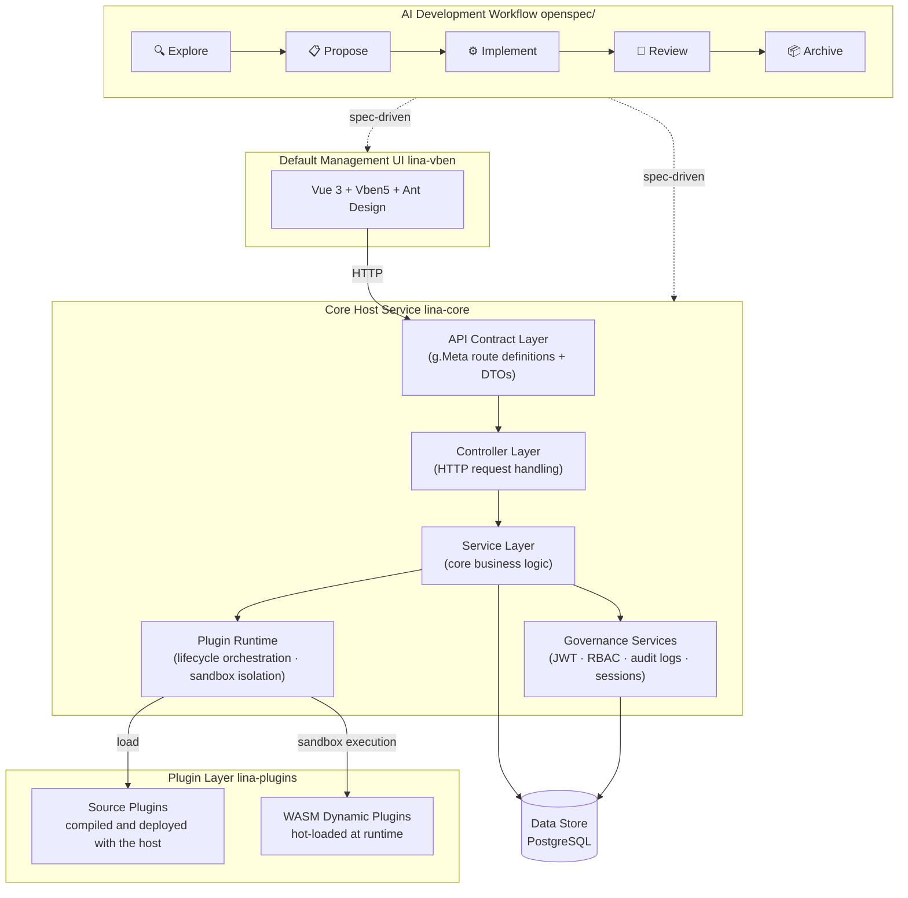

## About LinaPro

`LinaPro` is an **AI-native full-stack framework built for sustainable delivery**. It unifies a spec-driven AI development workflow, a lifecycle-spanning AI skill set, a complete plugin runtime, and an integrated full-stack design — all backed by enterprise-grade building blocks like permission management, system configuration, and task scheduling. The result is a complete AI-native delivery foundation that teams can start building on from day one, without assembling infrastructure from scratch.


## Quick Links

| Resource | URL |
|----------|-----|
| **Open-source repository** | https://github.com/linaproai/linapro |
| **Live demo** | http://demo.linapro.ai/ <br/>Username: `admin` <br/>Password: `admin123` |
| **Official website** | https://linapro.ai/ |

:::info Tip
The demo site is read-only, so data cannot be modified, but you can still explore the full `LinaPro` feature set and the management workspace flow. To try full read/write capabilities locally, use the official demo image to deploy a complete environment quickly.
:::

## Demo Container Image

Run the following command locally to start the complete demo image:

```bash
docker run -p 8080:8080 ghcr.io/linaproai/linapro:nightly
```

Then visit http://127.0.0.1:8080 to try the default `LinaPro` management workspace with username/password `admin/admin123`.

:::info Tip
The `nightly` image is a daily build intended mainly for testing. You can also switch it to a stable version tag such as `v0.1.0`.
:::

## Who LinaPro Is For

LinaPro is designed for independent developers, engineering teams, and enterprises. Its core capabilities include:

- **AI-native development workflow**: A built-in spec-driven AI development workflow with first-class OpenSpec support that puts AI in charge of analysis, design, and implementation. Every change is anchored to incremental specs and mandatory E2E tests, so the team stays focused on direction and decisions
- **Rich AI skill ecosystem**: Over a dozen AI skills covering the full development lifecycle — backend development, frontend design, test authoring, code review, performance auditing, version upgrades, and more — embedded as domain knowledge in the framework's AI collaboration specs, so AI can make professionally grounded decisions in each context without needing re-briefed every session
- **Rapid business development**: A ready-to-use management workspace and rich built-in modules that dramatically shorten time from zero to production
- **Integrated full stack**: Frontend and backend designed as a unified system — API contracts, permission models, and design conventions fully aligned without the overhead of integrating two separate frameworks
- **Complete API documentation**: Automatically aggregates host and plugin APIs with an interactive online browser and debugger
- **Plugin ecosystem**: A dual-mode plugin system (source plugins + WASM dynamic plugins) — any capability can be extended or replaced via plugins
- **Enterprise governance**: JWT authentication paired with declarative RBAC, with permissions declared at the API definition layer for natural auditability. Built-in operation logs, login logs, and session management
- **Native distributed architecture**: Built-in distributed locks, key-value cache, and horizontal scaling — no special migration required as your workload grows

## Architecture



## Core Features

### AI-Native Development Workflow

LinaPro's built-in spec-driven AI development workflow, with first-class OpenSpec support, covers the complete cycle from requirement to delivery:

- Explore → Propose → Implement → Review → Archive — every iteration goes through the full five-stage loop
- Every change is anchored to incremental spec files and mandatory E2E tests, preventing architectural drift and coverage gaps
- AI always builds on verified foundations rather than generating code from thin air
- Developers act as direction-setters and key decision-makers; requirements analysis, design, implementation, and testing are driven by AI within spec-defined constraints

### Rich AI Skill Ecosystem

LinaPro ships with over a dozen AI skills covering the full development lifecycle — backend development, frontend design, testing, code review, performance auditing, and version management. These skills are embedded as domain knowledge in the framework's AI collaboration specs. No installation required — AI tools activate them automatically in the right contexts, making accurate, framework-aware decisions without requiring the developer to re-explain project conventions in every session.


### Decoupled Host and UI

- The core host service (`lina-core`) is a pure backend runtime, completely decoupled from any frontend implementation
- The default management workspace (`lina-vben`) is a reference UI for the host's capabilities and can be replaced by any frontend — including mobile apps, mini-programs, or custom admin systems
- The host exposes all capabilities through a stable RESTful API contract, independent of any frontend
- Multiple frontends can connect to the same host instance simultaneously

### Core Host Service

`lina-core` is the stable foundation of the entire framework, built on GoFrame. It provides:

- **API contract layer**: Complete RESTful API definitions covering system management, plugin governance, and shared platform capabilities
- **Service layer**: Unified implementations of core services including authentication, permissions, users, roles, menus, dictionaries, configuration, and file management
- **Plugin runtime**: Loads source plugins and WASM dynamic plugins, coordinates their full lifecycle, and provides stable extension points
- **Governance capabilities**: Built-in JWT authentication, declarative RBAC, operation auditing, session management, and other enterprise-grade governance features
- **Task scheduling**: A built-in cron subsystem with task groups, execution records, and error tracking
- **Infrastructure**: Distributed locks, key-value cache, i18n, database migrations, and other foundational capabilities

### Dual-Mode Plugin System

Plugins are LinaPro's primary extension mechanism — each plugin is a self-contained module package:

- **Source plugins**: Compiled and deployed alongside the host at build time. Ideal for long-lived core business modules with no runtime overhead
- **WASM dynamic plugins**: Hot-loaded at runtime, supporting online install, enable, disable, and uninstall — all without restarting the host
- Plugins run in isolated sandboxes; database and file access are namespace-isolated so plugins cannot interfere with each other
- Each plugin independently declares its API routes, business logic, database schema, frontend pages, and menus — fully self-contained and non-intrusive

### Enterprise Security

- JWT authentication paired with declarative RBAC: permissions are declared as tags in the API definition layer, making them naturally visible and auditable
- Permission granularity down to the button level, with three-tier control over menus, pages, and actions
- Permission topology changes take effect quickly — immediately on single-node, within 3 seconds in a cluster — no service restart required
- Session management supports forced sign-out
- Login logs capture full IP address, device information, and login result

### Default Management Workspace

`lina-vben` is the framework's built-in, fully functional management workspace. Developers can build business applications directly on top of it:

#### Permission Management

- **User management**: User CRUD, role assignment, password reset, status management, batch export
- **Role management**: Role definition, menu permission assignment, button-level authorization
- **Menu management**: Dynamic menu tree with directory, menu, and button levels

#### Organization Management

- **Department management**: Hierarchical org structure, supporting multi-level departments
- **Position management**: Position definitions and staff associations

#### System Settings

- **Dictionary management**: Unified dictionary type and entry management with import/export
- **Parameter settings**: Runtime parameter management with config import/export
- **File management**: File upload, download, and storage management

#### Content Management

- **Announcements**: Announcement CRUD with support for multiple announcement types

#### Task Scheduling

- **Task management**: Cron expression configuration, run-now, pause/resume, execution history
- **Group management**: Tasks organized by business domain
- **Execution logs**: Execution record queries and error log inspection

#### System Monitoring

- **Online users**: Real-time session view with force sign-out
- **Service monitoring**: Server CPU, memory, disk, and runtime stats
- **Operation logs**: User action audit trail with request parameters, duration, and outcome
- **Login logs**: Login history with IP address, device info, and result

#### Extension Center

- **Plugin management**: Plugin install, enable, disable, uninstall, and version management

#### Developer Center

- **API documentation**: Interactive online API browser and debugger, automatically aggregating host and plugin interfaces
- **System info**: Runtime environment details

### Native Distributed Architecture

- Supports both single-node and distributed cluster deployments; horizontal scaling requires no changes to business code
- Built-in distributed lock and key-value cache mechanisms with cluster-aware core components
- The scheduled task subsystem is cluster-aware and automatically prevents duplicate execution across nodes


## Technology Stack

| Category | Technology | Notes |
|----------|------------|-------|
| Backend language | `Go` | `v1.25.0` |
| Backend framework | `GoFrame` | `v2.10.1` — routing, ORM, configuration, and more |
| Frontend framework | `Vue 3` | Based on the Vben 5 admin template |
| Frontend UI | `Ant Design Vue` | Enterprise-grade UI component library |
| Build tool | `Vite` | Fast frontend builds |
| Database | `PostgreSQL` / optional `SQLite` | `PostgreSQL 14+` is the default data store. `SQLite` is available for local demos or smoke testing only; it is single-node and not for production. |
| Plugin runtime | `WebAssembly` | `tetratelabs/wazero`, powers WASM dynamic plugins |
