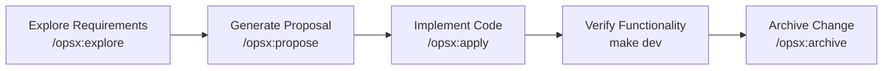

This guide walks you through building an article management CRUD plugin to experience LinaPro's AI-native development workflow from start to finish. AI drives the entire process — requirements analysis, system design, code implementation, and testing. You step in at key decision points to guide and approve.

## What We're Building

A source plugin called `content-article` that provides full article CRUD management, including:

- Article listing with pagination
- Create, edit, and delete articles
- Article status management (draft / published)
- RBAC permission integration on the backend

The entire process is driven by Claude Code through the OpenSpec workflow. Expect it to take around 30 minutes.

:::info
We recommend Claude Code — it is widely regarded as the most capable AI coding tool available today. That said, other tools like Codex CLI and Cursor work well too. Use whichever you're most comfortable with.
:::

## Prerequisites

Make sure LinaPro is installed and the service starts cleanly. See [Environment Setup](/quick/environment) and [Installation](/quick/installation) before continuing.

Open Claude Code in the project root:

```bash
claude
```

:::info
In LinaPro's development workflow, you don't need to call OpenSpec slash commands explicitly — you can drive the entire process with natural language instructions and AI will recognize your intent and execute the appropriate workflow operations. We use explicit slash commands here to make each phase of the workflow clearly visible.
:::

## Step 1: Explore Requirements

Start with an exploration conversation — let AI understand the requirements, analyze the existing architecture, and help you clarify exactly what needs to be built.

In Claude Code, enter:

```text
/opsx:explore I want to build an article management module with full CRUD — title, content, status (draft/published), and author info. It should be developed as a source plugin.
```

**What AI does:**

- Reads `CLAUDE.md` and the `openspec/` directory to understand the project architecture and conventions
- Browses existing source plugins (e.g., `plugin-demo-source`) for reference
- Analyzes the requirements and identifies the database tables, API endpoints, frontend pages, and menu entries that need to be created
- Raises potential questions and design suggestions — for example, whether article categories are needed, or whether cover image uploads should be supported

**What you do:**

Answer AI's clarifying questions to nail down the feature scope. For example:

```text
No categories for now, and no cover images either — just basic CRUD to start.
Use content-article as the plugin ID. Mount it under the content management menu.
```

Go back and forth with AI until you both have a shared understanding of the requirements, then move to the next step.

## Step 2: Generate a Proposal

Once requirements are explored, ask AI to formalize the discussion into an official OpenSpec change proposal.

In Claude Code, enter:

```text
/opsx:propose content-article
```

**What AI does:**

Automatically generates the following documents under `openspec/changes/content-article/`:

| File | Contents |
|------|----------|
| `proposal.md` | Change background, scope, and impact analysis |
| `design.md` | Database schema, API interface definitions, frontend page structure |
| `tasks.md` | Decomposed implementation task list, each with a clear acceptance criterion |
| `specs/` | Incremental capability specs describing the expected behavior of this plugin |

**What you do:**

Review the generated documents, paying particular attention to:

- Whether the database fields in `design.md` match your expectations
- Whether the task breakdown in `tasks.md` is complete and reasonable
- If anything is missing or off, tell AI to revise it

```text
The design looks good, let's start implementing.
```

## Step 3: Implement the Code

Once the proposal is approved, ask AI to implement the code task by task.

In Claude Code, enter:

```text
/opsx:apply
```

**What AI does:**

Works through the task list in `tasks.md` and completes the following:

**Backend (`backend/`):**

```text
1. Create plugin.yaml to declare plugin metadata and menus
2. Create install SQL (manifest/sql/): create the content_article table
3. Create uninstall SQL (manifest/sql/uninstall/): drop the content_article table
4. Generate DAO/DO/Entity data access layer (gf gen dao)
5. Define API DTOs and route interfaces (backend/api/)
6. Implement controllers (backend/internal/controller/)
7. Implement the service layer (backend/internal/service/)
8. Write the plugin registration entry (backend/plugin.go)
9. Wire the new plugin into the host's plugin registry file
```

**Frontend (`frontend/`):**

```text
10. Create the article list page (frontend/pages/article-list.vue)
    - Table showing the article list with pagination
    - Action column: edit and delete buttons
    - Toolbar: add button, status filter
11. Create the article form modal
    - Title, content (rich text or multi-line text), and status fields
    - Form validation
12. Connect to the backend API
```

**Tests (`hack/tests/`):**

```text
13. Write E2E test cases (TC{NNNN}-content-article.ts)
    - Test the article creation flow
    - Test the article editing flow
    - Test the article deletion flow
14. Run tests to verify functionality
```

**What you do:**

AI needs very little input from you during implementation — you can monitor the progress and provide feedback if you notice anything. Once all tasks are complete, AI automatically runs unit tests and E2E tests, then triggers the `/lina-review` skill for a code and spec review. If issues are found, AI fixes them and re-reviews until everything passes.

## Step 4: Start the Service and Access the Plugin

After implementation is complete, AI typically stops the service and reports the work done. At that point you can start the service manually to review and accept the results:

```bash
make dev
```

Once the service is up, open the management workspace at `http://localhost:5666`.

**Install and enable the plugin:**

1. Log in to the management workspace (`admin / admin123`)
2. Go to **Extension Center → Plugin Management**
3. Find the `content-article` plugin and click **Install and Enable**

**Access the article management page:**

Once the plugin is enabled, **Content Management → Article Management** automatically appears in the left sidebar. Click through to use the full article CRUD interface.

To adjust permissions, go to **Permission Management → Role Management** and grant the relevant role the article management button permissions.

**Found an issue? Report it with `/lina-feedback`:**

If you spot a bug, missing functionality, or a UX problem during acceptance, describe it in Claude Code and AI will fix it:

```text
/lina-feedback The article list pagination is broken — page 2 shows the same results as page 1
```

AI will:

- Record the issue as an `FB-N` task in `tasks.md`
- Investigate the root cause and apply a minimal, focused fix
- Write an E2E test to verify the fix and check for regressions in related modules

Be specific: describe "where, what you did, what you expected, and what you saw" to help AI zero in faster. You can report multiple issues at once — AI handles them one by one and delivers a fix summary when done.

## Step 5: Archive the Change

After verifying that everything works, archive this iteration to lock in the specs as a project baseline.

In Claude Code, enter:

```text
/opsx:archive
```

**What AI does:**

- Runs a comprehensive code and spec review one more time
- Syncs the incremental specs to `openspec/specs/` as the new baseline
- Moves the change directory to `openspec/changes/archive/` to complete archival

After archiving, all design decisions, API specs, and implementation details from this iteration are fully documented. On the next iteration, AI builds forward from these verified specs.

## Summary

You've just experienced LinaPro's complete AI-native development loop:



**Key characteristics:**

- **Humans own direction and decisions** — no manual coding required
- **AI guarantees implementation and documentation stay in sync** — specs and code are always updated together
- **Every iteration is fully documented** — architecture doesn't drift over time
- **Plugins are loosely coupled** — any plugin can be independently disabled or uninstalled without affecting others

From here, you can explore the [Plugin Development](/docs/plugin-development) guide for a full reference on source plugins and WASM dynamic plugins, or dive into the [Development Manual](/docs/architecture) for a detailed look at the framework's architecture.
