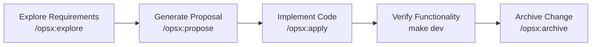

This guide walks you through building an article management `CRUD` plugin and experiencing LinaPro's full `AI`-native development flow. The entire process is led by `AI` from requirement analysis and system design to code implementation and test verification. You only need to provide guidance and decisions at key points.

## Development Goal

Build a source plugin named `content-article` that provides article create, read, update, and delete management, including:

- Article list display and pagination
- Article creation, editing, and deletion
- Article status management (draft, published)
- Backend `RBAC` permission integration

The entire development process is driven by `Claude Code` through the spec-driven workflow and usually takes about `30` minutes.

:::info Note
We recommend `Claude Code` because it is currently regarded as one of the strongest `AI Coding` tools in the industry. Other tools such as `Codex CLI` and `Cursor` also work well, so choose the `AI Coding` tool you are most comfortable with.
:::

## Prerequisites

Make sure installation is complete and the service can start normally. See [Environment Setup](./1500-environment.md) and [Quick Installation](./2000-installation.md).

Open `Claude Code` in the project root:

```bash
claude
```

:::info Note
In LinaPro development, you can drive the entire process with natural-language instructions, and `AI` will identify the intent and execute the corresponding workflow operation. This guide uses explicit slash commands only to make each workflow stage easier to see.
:::

## Step 1: Explore Requirements

The first step is an exploration conversation that lets `AI` understand the requirement, analyze the existing architecture, and help you clarify what should be built.

Enter a rough idea or requirement in `Claude Code`, then explore the background and technical approach with `AI`:

```text
/opsx:explore I want to develop an article management module with create, read, update, and delete support, including title, content, status (draft/published), and author information. I want to build it as a source plugin.
```

**What AI does:**

- Reads `CLAUDE.md` and the `openspec/` directory to understand the project architecture and conventions
- Browses existing source plugins, such as `plugin-demo-source`, as references
- Analyzes the requirement and identifies the database tables, `API` interfaces, frontend pages, and menus that need to be created
- Raises possible questions and design suggestions, such as whether article categories are needed or whether cover image upload should be supported

**What you need to do:**

Answer `AI`'s clarifying questions and define the feature boundary.
Go through a few rounds of conversation with `AI` until both sides share the same understanding of the requirement, then move to the next step.

:::info Note
The requirement exploration stage aligns the developer and `AI` on requirement details and the technical design, so `AI` can generate proposals and implement code accurately in later stages. The more thoroughly you communicate at this stage, the more efficient and reliable the following development work becomes.
:::

## Step 2: Generate a Proposal

After requirement exploration is complete, ask `AI` to turn the discussion into an official `OpenSpec` change proposal.

Enter in `Claude Code`:

```text
/opsx:propose content-article
```

**What AI does:**

Automatically generates the following documents under `openspec/changes/content-article/`:

| File | Contents |
|------|----------|
| `proposal.md` | Change background, target scope, and impact analysis |
| `design.md` | Database table design, `API` interface definitions, and frontend page structure |
| `tasks.md` | Decomposed implementation tasks, each with clear completion criteria |
| `specs/` | Incremental capability specs that describe the expected behavior of this plugin |

**What you need to do:**

Review the documents generated by `AI`, focusing on:

- Whether the table fields in `design.md` match your expectations
- Whether the task breakdown in `tasks.md` is complete and reasonable
- If anything is missing or inaccurate, tell `AI` to revise it directly

```text
The design looks good. You can start implementation.
```

## Step 3: Implement the Code

After the proposal is confirmed, ask `AI` to implement the code task by task.

Enter in `Claude Code`:

```text
/opsx:apply
```

**What AI does:**

Works through the task list in `tasks.md` and completes the following implementation work:

**Backend implementation (`backend/`):**

```text
1. Create plugin.yaml to declare plugin metadata and menus
2. Create install SQL (manifest/sql/): create the content_article table
3. Create uninstall SQL (manifest/sql/uninstall/): drop the content_article table
4. Generate DAO/DO/Entity data access layer (gf gen dao)
5. Define API DTOs and route interfaces (backend/api/)
6. Implement controllers (backend/internal/controller/)
7. Implement business service layer (backend/internal/service/)
8. Write plugin registration entry (backend/plugin.go)
9. Wire the new plugin into the host plugin registry file
```

**Frontend implementation (`frontend/`):**

```text
10. Create article list page (frontend/pages/article-list.vue)
    - Table showing articles with pagination
    - Action column: edit and delete buttons
    - Toolbar: add button and status filter
11. Create article form modal
    - Title, content (rich text or multiline text), and status fields
    - Form validation
12. Connect to backend API
```

**Tests (`hack/tests/`):**

```text
13. Write E2E test cases (TC{NNNN}-content-article.ts)
    - Test article creation flow
    - Test article editing flow
    - Test article deletion flow
14. Run tests to verify functionality
```

**What you need to do:**

During implementation, `AI` usually needs very little intervention, but you can inspect the generated code at any time and provide feedback if you notice a problem.

**After implementation:**

After all tasks are complete, `AI` automatically runs unit tests and `E2E` tests, then triggers the `/lina-review` skill for code and spec review. If issues are found, `AI` fixes them and reviews again until all tests pass.

## Step 4: Start the Service and Access the Plugin

After code implementation is complete, `AI` usually stops the service and reports that the work is done. At this point, you can manually start the service and review the completed page behavior and source implementation:

```bash
make dev
```

After the service starts, open the management workspace: `http://localhost:5666`

**Install and enable the plugin:**

1. Log in to the management workspace (`admin / admin123`)
2. Go to "Extension Center -> Plugin Management"
3. Find the `content-article` plugin and click "Install and Enable"

**Access the article management page:**

After the plugin is enabled, the "Content Management -> Article Management" entry appears automatically in the left sidebar. Open it to use the full article `CRUD` feature.

To adjust permissions, go to "Permission Management -> Role Management" and assign the article management button permissions to the relevant role.

**When you find an issue, report it with `/lina-feedback`:**

If you find a `Bug`, incomplete feature, or experience issue during acceptance, describe it directly in `Claude Code`. `AI` will apply a targeted fix and complete testing:

```text
/lina-feedback The article list pagination is incorrect. Page 2 shows the same data as page 1.
```

`AI` will:

- Record the issue as an `FB-N` task in `tasks.md`
- Analyze the root cause and apply a minimal fix
- Write an `E2E` test to verify the fix and check regression risk in related modules

The more specific your report is, covering "where", "what you did", "expected result", and "actual result", the faster the issue can be located. You can submit multiple issues at once, and `AI` will handle them one by one before reporting the fix summary.

:::info Note
For product projects that need long-term maintenance, you should also review the code generated by `AI` at this stage to make sure the implementation logic matches your expectations. If you skip review here, `AI` may leave subtle issues that only become visible in later iterations, when the cost of fixing them is higher.
:::

## Step 5: Archive the Change

After the feature is verified, archive this iteration so the specs are consolidated into the project baseline.

Enter in `Claude Code`:

```text
/opsx:archive
```

**What AI does:**

- Runs a comprehensive code and spec review again
- Syncs the incremental specs into `openspec/specs/` as the baseline
- Moves the change directory into `openspec/changes/archive/` to complete archival

After archival, all design decisions, interface specs, and implementation details from this iteration have complete documentation. In the next iteration, `AI` can continue from these verified specs.

## Summary

Through this example, you have experienced LinaPro's complete `AI`-native development loop:



**Key characteristics:**

- **Humans are responsible for direction and decisions**, without manually writing code
- **AI ensures implementation and documentation stay consistent**, with specs and code updated together
- **Every iteration has a complete record**, so the architecture does not drift over time
- **Plugins use a loosely coupled design**, so they can be disabled or uninstalled independently without affecting other modules

Next, read [Source Plugins](/docs/source-plugins) to learn the full development rules for source plugins and `WASM` dynamic plugins, or read [Components](/docs/components) for the framework's detailed architecture design.
