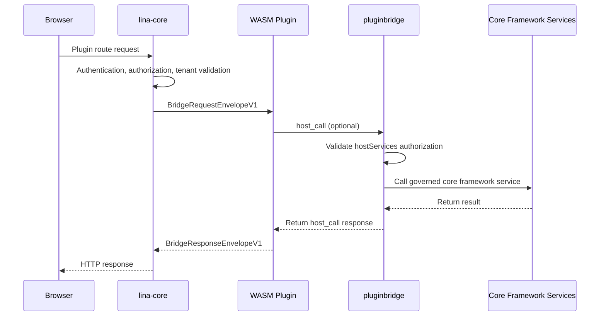

## Introduction

Dynamic plugins are `LinaPro`'s runtime-extensible plugin form. They compile plugins into `.wasm` artifacts and support uploading, installing, enabling, disabling, uninstalling, and explicit upgrading at runtime — all without recompiling the core framework.

Dynamic plugins run inside a `WASM` sandbox. They cannot directly access the core framework's filesystem, network, or database; every access to core framework capabilities must go through `pluginbridge` and `hostServices` authorization.

### When to Use

| Scenario | Description |
|----------|-------------|
| **Runtime hot-loading** | Upload a `.wasm` artifact and it enters the plugin governance pipeline immediately |
| **Rapid feature validation** | Quickly deploy a proof-of-concept feature, then decide whether to convert it to a source plugin |
| **Commercial plugin distribution** | Ship only binary artifacts without exposing source code |
| **Controlled external integrations** | Network, storage, and data access are all governed through authorization snapshots |

For long-term core business capabilities, source plugins remain the preferred choice. Dynamic plugins are suited for scenarios that require hot-loading and stronger isolation.

### What Is WebAssembly?

`WebAssembly` (abbreviated `WASM`) is a binary instruction format for a stack-based virtual machine, standardized by the `W3C`. Originally designed for browsers, it is now widely adopted in server-side, edge computing, and plugin system scenarios.

- **Cross-platform portability**: `WASM` modules are platform-agnostic binaries. The same `.wasm` artifact runs on `Linux`, `macOS`, and `Windows` across `x86`, `ARM`, and other architectures without recompilation.

- **Secure sandbox**: `WASM` executes in a strictly isolated sandbox by default, with no access to the host filesystem, network, memory, or system calls. All host capabilities require explicit interface authorization, fundamentally limiting the blast radius of malicious code or vulnerabilities.

- **Near-native performance**: `WASM` uses a compact binary format that can be just-in-time compiled (`JIT`) to native machine code at runtime, delivering execution efficiency close to native code while maintaining sandbox isolation.

- **Hot-loading support**: `WASM` modules can be loaded and unloaded dynamically at runtime without restarting the core framework process. This gives plugin systems a natural hot-update capability — new module versions can go live or roll back without affecting the overall system.

- **Multi-language ecosystem**: Languages like `Go`, `Rust`, `C/C++`, and `AssemblyScript` can all compile to `WASM`, so plugin developers are not locked into a single tech stack. `LinaPro` currently uses `Go` as the primary plugin development language and extends the sandbox-to-host communication contract through `WASI` (`WebAssembly System Interface`).

## Runtime Model



The core framework completes authentication, authorization, and tenant context processing before passing a request snapshot into the `WASM` instance. Dynamic plugins see a structured request envelope, not raw core framework internal objects.


## Directory Layout

The source directory layout of a dynamic plugin mirrors that of a source plugin, with an additional `main.go` serving as the `WASM` entry point:

```text
apps/lina-plugins/<plugin-id>/
├── main.go                          # WASM export function entry point
├── plugin.yaml
├── plugin_embed.go
├── backend/
│   ├── api/                         # API DTOs and route contracts
│   ├── internal/
│   │   ├── controller/              # HTTP controllers
│   │   ├── service/                 # Business service layer
│   │   ├── dao/                     # gf gen dao output
│   │   └── model/                   # do/entity models
│   └── plugin.go                    # Plugin registration entry
├── frontend/
│   └── pages/                       # Dynamic plugin frontend assets
├── manifest/
│   ├── config/
│   │   ├── config.yaml              # Default config bundled with the dynamic artifact
│   │   └── config.example.yaml      # Configuration template, not a runtime default
│   ├── sql/                         # Installation and upgrade SQL
│   │   ├── mock-data/               # Demo data, optional
│   │   └── uninstall/               # Uninstallation SQL
│   └── i18n/                        # Plugin language packs
└── README.md
```

The build tool reads plugin embedded resources first and falls back to scanning the directory when needed. It writes `plugin.yaml`, `frontend/` assets, `manifest/sql`, `manifest/i18n`, `manifest/config/config.yaml`, `manifest/config/config.example.yaml`, and other resources under `manifest/` into the dynamic artifact. Runtime resources are bound to the checksum and build number of the current active release — installing, enabling, disabling, uninstalling, upgrading, or refreshing the same version all trigger the corresponding cache invalidation.

The configuration and `manifest` resource path semantics for dynamic plugins are consistent with source plugins. `manifest/config/config.yaml` serves as the default configuration snapshot bundled with the dynamic artifact; it only acts as a fallback when no production external configuration or development-time config file exists. `manifest/config/config.example.yaml` is merely a template. Files such as `profile.yaml`, `resources/policy.yaml`, `config/config.example.yaml`, `sql/*.sql`, and `i18n/*.json` can be read verbatim through the `manifest` `hostService`, but the relevant paths must be authorized in `resources.paths`. Reading the raw content does not activate configuration, `SQL`, or language-pack pipelines. For full details, see [Plugin Configuration and Manifest Resources](./4000-plugin-config-and-manifest.md).

## WASM Entry Points

Dynamic plugins must export the functions specified by the core framework contract. Taking the official example as a reference:

```go
var guestRuntime = pluginbridge.NewGuestRuntime(dynamicbackend.HandleRequest)

//go:wasmexport lina_dynamic_route_alloc
func linaDynamicRouteAlloc(size uint32) uint32 {
    return guestRuntime.Alloc(size)
}

//go:wasmexport lina_dynamic_route_execute
func linaDynamicRouteExecute(size uint32) uint64 {
    responsePointer, responseLength, err := guestRuntime.Execute(size)
    if err != nil {
        fallback, _ := pluginbridge.EncodeResponseEnvelope(
            pluginbridge.NewInternalErrorResponse(err.Error()),
        )
        responsePointer, responseLength, _ = guestRuntime.ExposeResponseBuffer(fallback)
    }
    return uint64(responsePointer)<<32 | uint64(responseLength)
}

//go:wasmexport lina_host_call_alloc
func linaHostCallAlloc(size uint32) uint32 {
    return guestRuntime.HostCallAlloc(size)
}

func main() {}
```

Business routing is typically delegated to `pluginbridge.MustNewGuestControllerRouteDispatcher`, where controller methods handle individual requests. `linactl` injects the contract metadata required for zero-reflection dispatch when building for `wasip1`.

## hostServices Authorization

Dynamic plugins must declare the core framework services, methods, and resource scopes they need in `plugin.yaml`. The core framework writes the authorization into the release snapshot at install or enable time; any unauthorized call at runtime is rejected.

| Service | Typical Capabilities |
|---------|---------------------|
| `runtime` | Log writing, plugin status, time, `UUID`, node information |
| `data` | Database reads and writes, constrained by table scope and tenant filtering |
| `storage` | File reads and writes within the plugin's namespace |
| `network` | External `HTTP` requests, constrained by target address |
| `cache` | Cluster-aware cache reads and writes |
| `lock` | Distributed lock acquisition, renewal, and release |
| `cron` | Built-in task registration for dynamic plugins |
| `config` | Read-only access to the current plugin's own configuration |
| `hostConfig` | Read-only access to allowlisted host public configuration keys |
| `manifest` | Raw resource reading from the current plugin's `manifest/` directory |
| `notify` | Core framework notification capabilities |

Example:

```yaml
hostServices:
  - service: runtime
    methods: [log.write, info.now, info.node]
  - service: cron
    methods: [register]
  - service: data
    methods: [list, get, create, update, delete]
    resources:
      tables:
        - plugin_demo_dynamic_record
  - service: network
    methods: [request]
    resources:
      - url: https://api.example.com
  - service: config
    methods: [get]
  - service: hostConfig
    methods: [get]
    resources:
      keys:
        - workspace.basePath
        - i18n.default
  - service: manifest
    methods: [get]
    resources:
      paths:
        - profile.yaml
```

The `config`, `hostConfig`, and `manifest` services only allow the `get` method. Convenience helpers like `String`, `Bool`, `Int`, `Duration`, and `Scan` on the guest-side `SDK` translate to `get` calls and should not be declared as authorization methods. `hostConfig` must declare `resources.keys`, and `manifest` must declare `resources.paths`. Manifest resource paths are relative to the `manifest/` directory — for example, `profile.yaml` in the sample above should not be written as `manifest/profile.yaml`.

## Building Dynamic Plugins

Dynamic plugins are compiled to the `wasip1/wasm` target using the standard `Go` toolchain. The project also provides `make` targets for convenience:

```bash
make wasm
make wasm p=plugin-demo-dynamic
```

The build output is written to `temp/output/<plugin-id>.wasm` and includes the plugin manifest, route contracts, public frontend assets, installation and uninstallation scripts, language packs, plugin default configuration, and `manifest` resources. The default configuration in the build output only acts as a fallback when no production external configuration or development-time configuration exists.

## Frontend Assets

Dynamic plugins declare publicly accessible resources through the `public_assets` field in `plugin.yaml`. The core framework hosts them under `/x-assets/{plugin-id}/{version}/...`:

```yaml
public_assets:
  - source: frontend/pages
    mount: /
    index: index.html

menus:
  - key: plugin:linapro-demo-dynamic:main-entry
    path: /x-assets/linapro-demo-dynamic/v0.1.0/mount.js
    component: system/plugin/dynamic-page
    query:
      pluginAccessMode: embedded-mount
```

`frontend` files present in a dynamic plugin artifact are not automatically made public. Only resources matched by a `public_assets` declaration are served through `/x-assets`. When a plugin is disabled, uninstalled, unavailable to a tenant, or the accessed version does not match, public assets return `404` by default.

## Installation, Enablement, and Upgrades

The runtime flow for dynamic plugins:

1. Build the `.wasm` artifact.
2. Upload the dynamic plugin package in the admin console's extension center.
3. The core framework validates the `WASM` file header, custom sections, embedded manifest, `ABI` version, and resources.
4. The administrator confirms the `hostServices` authorization. If resource-scoped declarations such as `storage`, `network`, `data`, `hostConfig`, or `manifest` are present, the resource scopes must also be confirmed.
5. Installation `SQL` is executed and governance records are written.
6. Once enabled, the core framework loads the `WASM` sandbox and projects routes, menus, public assets, and resource snapshots.

When a higher version is uploaded, the core framework does not switch to it immediately. Instead, it marks the plugin as `pending_upgrade`. The administrator previews the diff on the plugin management page and explicitly executes the runtime upgrade. If the upgrade fails, the previous active version is preserved and a failure diagnostic is recorded for later retry.

Dynamic plugin `API`s are exposed under the unified plugin namespace. The core framework only concatenates the `/x/{plugin-id}` prefix; the remainder of the path comes from the plugin's own route contract. External access paths therefore look like:

```text
/x/linapro-demo-dynamic/demo-records
/x/linapro-demo-dynamic/backend-summary
```

## Differences from Source Plugins

| Dimension | Source Plugins | WASM Dynamic Plugins |
|-----------|---------------|---------------------|
| Delivery form | Source code participates in core framework compilation | `.wasm` runtime artifact |
| Hot-loading | Requires deploying a new core framework | Supports runtime upload and enablement |
| Performance | Native `Go` performance | Sandbox and bridging overhead |
| Core framework access | Stable `pluginhost` contracts | `hostServices` authorized bridging |
| Isolation strength | Namespace isolation | `WASM` sandbox isolation |
| Debugging experience | Standard `Go` debugging workflow | More reliant on logging and bridge diagnostics |
| Typical use cases | Long-term business modules | Commercial distribution, hot-loading, temporary extensions |

## Best Practices

- Request only the `hostServices` methods and resource scopes you actually need.
- Continue using the plugin `ID` namespace for database tables to avoid conflicts with the core framework and other plugins.
- Explicitly specify target addresses for outbound network requests; avoid broad authorization.
- Prepare rollback-safe, idempotent upgrade `SQL` for runtime upgrades.
- Promote long-running, high-frequency business logic to source plugins; use dynamic plugins for hot-loading and isolation scenarios.
