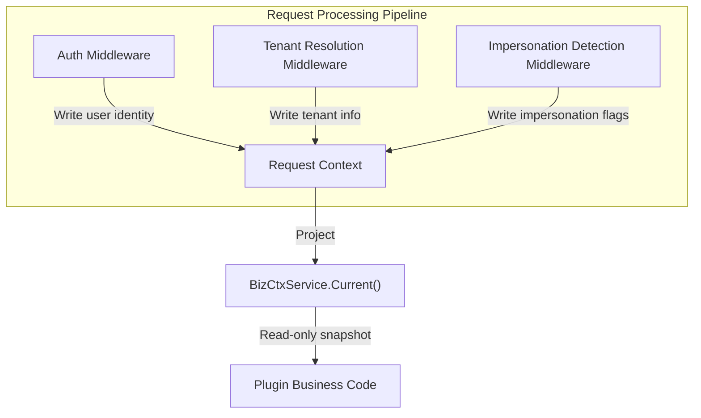
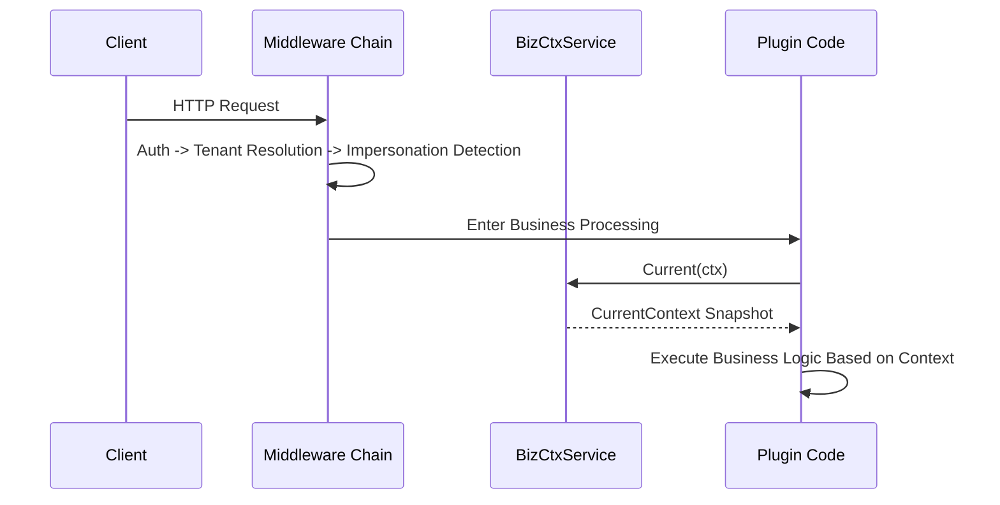

## Introduction

`BizCtxService` provides plugins with a read-only projection of the current request's business context. It encapsulates the host's complex internal request context model into a stable `CurrentContext` snapshot. Plugins obtain it via `services.BizCtx()` and read user, tenant, impersonation state, and other information without needing to understand the host's internal context storage mechanism.

This service is used by virtually every plugin that needs to be aware of request identity, making it one of the most fundamental context-reading capabilities.

## Design Philosophy

The core design of `BizCtxService` is **read-only projection**. Before a request enters business processing, the host injects the results of authentication, tenant resolution, and impersonation detection into the request context. `BizCtxService` projects these results into a `CurrentContext` struct that plugins can only read, not modify.

`CurrentContext` contains the following key fields:

| Field | Type | Description |
|-------|------|-------------|
| `UserID` | `int` | Current authenticated user ID |
| `Username` | `string` | Current authenticated username |
| `TenantID` | `int` | Current request tenant ID; `0` indicates a platform context |
| `ActingUserID` | `int` | Real administrator ID in an impersonation scenario |
| `ActingAsTenant` | `bool` | Whether operating from a tenant perspective |
| `IsImpersonation` | `bool` | Whether the current Token is an impersonation token |
| `PlatformBypass` | `bool` | Whether tenant filtering may be bypassed |

The semantics of `PlatformBypass` are: when `TenantID` is `0`, it is automatically set to `true`, indicating the request runs in a platform-wide scope and can read data across tenants. Plugins should check this field when cross-tenant queries are needed.

## Architectural Position

`BizCtxService` sits at the output end of the request pipeline, serving as the unified entry point for other services and plugin business logic to obtain request identity:

This service is a "consumer" of request context information, with data provided by the following "producers":

- `AuthService`: The authentication middleware uses `AuthService` to verify the Token and write the user identity
- `TenantService`: The tenant resolution middleware uses `TenantService` to resolve the tenant and write tenant information
- Impersonation detection middleware: Detects impersonation flags in the Token and writes `ActingUserID` and `IsImpersonation`

## Key Capabilities

| Method | Description |
|--------|-------------|
| `Current` | Returns a read-only `CurrentContext` snapshot of the current request, containing user, tenant, impersonation state, and other fields |

`Current` is the only method on `BizCtxService`, intentionally designed to keep the interface minimal. All request context information is encapsulated in a single `CurrentContext` struct, and plugins read fields as needed.

## Design Constraints

- **Read-only projection, not modifiable.** `BizCtxService` returns a snapshot — plugins cannot modify the request context through it. Scenarios requiring context modification (such as tenant switching) should use `AuthService`.
- **Does not expose host internal types.** `CurrentContext` is a stable projection visible to plugins, and does not expose the host's internal context model, database entities, or authentication state types.
- **Zero values indicate absence.** When context is unavailable (e.g., non-`HTTP` requests, middleware not injected), `Current` returns a zero-value struct rather than an error. Plugins should check whether critical fields are zero-valued.
- **`PlatformBypass` is determined by the host.** Plugins should not set or modify the `PlatformBypass` flag on their own — this field is automatically determined by the host based on `TenantID`.

## Related Services

- [AuthService](./6700-auth.md) - The authentication middleware uses AuthService to write user identity
- [TenantService](./7900-tenant.md) - The tenant resolution middleware writes tenant information
- [TenantFilterService](./8000-tenant-filter.md) - Uses TenantID and PlatformBypass from BizCtx to filter data
