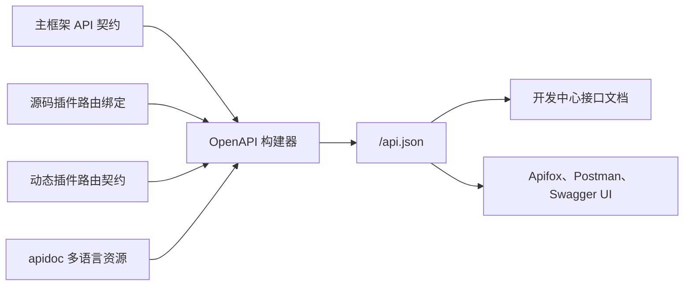

## 基本介绍

接口文档是`lina-core`对外暴露`API`契约的统一视图。主框架不会要求开发者单独维护文档文件，而是在运行时根据主框架路由、源码插件路由和动态插件路由生成`OpenAPI 3.0`文档。

默认访问路径由`config.yaml`中的`server.extensions.apiDocPath`控制，默认值为：

```text
http://localhost:8080/api.json
```

管理工作台在「开发中心 → 接口文档」中消费同一份文档，提供浏览和调试入口。

## 聚合范围

接口文档聚合三类来源：

| 来源 | 接入方式 | 文档内容 |
|------|----------|----------|
| 主框架 | 主框架`api/`目录中的`g.Meta`契约和绑定路由 | 平台基础接口、认证、权限、配置、任务、插件治理等接口 |
| 源码插件 | `pluginhost`记录的源码插件路由绑定 | 插件自己的`API`、请求响应结构和权限标识 |
| 动态插件 | 动态插件产物中的路由契约和运行时投影 | 动态插件公开的路由、方法和描述信息 |



插件启用、禁用或升级后，文档会随运行时投影变化而更新。接口文档展示的是当前主框架可访问的接口集合，而不是源码仓库中所有可能存在的接口。

## API契约声明

主框架和源码插件使用`GoFrame`的`g.Meta`结构体标签声明接口契约。路径、方法、标签、摘要、描述和权限标识都写在请求结构体上：

```go
type ArticleListReq struct {
    g.Meta  `path:"/plugins/content-article/articles" method:"get" tags:"Content Article" summary:"List articles" dc:"Query article records by page." permission:"content-article:article:view"`
    Page    int    `json:"page" v:"min:1" dc:"Page number"`
    Size    int    `json:"size" v:"min:1,max:100" dc:"Page size"`
    Keyword string `json:"keyword" dc:"Title keyword"`
}

type ArticleListRes struct {
    g.Meta `mime:"application/json"`
    List   []*ArticleItem `json:"list" dc:"Article list"`
    Total  int            `json:"total" dc:"Total records"`
}
```

这里的`permission:"content-article:article:view"`会进入接口文档，也会和`RBAC`权限体系形成一致的审计口径。不要使用旧式或非当前契约的权限标签来描述新接口。

## 权限与文档一致性

接口权限不是文档层的附加说明，而是`API`契约的一部分。这样做有三个价值：

| 设计点 | 价值 |
|--------|------|
| 权限标识靠近路由声明 | 开发时更容易发现遗漏或拼写不一致 |
| 文档直接展示权限标识 | 前端联调和角色配置时能快速定位授权需求 |
| 菜单按钮权限和接口权限共用命名空间 | 便于平台管理员审计页面入口和实际写操作 |

工作台中的按钮权限来自菜单治理数据，接口权限来自`g.Meta`契约。两者应使用同一业务语义，但不要假设“看到按钮”就一定能绕过接口权限校验。

## 源码插件接口

源码插件在自己的`backend/api/`目录定义`DTO`，在`backend/plugin.go`中通过`pluginhost`注册路由。主框架会记录这些路由绑定，并把符合`GoFrame`处理器形态的接口投影到统一`OpenAPI`文档。

源码插件接口建议遵守这些规则：

- 路径使用插件命名空间，例如`/plugins/content-article/articles`。
- `tags`使用稳定的业务模块名，避免每次版本升级都改变分组。
- `summary`保持短句，`dc`用于补充更完整的描述。
- `permission`必须和插件`plugin.yaml`声明的权限资源保持一致。
- 请求和响应字段使用`dc`说明业务含义，避免只写字段名。

## 动态插件接口

`WASM`动态插件的接口由插件产物携带路由契约，主框架在安装、启用和升级时读取并投影到接口文档。动态插件运行在`pluginbridge`之上，接口请求进入主框架后仍会先经过认证、权限和租户上下文处理，再传入`WASM`沙箱。

动态插件不能直接修改主框架路由表。它公开哪些路由、能访问哪些主框架服务、能触达哪些数据表或外部地址，都由插件清单、产物元数据和`hostServices`授权快照共同决定。

## 接口多语言

接口文档的多语言资源位于主框架和插件的：

```text
manifest/i18n/<locale>/apidoc/
```

运行时界面语言包和接口文档语言包采用不同加载模式：直接位于`manifest/i18n/<locale>/`下的`JSON`文件用于运行时界面文案，`apidoc/`子目录用于接口文档翻译，并按子目录递归加载。

示例：

```text
apps/lina-core/manifest/i18n/zh-CN/apidoc/
├── common.json
└── core-api-auth.json

apps/lina-plugins/content-notice/manifest/i18n/zh-CN/apidoc/
└── plugin-api-notice.json
```

插件接口翻译应只维护自己的插件命名空间，避免把插件文案写入主框架接口文档资源中。`en-US`接口文档资源可以保持为空占位，由源码中的英文元数据提供默认文案。

## 在线调试

管理工作台的「开发中心 → 接口文档」支持查看请求参数、响应结构、权限标识和接口描述，并可以直接发起调试请求。

在线调试会使用当前登录用户的认证状态。调试`POST`、`PUT`、`PATCH`、`DELETE`等写操作时，会产生真实数据变更，应在测试环境或明确可回滚的数据范围内使用。

## 第三方工具导入

`/api.json`是标准`OpenAPI 3.0`文档，可以导入常见接口工具：

| 工具 | 使用方式 |
|------|----------|
| `Apifox` | 新建项目后选择导入`OpenAPI/Swagger`，填写`http://localhost:8080/api.json` |
| `Postman` | 使用`Import`的`Link`方式导入`/api.json` |
| `Swagger UI` | 指向主框架暴露的`/api.json`地址 |
| `curl` | 使用`curl -o api.json http://localhost:8080/api.json`下载文档 |

## 常见问题

| 现象 | 排查方向 |
|------|----------|
| 插件接口没有出现在文档中 | 确认插件是否已安装并启用，源码插件路由是否通过`pluginhost`注册 |
| 权限标识为空 | 检查`g.Meta`是否声明了`permission`标签 |
| 文档语言未变化 | 检查`manifest/i18n/<locale>/apidoc/`是否存在对应翻译，并确认运行时缓存是否刷新 |
| 动态插件接口缺失 | 检查`.wasm`产物是否包含路由契约，插件是否处于有效启用版本 |

