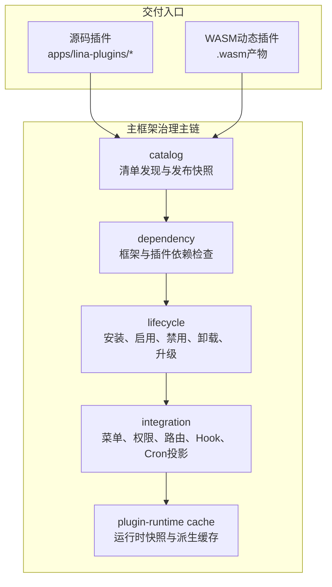
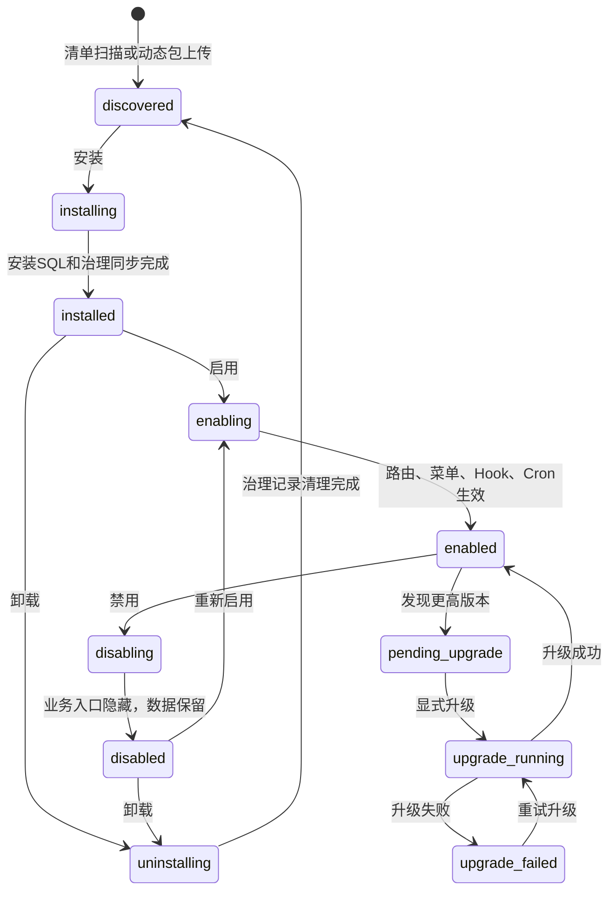

## 基本介绍

插件系统是`LinaPro`承载业务能力的核心扩展机制。每个插件都是自包含模块，可以声明`API`路由、数据库资源、前端页面、菜单权限、语言包、定时任务和生命周期回调。

`LinaPro`同时支持两种交付模式：

- **源码插件**：以`Go`源码形式参与主框架编译，适合长期维护的业务能力。
- **动态插件**：以`.wasm`产物运行时上传和加载，适合二进制分发、热加载和临时扩展。

两种模式运行形态不同，但共享同一套插件治理面。管理端看到的是同一类插件生命周期、依赖、权限、状态和多租户策略。

## 为什么需要双模式

单一插件形态很难同时满足研发效率、运行性能、热加载和商业分发。

| 需求 | 更适合的模式 | 原因 |
|------|--------------|------|
| **长期业务模块** | 源码插件 | 原生`Go`性能，工具链完整，易测试和维护 |
| **紧急修复或临时能力** | 动态插件 | 可在运行时上传和启用，减少部署影响 |
| **商业插件分发** | 动态插件 | 可以只分发二进制产物，不暴露源码 |
| **与主框架深度协作** | 源码插件 | 可通过稳定`pluginhost`契约使用主框架能力 |

在大多数业务开发中，源码插件是默认选择；当热加载、源码保护或最终用户自行上传插件成为硬要求时，再选择动态插件。

## 治理主链

插件系统不是简单扫描目录再注册路由，而是一条从发现到运行的治理主链：



| 源码组件 | 组件职责 |
|------|------|
| `catalog` | 读取`plugin.yaml`或`WASM`自定义段，生成可审查的发布快照 |
| `dependency` | 检查框架版本范围、插件依赖和循环依赖 |
| `lifecycle` | 编排安装、启用、禁用、卸载和运行时升级 |
| `integration` | 将菜单、权限、路由、钩子和定时任务投影到主框架运行时 |
| `plugin-runtime cache` | 为请求路径提供低延迟的插件状态、路由和资源快照 |

## 关键公共契约

### plugin.yaml

每个插件都必须提供`plugin.yaml`。它是插件身份、依赖、菜单、多租户策略和动态插件主框架服务授权的统一入口。

```yaml
id: content-article
name: 文章管理
version: v0.1.0
type: source
scope_nature: tenant_aware
supports_multi_tenant: true
default_install_mode: tenant_scoped
description: 提供文章内容的增删改查管理功能
author: linapro
license: Apache-2.0
menus:
  - key: plugin:content-article:list
    name: 文章管理
    path: content-article-list
    component: system/plugin/dynamic-page
    perms: content-article:article:view
    type: M
```

动态插件还可以声明`hostServices`，申请访问主框架服务：

```yaml
hostServices:
  - service: data
    methods: [list, get, create, update, delete]
    resources:
      tables:
        - plugin_demo_dynamic_record
  - service: storage
    methods: [put, get, delete, list]
    resources:
      paths:
        - plugin-demo-dynamic/
```

### pluginhost

`pluginhost`是**源码插件**使用的稳定扩展接缝。源码插件通过它注册：

| 接口 | 能力 |
|------|------|
| `Assets()` | 嵌入插件清单、语言包、`SQL`和前端资源 |
| `HTTP()` | 注册插件`HTTP`路由 |
| `Hooks()` | 订阅主框架事件 |
| `Cron()` | 注册插件任务处理器 |
| `Lifecycle()` | 注册安装、升级、禁用、卸载等生命周期回调 |
| `Governance()` | 声明菜单和权限过滤逻辑 |

源码插件无法直接`import`主框架`internal/`目录，只能使用主框架发布的稳定契约。

### pluginbridge

`pluginbridge`是**动态插件**的沙箱通信层。主框架将请求、身份、租户和权限快照封装为`BridgeRequestEnvelopeV1`传入`WASM`模块，插件返回`BridgeResponseEnvelopeV1`。

动态插件访问主框架能力时发起`host_call`，主框架按安装时确认的`hostServices`授权快照校验服务、方法和资源边界。

## 生命周期状态

插件生命周期覆盖发现、安装、启用、禁用、卸载和升级：



插件文件更新不会自动切换有效版本。主框架启动或扫描发现更高版本后，将插件标记为`pending_upgrade`，管理员在插件管理页预览并显式执行运行时升级。升级流程会执行依赖预检、生命周期回调、升级`SQL`、治理资源同步、有效发布切换、缓存失效和集群通知。

## 隔离机制

### 数据库命名空间

插件自有表必须使用插件`ID`转换后的`snake_case`前缀：

```text
主框架表：sys_user、sys_role、sys_menu
插件表：content_notice_notice、org_center_dept、plugin_demo_dynamic_record
```

系统表使用`sys_`前缀，插件表使用`<plugin_id>_`前缀。主框架能力和插件能力的数据完全隔离，避免命名冲突和权限误用。

插件如果需要支持多租户，那么需要自行设计包含`tenant_id`列，并通过主框架发布的租户过滤能力追加过滤条件。

### 文件命名空间

插件文件存储应以插件`ID`作为路径命名空间，例如：

```text
temp/upload/content-notice/
temp/upload/plugin-demo-dynamic/
```

### 沙箱隔离

`WASM`动态插件不能直接访问主框架文件系统、网络或数据库。所有访问都通过`hostServices`桥接，并受授权快照约束。

## 多租户字段

插件通过三个字段声明多租户边界：

| 字段 | 可选值 | 说明 |
|------|--------|------|
| `scope_nature` | `platform_only` / `tenant_aware` | 插件是平台级治理能力，还是可进入租户上下文 |
| `supports_multi_tenant` | `true` / `false` | 是否支持租户级安装、开通和数据隔离 |
| `default_install_mode` | `global` / `tenant_scoped` | 默认全局启用还是按租户独立启停 |

例如，`multi-tenant`插件本身是平台级治理插件，使用`platform_only`和`global`；内容、组织、审计类插件通常是`tenant_aware`。

## 主框架与插件边界

| 规则 | 原因 |
|------|------|
| 插件不直接依赖主框架`internal/`包 | 主框架内部实现可演进，稳定契约由`pkg/`提供 |
| 插件菜单使用`plugin:<plugin-id>:<key>`格式 | 避免与主框架或其他插件冲突 |
| 安装`SQL`必须幂等 | 支持重复执行、保留数据后重新安装和升级恢复 |
| 插件服务逻辑放在`backend/internal/service/` | 保持插件后端结构一致，避免包命名混乱 |
| 插件卸载区分保留数据和清理数据 | 降低误删风险，允许后续重新安装复用数据 |

