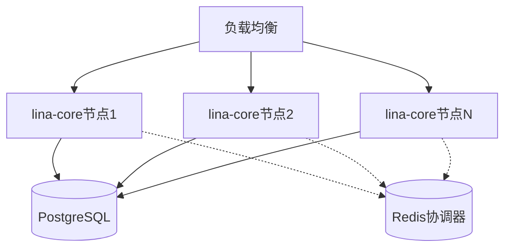
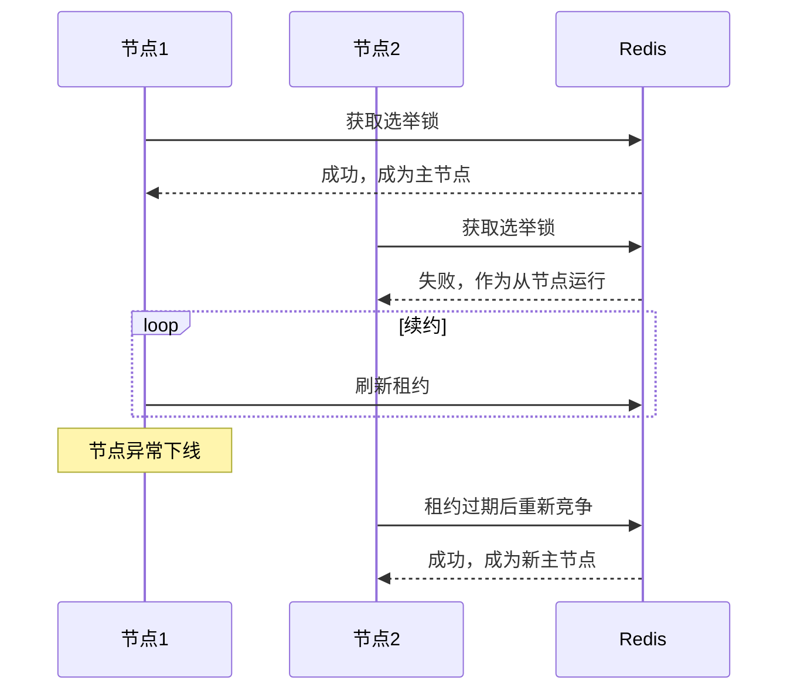
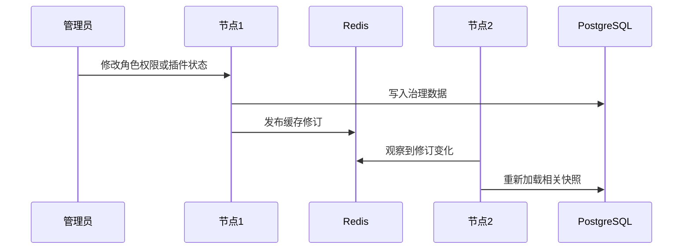
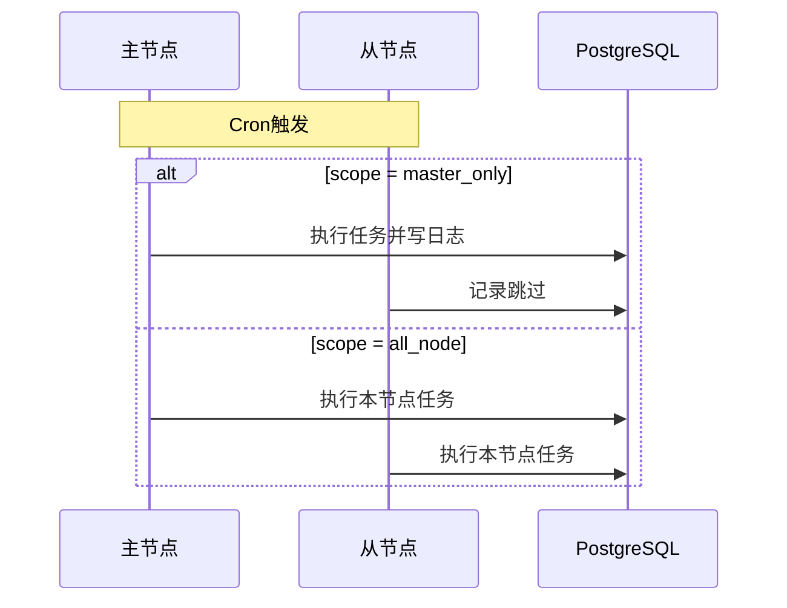

## 基本介绍

`LinaPro`的分布式能力内建在主框架服务中。开发环境和小规模部署可以使用单机模式；业务规模增长后，通过配置启用集群模式，多个主框架节点共享同一套`PostgreSQL`数据库，并使用`Redis`完成跨节点协调。

业务代码、插件代码和前端工作台不需要因为单机切换到集群而改写。需要改变的是部署拓扑和`cluster`配置。

## 单机模式

单机模式是默认模式：

```yaml
cluster:
  enabled: false
```

单机模式不需要`Redis`。主框架进程使用本地缓存、本地锁和`PostgreSQL`即可完成开发、测试和小规模运行。

```text
┌─────────────────────┐
│      lina-core      │
│   single process    │
└──────────┬──────────┘
           │
      ┌────▼─────┐
      │PostgreSQL│
      └──────────┘
```

## 集群模式

启用集群模式：

```yaml
cluster:
  enabled: true
  coordination: redis
  election:
    lease: 30s
    renewInterval: 10s
  redis:
    address: "127.0.0.1:6379"
    db: 0
    password: ""
```

当前版本的协调后端仅支持`Redis`。`PostgreSQL`继续负责业务数据、治理数据和插件状态持久化；`Redis`负责选主、分布式锁、缓存修订和跨节点事件。



## 主节点选举

集群模式下，节点通过`Redis`选举主节点。主节点持有带租约的选举锁，并按`renewInterval`续约。主节点异常退出后，其他节点会在租约过期后竞争成为新主节点。



`lease`建议保持在`30s`左右，`renewInterval`建议为租约的三分之一。

## 节点职责

所有节点都可以处理`HTTP`请求。主节点额外承担部分需要全局唯一协调的工作。

| 职责 | 主节点 | 从节点 |
|------|--------|--------|
| 处理业务和插件`API` | 支持 | 支持 |
| 读取权限和菜单缓存 | 支持 | 支持 |
| 执行`master_only`任务 | 支持 | 跳过 |
| 执行`all_node`任务 | 支持 | 支持 |
| 发布部分全局维护事件 | 支持 | 不负责 |
| 参与插件运行时升级锁竞争 | 支持 | 支持 |

## 缓存修订与权限同步

权限拓扑、插件运行时快照、前端包、`WASM`模块和国际化资源都可能被缓存。集群模式下，节点通过共享修订号或事件广播感知变化，并在读路径刷新本地缓存。



这种机制避免每次请求都回查数据库，同时保证权限、菜单和插件状态变更能在多节点中收敛。

## 分布式锁

主框架提供统一锁能力。单机模式下退化为本地锁；集群模式下使用协调后端提供的分布式锁。插件运行时升级、关键维护任务和需要全局互斥的流程都可以复用这套能力。

分布式锁的设计目标不是替代数据库事务，而是保护跨节点只能有一个执行者的运行时编排过程。

## 键值缓存

键值缓存用于保存短期状态、版本号和运行时快照。集群模式下，缓存写入和失效需要带作用域，避免全量清空影响无关语言、插件或租户。

常见缓存对象包括：

- 权限拓扑版本。
- 在线会话状态。
- 插件运行时快照。
- 插件前端包和`WASM`模块。
- 运行时语言包。

## 定时任务调度

持久化任务支持两种执行范围：

| 执行范围 | 行为 | 适用场景 |
|----------|------|----------|
| `master_only` | 仅当前主节点执行，从节点记录跳过 | 数据归档、统计汇总、全局清理 |
| `all_node` | 每个节点都执行 | 本地缓存刷新、节点自检 |



任务执行结果写入共享数据库，所有节点都可以在管理工作台查看。

## 扩容流程

从单机扩展到集群通常按以下步骤执行：

1. 准备共享`PostgreSQL`数据库。
2. 准备可访问的`Redis`实例。
3. 将`cluster.enabled`设为`true`，配置`cluster.coordination: redis`和`cluster.redis`端点。
4. 启动多个`lina-core`节点，指向同一套数据库。
5. 在负载均衡器中加入所有主框架节点。
6. 验证`/health`、登录、菜单、插件状态、任务调度和权限变更同步。

## 设计边界

- 集群协调当前只支持`Redis`。
- `SQLite`仅用于单节点本地演示或冒烟验证，不支持集群。
- 分布式能力不改变业务`API`契约；业务代码仍应通过主框架和插件发布的稳定服务访问数据。
- 高可用还需要外部负载均衡、数据库可靠性和`Redis`可靠性共同保证。


