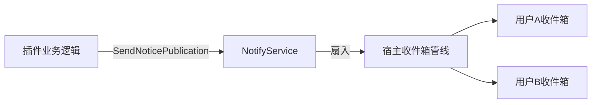
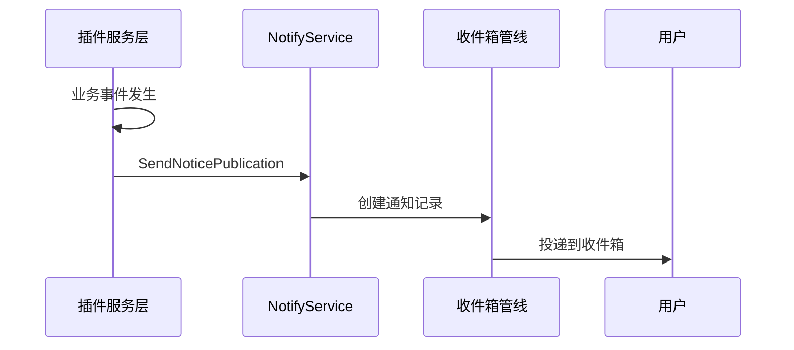

## 基本介绍

`NotifyService`为插件提供通知发布能力，将业务事件扇入宿主统一收件箱管线。插件通过`services.Notify()`获取该服务，用于向用户发送系统通知、业务提醒等消息。

该服务采用**发布-投递**模型：插件发布通知，宿主负责将通知投递到目标用户的收件箱。

## 设计思路

`NotifyService`的设计围绕**来源分类**和**收件箱分类**两个维度展开。

**来源类型（SourceType）** 标识通知的业务来源：

| SourceType | 说明 |
|------------|------|
| `SourceTypeNotice` | 来自公告模块的通知 |
| `SourceTypePlugin` | 来自插件业务逻辑的通知 |

**收件箱分类（CategoryCode）** 标识通知在收件箱中的分类。插件可以声明自己的分类码，宿主提供通用回退分类`CategoryCodeOther`。

`SendNoticePublication`接受一个`NoticePublishInput`，包含通知ID、标题、内容、分类码和发送者ID。宿主根据这些信息创建通知记录并投递到目标用户。

`DeleteBySource`用于清理特定业务来源的通知记录。当业务数据被删除时，关联的通知也应一并清理。

## 架构位置

`NotifyService`在业务事件处理链路的末端，作为事件到通知的转换层：

该服务是单向的发布通道，不提供通知状态查询或已读标记能力。这些能力由宿主收件箱模块独立提供。

## 主要能力

| 方法 | 说明 |
|------|------|
| `SendNoticePublication` | 将一条通知发布到宿主收件箱管线 |
| `DeleteBySource` | 按业务来源类型和标识删除通知记录 |

## 设计约束

- **插件定义分类码。** 插件可以使用任意字符串作为`CategoryCode`，宿主不预设分类列表。未指定时回退到`CategoryCodeOther`。
- **通知是异步投递。** `SendNoticePublication`返回后不保证通知已送达用户，宿主在后台完成投递。
- **删除按来源匹配。** `DeleteBySource`按`SourceType`和`sourceIDs`匹配删除，适用于业务数据清理时同步清理关联通知。
- **通知内容是文本。** 通知标题和内容是纯文本，不支持富文本或模板渲染。

## 相关服务

- [BizCtxService](./6800-bizctx.md) - 获取当前用户`ID`作为通知发送者
- [I18nService](./7100-i18n.md) - 通知内容可能需要翻译
