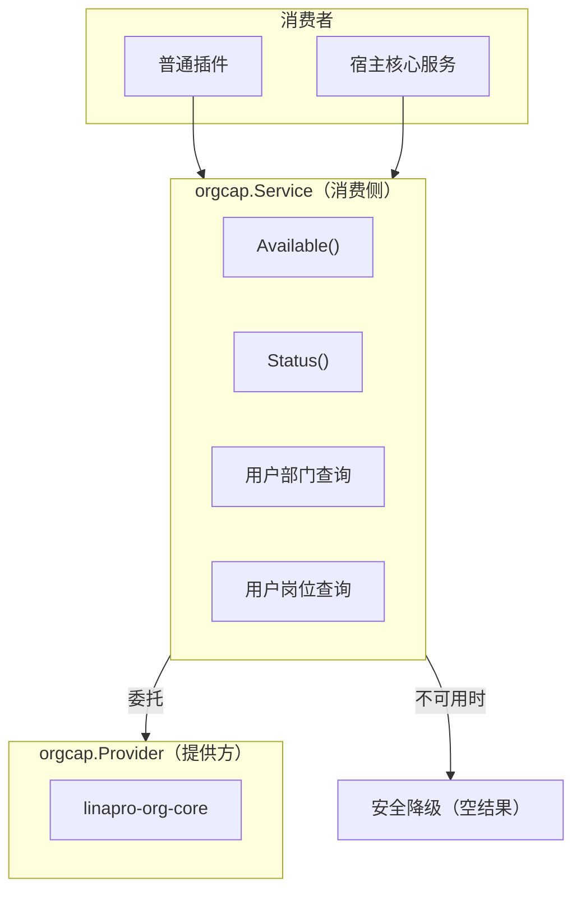
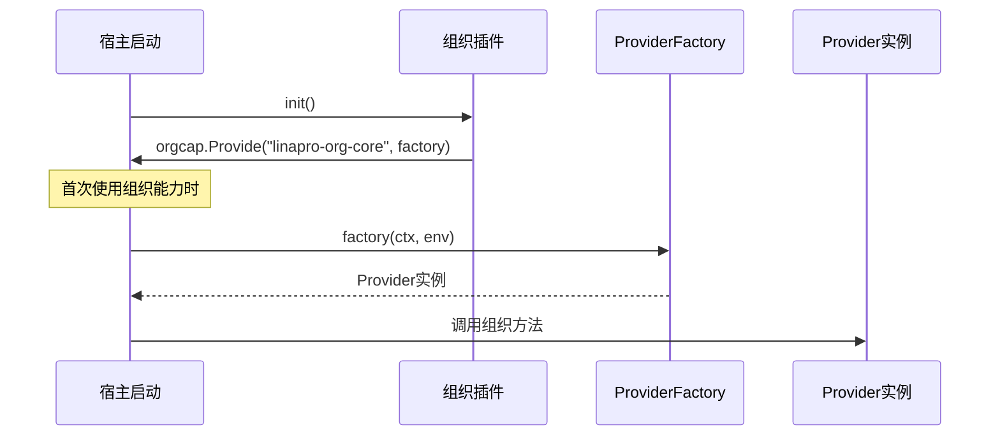
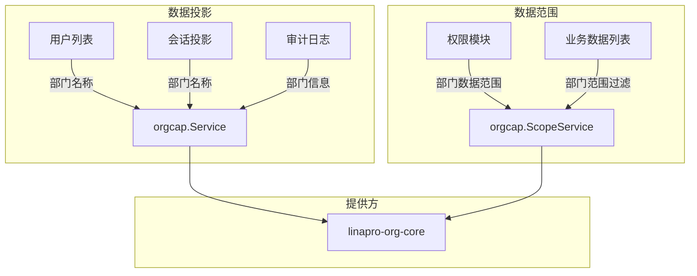

## 基本介绍

组织能力（`orgcap`）是`LinaPro`的框架级可选能力，为插件和宿主提供用户部门、岗位等组织数据的只读投影和数据范围过滤。插件通过`services.Org()`获取消费侧接口。

组织能力采用**能力提供方+消费侧服务**模式：由专门的提供方插件（如`linapro-org-core`）实现具体组织逻辑，消费侧通过`orgcap.Service`接口访问，不直接依赖提供方实现。当提供方不可用时，消费侧安全降级，返回空结果。

## 设计思路

### 消费侧 Service

`orgcap.Service`是面向普通插件和宿主核心服务的只读消费接口。它提供以下能力：

- **可用性检查**：`Available()`判断组织能力提供方是否可用
- **能力状态**：`Status()`返回详细的激活状态，包括提供方插件、冲突信息等
- **用户部门查询**：批量或单个查询用户的部门归属
- **用户岗位查询**：查询用户关联的岗位

### 提供方 Provider

`orgcap.Provider`是组织能力插件必须实现的接口。它定义了组织数据的完整读写契约，包括用户部门关系、岗位关系、数据范围过滤和组织树投影。

提供方通过`orgcap.Provide(pluginID, factory)`注册工厂函数。宿主在首次使用组织能力时延迟调用工厂，传入`ProviderEnv`构造环境。

## 架构位置

组织能力在系统中承担两个关键角色：

- **数据投影**：为用户列表、会话、审计日志等提供部门名称等展示信息
- **数据范围**：为权限模块和业务数据提供部门级数据范围过滤（`ScopeService`是宿主内部接口，不通过`capability.Services`暴露）

## 主要能力

`orgcap.Service`（消费侧）的主要方法：

| 方法 | 说明 |
|------|------|
| `Available` | 判断组织能力提供方是否可用 |
| `Status` | 返回详细的激活状态和提供方信息 |
| `ListUserDeptAssignments` | 批量查询用户部门归属投影 |
| `GetUserDeptInfo` | 查询单个用户的部门标识和名称 |
| `GetUserDeptName` | 查询单个用户的部门名称（轻量投影） |
| `GetUserDeptIDs` | 查询单个用户的部门标识列表 |
| `GetUserPostIDs` | 查询单个用户关联的岗位标识列表 |

## 设计约束

- **消费侧是只读的。** `orgcap.Service`不包含写入操作。用户部门和岗位关系的维护通过宿主内部的`AssignmentService`完成，不暴露给普通插件。
- **能力可选，安全降级。** 插件应先检查`Available()`再使用组织能力。不可用时查询方法返回空结果，不会报错。
- **`Provider`是延迟构造的。** 宿主在首次使用组织能力时才调用工厂函数构造`Provider`实例，避免启动时加载不需要的能力。
- **`ScopeService`不暴露给插件。** 数据范围过滤涉及数据库查询构建器，通过宿主内部接口使用，不通过`capability.Services`暴露。

## 提供方指引

如果需要实现自定义组织能力插件，需要：

1. 实现`orgcap.Provider`接口，提供用户部门、岗位、数据范围等方法
2. 通过`orgcap.Provide(pluginID, factory)`注册工厂函数
3. 工厂函数接收`ProviderEnv`，包含`PluginID`和`TenantFilter`等宿主服务

提供方插件需要在`init()`中注册工厂，宿主在首次使用时延迟构造实例。

## 相关服务

- [TenantService](./7900-tenant.md) - 租户能力与组织能力互补，共同构成多租户+组织的数据模型
- [PluginStateService](./7600-plugin-state.md) - 使用`IsProviderEnabled`判断组织提供方是否可用
- [SessionService](./7800-session.md) - 会话投影中的部门名称来自组织能力
