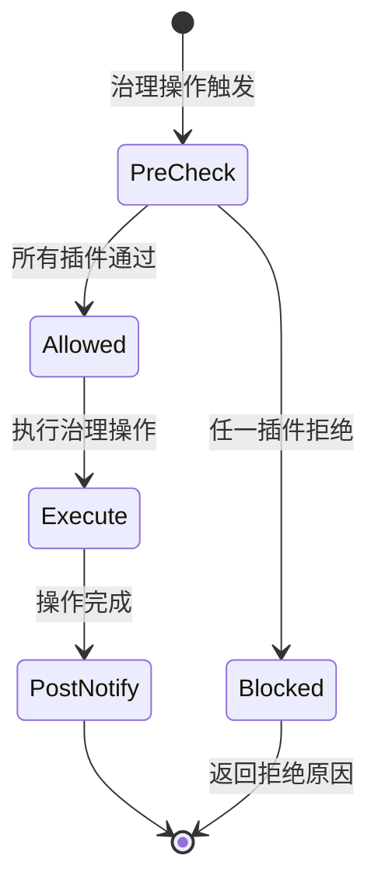
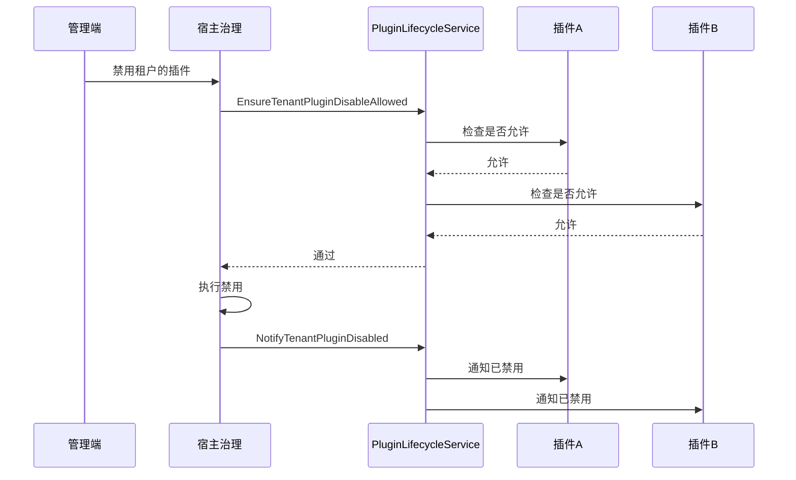
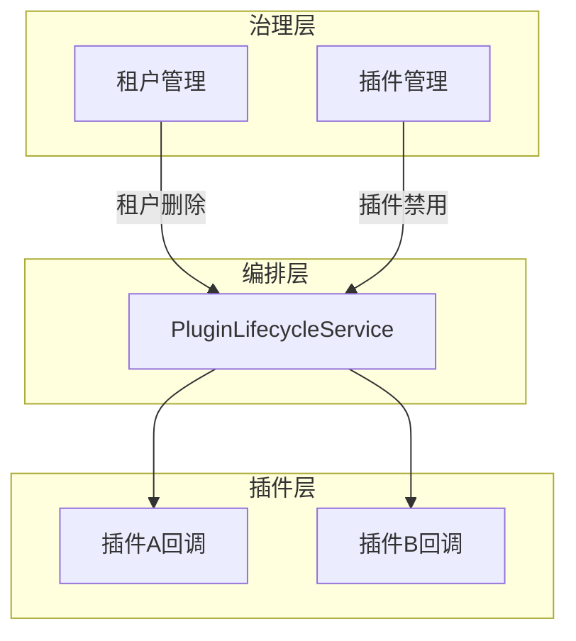

## 基本介绍

`PluginLifecycleService`为插件提供租户级生命周期编排能力，处理租户禁用插件和租户删除的前置检查与后置通知。插件通过`services.PluginLifecycle()`获取该服务。

该服务与`pluginhost.Lifecycle()`不同：`pluginhost.Lifecycle()`是单个插件注册自身生命周期回调的入口，`PluginLifecycleService`是宿主编排跨插件生命周期事件的服务。前者面向插件注册，后者面向治理模块消费。

## 设计思路

`PluginLifecycleService`采用**前置检查+后置通知**的两阶段编排模型：

以"租户禁用插件"为例：

1. **前置检查**：`EnsureTenantPluginDisableAllowed`遍历所有注册了该钩子的插件，询问是否允许禁用。任一插件返回错误则整体拒绝。
2. **后置通知**：`NotifyTenantPluginDisabled`在禁用完成后通知相关插件，插件可以执行清理逻辑。

`EnsureTenantDeleteAllowed`和`NotifyTenantDeleted`遵循同样的模式，用于租户删除场景。

## 架构位置

`PluginLifecycleService`位于宿主治理层和插件生命周期回调之间：

该服务是治理操作到插件回调的编排桥梁，确保跨插件的生命周期事件以一致的顺序和语义传播。

## 主要能力

| 方法 | 说明 |
|------|------|
| `EnsureTenantPluginDisableAllowed` | 租户禁用插件前的前置检查，任一插件拒绝则整体拒绝 |
| `NotifyTenantPluginDisabled` | 租户禁用插件后的后置通知，最佳努力投递 |
| `EnsureTenantDeleteAllowed` | 租户删除前的前置检查 |
| `NotifyTenantDeleted` | 租户删除后的后置通知 |

## 设计约束

- **前置检查可以阻断。** `Ensure*`方法返回错误时，治理操作被阻止。插件应返回稳定的拒绝原因键，便于管理端展示。
- **后置通知是最佳努力。** `Notify*`方法不返回错误，插件在通知回调中的失败不影响治理操作的完成。
- **与`pluginhost.Lifecycle()`互补。** `pluginhost.Lifecycle()`注册的是单个插件的安装、升级、卸载回调；`PluginLifecycleService`编排的是跨插件的租户级事件。
- **面向治理模块消费。** 普通业务插件通常不需要直接调用该服务，它的消费方是租户管理、插件管理等治理模块。

## 相关服务

- [PluginStateService](./7600-plugin-state.md) - 查询插件启用状态，与生命周期编排互补
- [TenantService](./7900-tenant.md) - 租户管理模块使用`PluginLifecycleService`编排租户级事件
