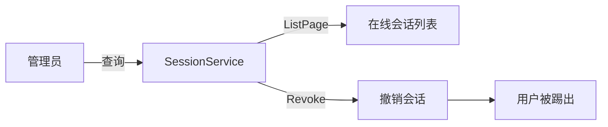
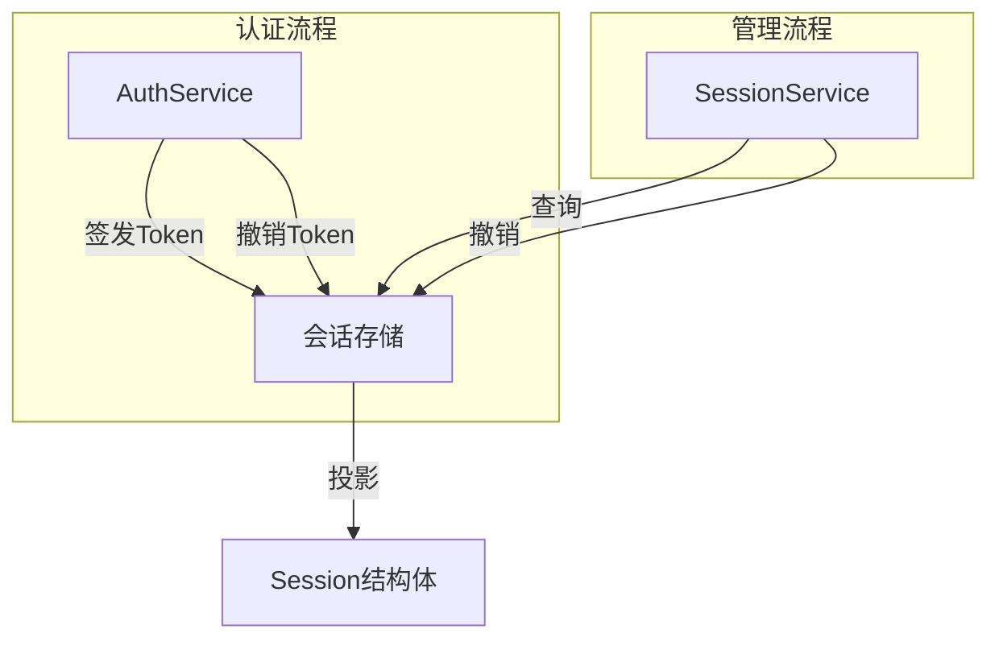

## 基本介绍

`SessionService`为插件提供在线会话的查询和管理能力。插件通过`services.Session()`获取该服务，用于分页查询在线会话列表和按`TokenID`撤销会话。

典型消费方是`linapro-monitor-online`插件，它提供在线用户监控功能，通过`SessionService`展示当前在线用户并支持管理员踢出会话。

## 设计思路

`SessionService`的设计围绕**会话投影**和**会话管理**两个能力展开。

**会话投影。** `Session`结构体是在线会话的稳定投影，包含以下字段：

| 字段 | 说明 |
|------|------|
| `TokenId` | 会话的唯一`Token`标识 |
| `TenantId` | 会话所属租户，`0`表示平台 |
| `UserId` | 认证用户ID |
| `Username` | 认证用户名 |
| `ClientType` | 客户端类型 |
| `DeptName` | 部门名称投影 |
| `Ip` | 登录IP |
| `Browser` | 浏览器指纹 |
| `Os` | 操作系统指纹 |
| `LoginTime` | 首次登录时间 |
| `LastActiveTime` | 最近活跃时间 |

**会话过滤。** `ListFilter`支持按用户名和登录IP进行模糊匹配过滤，适用于管理员在大量会话中搜索特定用户。

## 架构位置

`SessionService`在会话管理链路中处于查询和管理层，与`AuthService`的会话注册层互补：

- `AuthService`在认证流程中注册和撤销会话
- `SessionService`在管理流程中查询和撤销会话
- 两者共享同一会话存储，但职责不同

## 主要能力

| 方法 | 说明 |
|------|------|
| `ListPage` | 分页查询在线会话列表，支持用户名和IP模糊过滤 |
| `Revoke` | 按`TokenID`撤销一个在线会话，用户被踢出 |

## 设计约束

- **会话是只读投影。** `Session`结构体是只读的，不能通过修改它来改变会话状态。需要撤销会话使用`Revoke`。
- **分页查询受租户范围影响。** 平台管理员可以查询所有租户的会话，租户管理员只能查询本租户会话。
- **撤销是即时生效。** `Revoke`执行后，对应`Token`立即失效，客户端下次请求将被拒绝。
- **`DeptName`是投影字段。** 部门名称来自组织能力提供方的投影，如果组织能力不可用，该字段可能为空。

## 相关服务

- [AuthService](./6700-auth.md) - `AuthService`在认证流程中注册会话，`SessionService`在管理流程中查询会话
- [BizCtxService](./6800-bizctx.md) - 当前请求的会话信息投影到`BizCtx`中
- [OrgService](./7400-org.md) - `Session`中的`DeptName`来自组织能力投影
