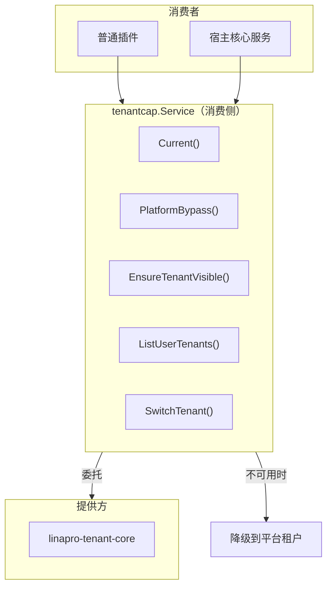
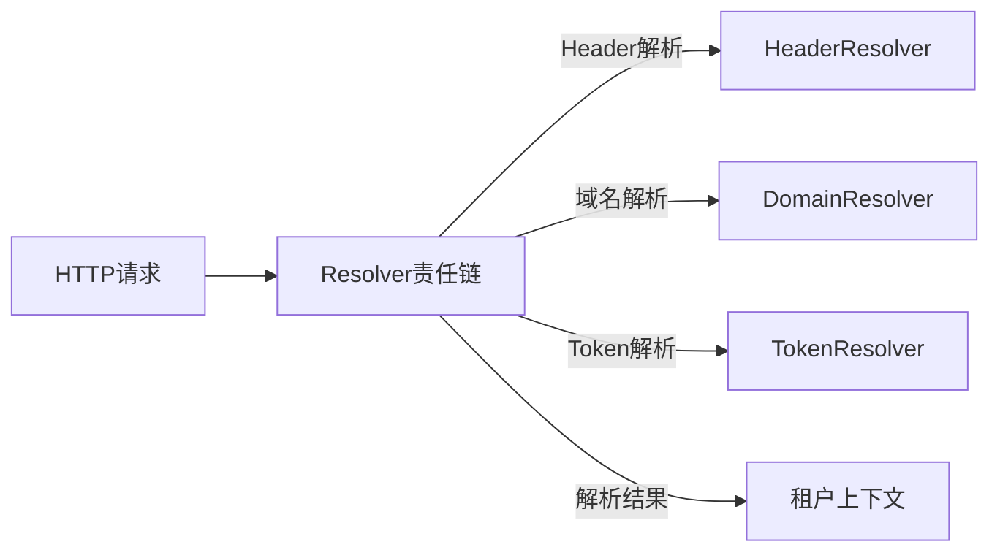
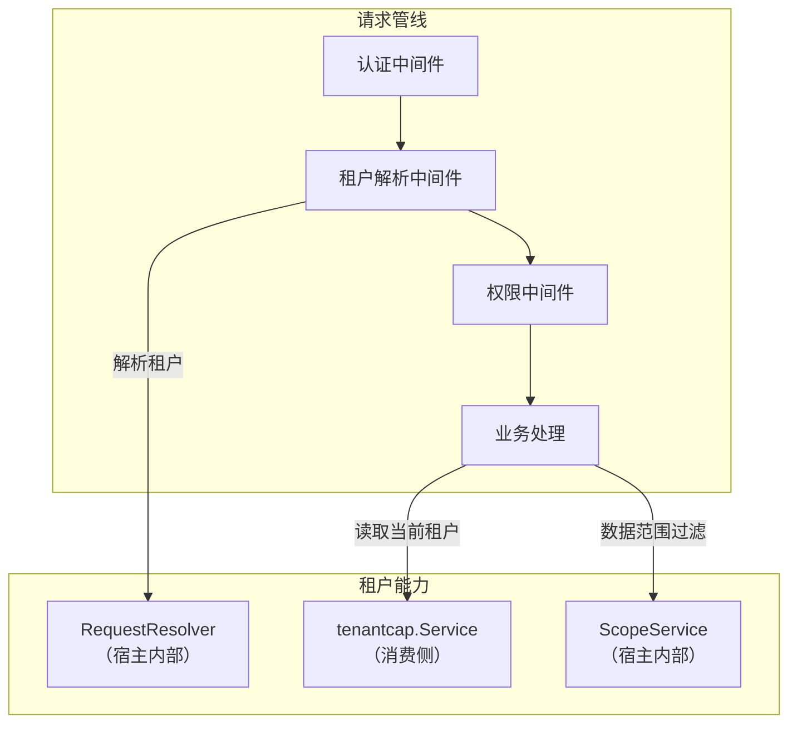

## 基本介绍

租户能力（`tenantcap`）是`LinaPro`的框架级可选能力，为插件和宿主提供租户解析、租户可见性校验、用户租户关系查询和租户切换等多租户基础能力。插件通过`services.Tenant()`获取消费侧接口。

与组织能力类似，租户能力采用**能力提供方+消费侧服务**模式。提供方插件（如`linapro-tenant-core`）实现具体租户逻辑，消费侧通过`tenantcap.Service`接口访问。当提供方不可用时，系统降级到平台租户（`PlatformTenantID = 0`）的单租户模式。

## 设计思路

### 消费侧 Service

`tenantcap.Service`是面向普通插件和宿主核心服务的消费接口：

- **可用性检查**：`Available()`判断租户能力提供方是否可用
- **当前租户**：`Current()`返回当前请求的租户ID，不可用时返回平台租户
- **平台绕过**：`PlatformBypass()`判断当前请求是否允许跨租户访问
- **租户可见性**：`EnsureTenantVisible()`校验当前用户是否可访问指定租户
- **用户租户关系**：`ListUserTenants()`返回用户可见的活跃租户列表
- **租户切换**：`SwitchTenant()`校验租户切换的合法性

### 提供方 Provider

`tenantcap.Provider`定义了租户能力插件必须实现的基础契约：

- **租户解析**：`ResolveTenant`从HTTP请求解析租户身份
- **租户校验**：`ValidateUserInTenant`校验用户对租户的访问权限
- **租户列表**：`ListUserTenants`返回用户可见的活跃租户
- **租户切换**：`SwitchTenant`校验租户切换合法性

`tenantcap.Resolver`是HTTP请求级租户解析器接口，用于租户中间件在请求进入业务处理前建立租户上下文。多个`Resolver`可以组成责任链，按配置顺序尝试解析。

## 架构位置

租户能力在系统中承担多个关键角色：

- **请求管线**：租户解析中间件使用`RequestResolver`在认证后建立租户上下文
- **业务处理**：插件通过`Service`读取当前租户、校验可见性
- **数据过滤**：宿主内部使用`ScopeService`注入租户过滤条件（不暴露给插件）

## 主要能力

`tenantcap.Service`（消费侧）的主要方法：

| 方法 | 说明 |
|------|------|
| `Available` | 判断租户能力提供方是否可用 |
| `Status` | 返回详细的激活状态和提供方信息 |
| `Current` | 返回当前请求租户ID，不可用时返回平台租户 |
| `PlatformBypass` | 判断当前请求是否允许绕过租户过滤 |
| `EnsureTenantVisible` | 校验当前用户是否可访问指定租户 |
| `ValidateUserInTenant` | 校验指定用户是否可访问指定租户 |
| `ListUserTenants` | 返回用户可见的活跃租户列表 |
| `SwitchTenant` | 校验用户切换到目标租户的合法性 |

## 设计约束

- **降级到平台租户。** 当租户能力不可用时，`Current()`返回`PlatformTenantID (0)`，系统以单租户模式运行。
- **`ScopeService`不暴露给插件。** 租户过滤涉及数据库查询构建器，通过宿主内部接口使用。
- **`RequestResolver`不暴露给插件。** HTTP请求级租户解析是宿主中间件的职责，普通插件不需要直接使用。
- **`Provider`和`Resolver`独立注册。** `Provider`提供租户业务逻辑，`Resolver`提供HTTP请求解析，两者可以由不同插件实现。

## 提供方指引

如果需要实现自定义租户能力插件，需要：

1. 实现`tenantcap.Provider`接口，提供租户解析、校验、列表、切换等方法
2. 可选实现`tenantcap.Resolver`接口，提供HTTP请求级租户解析
3. 通过`tenantcap.Provide(pluginID, factory)`注册工厂函数
4. 工厂函数接收`ProviderEnv`，包含`PluginID`、`BizCtx`和`PluginLifecycle`等宿主服务

提供方插件需要在`init()`中注册工厂，宿主在首次使用时延迟构造实例。

## 相关服务

- [OrgService](./7400-org.md) - 组织能力与租户能力互补，共同构成多租户+组织的数据模型
- [BizCtxService](./6800-bizctx.md) - 租户解析结果投影到`BizCtx`的`TenantID`字段
- [AuthService](./6700-auth.md) - 租户切换前使用`TenantService`校验合法性
- [TenantFilterService](./8000-tenant-filter.md) - 使用`Tenant`中的租户信息过滤数据
