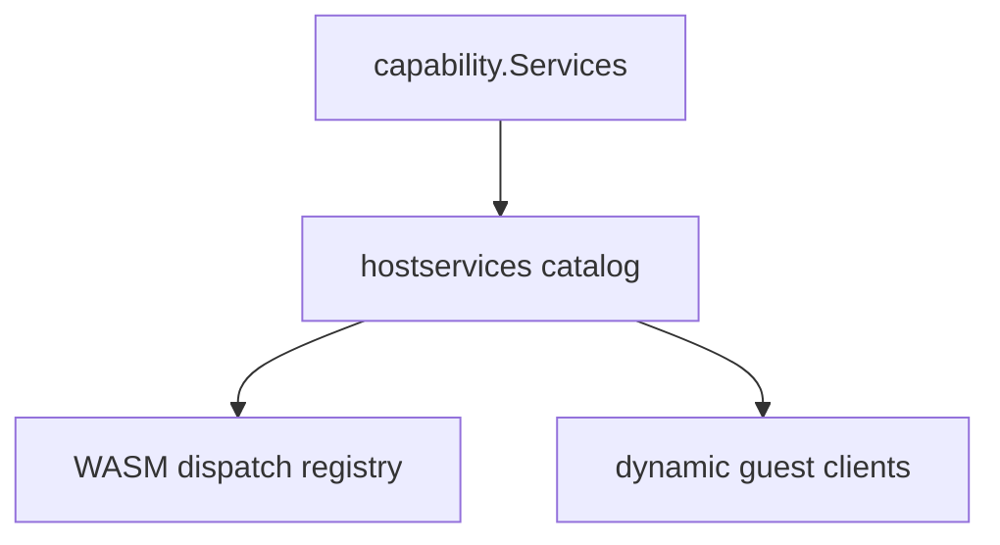

## Context

`protocol/hostservices/catalog.go`已是声称中的唯一来源，并带`PayloadKind`、资源种类和治理测试。`wasm_host_service_registry.go`仍手工`register*HostService`。`capability.Services`与`pluginbridge.Services`方法集合几乎抄了一遍，动态侧额外有`Runtime`、`Network`、`RecordStore`。`TestHostServiceDispatchRegistryCoversCatalog`只能在测试时抓住漂移，不能去掉手写注册。

既有`plugin-host-layer-simplification`已要求新方法走 JSON、dedicated codec 冻结。本变更第一刀只做「可生成的唯一来源」，不退役存量二进制编解码，不拆插件总门面。

## Goals / Non-Goals

**Goals:**

- 新增 core-owned 方法时，开发者只改 catalog（及真正的 handler 实现），WASM 注册与 guest 客户端由目录推导。
- 漂移必须在治理测试或生成步骤失败，而不是运行时漏注册。
- 动态独有入口保持额外，不回抄进源码插件目录。

**Non-Goals:**

- 不删除 storage/cache/lock/data 的 dedicated codec。
- 不把`RecordStore`标生产主路径，也不删除。
- 不压扁`plugin.Service`，不收七个声明门面。
- 不引入运行期反射式万能分发来「少写注册」。

## Decisions

### D1：catalog 继续手写元数据，派生表生成或编译期构建

- **选择**：方法名、wire 常量、资源种类、payload kind 仍以 catalog + `wire_constants.go` 为源。WASM 注册表的「service/method → 已有 handler」清单和 guest 客户端方法表从 catalog 推导。允许`go generate`生成注册胶水，或在`init`/显式`BuildRegistry(handlers)`里按 catalog 绑定已存在的 handler 函数。
- **理由**：用户要的是唯一来源，不是再发明第四本账。规范禁止为 wire 常量本身使用`go generate`；注册胶水可以生成。
- **替代**：继续只用测试对账。否决，加方法仍要改三处。

### D2：handler 实现仍手写，注册不再手写平行方法表

- **选择**：每个方法仍有明确 Go handler（如`wasm_host_service_users.go`）。生成或构建步骤只连接 catalog 方法与已有 handler。缺 handler 或孤儿 handler 必须失败。
- **理由**：避免一个巨大 switch；保留可读实现；去掉重复方法名列表。
- **替代**：完全代码生成 handler。过冲，且本变更不改协议语义。

### D3：guest 客户端从同一目录推导

- **选择**：动态 guest 对 core-owned 方法的客户端方法集合与 catalog 发布面一致。`pluginbridge.Services`保留为 facade，但不得再维护一份独立方法清单。
- **理由**：源码侧`capability.Services`已是 Go 接口；动态侧缺的是传输映射，不是第二套领域语义。
- **替代**：让动态插件直接依赖`capability`接口。WASM 边界仍需要客户端，不能消失。

### D4：动态独有服务不并入源码目录

- **选择**：`Runtime`、`Network`、`RecordStore`继续作为动态侧额外入口，并在 catalog 中标记动态专用。源码插件`capability.Services`不增加这些方法。
- **理由**：审查要求不要把整份目录再抄一遍，但也不要把仅动态能力硬塞进源码目录。

### D5：资源种类单一来源

- **选择**：`ResourceKind`只在 hostservices 目录定义；能力注册表引用它或由它投影，禁止平行枚举各写各的。
- **理由**：审查点明资源种类被写了两遍。

### D6：不退役 dedicated codec

- **选择**：存量`PayloadKindDedicated`方法保持冻结名单。本变更生成/绑定逻辑必须同时支持 JSON 与 dedicated handler。
- **理由**：用户要求第一刀只做到可生成 SSOT。

## Risks / Trade-offs

- [生成胶水与手工 handler 不同步] → 构建或测试在缺 handler/孤儿 handler 时失败，现有 catalog 覆盖测试升级为强制生成/绑定检查。
- [过度生成降低可读性] → 只生成注册表，不生成领域 handler 体。
- [guest 客户端生成影响插件编译] → 保持公开 API 形状稳定，只改组装方式。

## Migration Plan

1. 明确 catalog 字段足以描述「是否 dispatcher / guest 发布」。
2. 把 WASM 手工方法列表改为由 catalog + handler 图构建。
3. 把 guest 核心方法表改为同一来源。
4. 收敛资源种类重复定义。
5. 升级治理测试：只改一处方法名必须失败。
6. 不改 wire 字符串，插件产物无需重签。

## Open Questions

- 注册胶水是`go generate`文件还是运行时`BuildRegistry`。实现时优先显式`BuildRegistry`（无生成文件漂移），若重复代码过多再生成。
- owner 插件投影的 host services 是否纳入同一生成器。第一波覆盖 core-owned；plugin-owned 已有 descriptor 投影的，复用同一 catalog 合并点，不另起目录。
