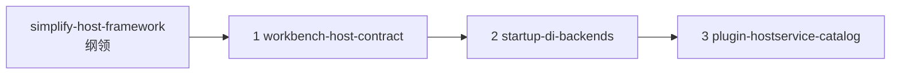

## Context

审查文档`localdocs/linapro-framework-architecture-review.md`把主框架痛点分成「该有的复杂」和「叠上去的复杂」。探索结论：双插件模型、可选组织/租户、配置读写分离、集群与协调存储分离都应保留。第一波只吃三件战略，并且用三个可独立合入的子变更落地，避免一份大变更无法回滚。

当前约束：

- 可替换管理工作台是框架硬约束，不是未来可选项。
- 本仓库默认工作台仍是`lina-vben`，必须在第一个子变更里一次迁完。
- 不考虑仓外对旧 Vben 路由 JSON 的兼容。
- 壳偏好（登录面板位置、侧栏导航模式）可以留在宿主公开配置，新壳自行决定是否应用。
- 菜单图标全局唯一保留为通用导航规则。

## Goals / Non-Goals

**Goals:**

- 冻结第一波范围、子变更边界、合入顺序和明确排除项。
- 让后续`/opsx:apply`只进入某一个子变更，而不把三件事揉进一次实现。
- 把「宿主 API 必须通用、默认工作台负责编译」写成可归档的设计决策。

**Non-Goals:**

- 本变更不修改`apps/lina-core`或`apps/lina-vben`生产代码。
- 不在本变更中展开菜单字段级 DTO 或生成器实现。
- 不把审查文档第六块（门面压扁、包合并、演示残留）纳入第一波。

## Decisions

### D1：纲领与实现分离

- **选择**：本目录只承载纲领；实现分别在`workbench-host-contract`、`startup-di-backends`、`plugin-hostservice-catalog`。
- **理由**：用户要求可独立审查、合入、回滚。一个超大`tasks.md`无法按风险停下来。
- **替代**：单变更分阶段任务。否决，因为阶段仍共用一次归档和一次回滚。

### D2：合入顺序固定为工作台 → DI → 协议

- **选择**：先把换壳硬约束落地，再收启动后门，最后做 catalog 生成。
- **理由**：工作台契约是产品边界；DI 是规则已经禁止的局部违规；协议生成不阻塞换壳，但能降低后续加方法成本。
- **替代**：先 DI。技术上可并行，但会让第一批合入与用户最关心的换壳约束错位。

### D3：第一波只吃三件战略，其余进第二波

| 进入第一波 | 进入第二波`simplify-host-runtime` | 仍排除 |
| --- | --- | --- |
| 工作台编译器离开核心契约 | 权限菜单投影、单插件启停同步 | `plugin.Service`拆成多包 |
| 锁/会话/缓存构造期注入 | 表锁实现`LockStore`、收件箱并入`notify` | `cron`/`jobmgmt`/`jobhandler`合并 |
| catalog 生成 WASM 注册与 guest 客户端 | 声明面压缩、演示钩子移出生产 | dedicated 编解码退役 |
| 工作台变更附带的身份菜单、能力标志、`FilterMenus`投影 | 分析页假数字、死登录路由、`RecordStore`实验标注 | `RecordStore`删除、`config`窄接口拆分 |

- **理由**：排除项观察正确，但战略三件完成后应立刻吃掉仍造成错误分层的部分。高风险包合并继续排除，因为`backend-go`要求`cron.Start`，`architecture.md`禁止再切重复窄接口。
- **替代**：审查六块一次做完。否决，变更面过大。

### D4：壳偏好可留、路由形状不可留

- **选择**：`panel-left`、`sidebar-mixed-nav`等可作为可选公开配置留在宿主。`GET /menus/all`的 Vben`RouteRecord`形状必须离开宿主。
- **理由**：配置是数据，换壳可忽略；路由 JSON 是编译结果，会强制换壳说 Vben。
- **替代**：公开配置也拆走。用户已否决，认为新壳可自行决定是否应用。

### D5：本仓库一次切完，不保留双轨

- **选择**：默认工作台与宿主契约在`workbench-host-contract`内一起改。不保留旧`/menus/all` Vben 形状。
- **理由**：用户明确不考虑兼容性。双轨会让「通用契约」永远长不大。
- **替代**：新旧接口并存一个版本。否决。

### D6：插件门面只停止膨胀

- **选择**：第一波不拆`plugin.Service`。后续若做，另开变更。
- **理由**：内部子包已经切开，总门面是装配根。大拆与协议生成是两类工程。

## Risks / Trade-offs

- [第一个子变更破坏面大] → 范围锁在导航/身份/插件页面；公开配置布局词不动；菜单 CRUD 树选择不改成「前端自己拼树」。
- [四个活跃变更并行造成范围漂移] → 子变更 proposal 必须回指本纲领；排除项变更必须先改本 design。
- [纲领变更可能被误 apply] → `tasks.md`只含文档与校验，禁止生产代码任务。

## Migration Plan

1. 保持本变更为索引，不实现代码。
2. 按 D2 顺序 apply 三个子变更。
3. 三个子变更归档后，再归档本纲领。
4. 回滚以子变更为单位，不要求四份一起回滚。

## Open Questions

- 菜单通用资源的精确 JSON 字段名在`workbench-host-contract`设计中冻结，本纲领不预先锁 DTO 字段表。
- `sys_cache_revision`是删表还是只改注释，由`startup-di-backends`在实现前确认服务层零调用后决定。
