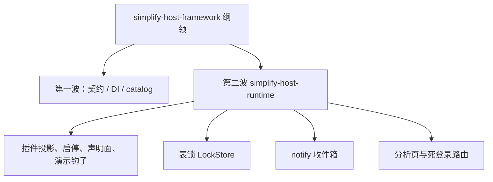

## Context

审查文档`localdocs/linapro-framework-architecture-review.md`的第一波三件战略已由`workbench-host-contract`、`startup-di-backends`、`plugin-hostservice-catalog`落地。本变更吃第四到第六块里仍然值得立刻做、且不与现行规则冲突的部分。

约束：

- `backend-go.md`要求宿主定时任务仍由`service/cron`统一`Start`。不得把`cron`包删进`jobmgmt`。
- `architecture.md`禁止为拆循环再切一批重复窄接口。权限菜单过滤用投影，而不是再给每个调用方做一个更窄的插件接口。
- 第一波已决定保留菜单图标全局唯一和公开配置布局词。本波不撤销。
- 存量 dedicated 编解码已冻结。本波不退役。

## Goals / Non-Goals

**Goals:**

- 跨模块菜单/权限过滤只走`FilterItem`。
- 启停一个插件只同步该插件目标清单。
- 生产分发不再解释演示钩子动作。
- 源码插件作者面对单一`Declarations`。
- 表锁与 Redis 锁实现同一个`LockStore`。
- 当前用户收件箱详情进入`notify`。
- 通用会话存储不再承载带范围列表。
- 默认壳去掉虚构分析数字和未交付登录路由。
- `RecordStore`从主路径文档降级为实验能力。

**Non-Goals:**

- 不把`plugin.Service`拆成八个包。根 facade 仍是组合根；内部子包已经切开。
- 不合并`cron`/`jobhandler`/`jobmeta`/`jobmgmt`。
- 不把`config.Service`切成一簇窄读取接口。
- 不合并`cachecoord`/`revisionctrl`/`kvcache`物理包。
- 不删除`hostlock`、`RecordStore`实现或 dedicated codec。
- 不把字典`tagStyle`/`cssClass`从存储模型拿掉，不把菜单树选择改成前端自己拼树。
- 不撤销图标唯一和公开布局词。

## Decisions

### D1：权限过滤用投影，不新切窄接口

- **选择**：`FilterPermissionMenus`和`ShouldKeepPermission`改为`menu.FilterItem`。`role`在 DAO 边界把`SysMenu`映成投影再滤。
- **理由**：审查要的是停止泄漏表实体，不是再加一层`permissionFilter`变体。
- **替代**：让`role`直接依赖`plugin.Service`。否决，循环依赖会回到启动代理。

### D2：启停只同步当前目标清单

- **选择**：`UpdateStatus`用`GetDesiredManifest(pluginID)`同步这一条，再`SetPluginEnabledState`或刷新快照。禁止`ScanManifests`后对全集`SyncManifest`。
- **理由**：双模型需要的是当前插件目标态。全集扫描是编排膨胀。
- **替代**：保留全量扫描以保证依赖插件 registry 新鲜。否决。依赖检查已有独立路径，缺清单时再按 ID 取。

### D3：演示钩子离开生产分发

- **选择**：生产`executePluginDeclaredHook`只分发类型化回调或宿主服务调用。`insert`/`sleep`/`error`从`publishedHookActions`生产集合移除。测试可走测试专用注册器。
- **理由**：真实扩展点不该解释演示动作。
- **替代**：保留但加`debug`开关。否决，生产路径不应默认认识它们。

### D4：声明面嵌入而不是七个包装对象

- **选择**：`Declarations`直接嵌入资源、生命周期、钩子、HTTP、任务、提供者、访问控制方法。删除只做字段赋值的`sourcePluginAssets`一类包装。作者可写`declarations.RegisterRoutes(...)`。
- **理由**：同进程调用不必再套一层只读描述对象。
- **替代**：保留分组访问器作兼容。允许短暂保留`HTTP()`返回自身，但包装结构体删掉。

### D5：表锁实现`LockStore`

- **选择**：`locker.NewSQLStore()`实现`coordination.LockStore`。`locker.New(store)`在`store==nil`时于构造期绑定 SQL store，之后方法只走`LockStore`。
- **理由**：单机表锁需求仍在；多余的是方法内分叉和不同方法名。
- **替代**：删除`locker.Service`，调用方直接用`LockStore`。否决。`Lock`/`LockFunc`仍是宿主领域 API，`hostlock`继续发票据。

### D6：收件箱详情并入`notify`

- **选择**：`notify`增加当前用户可见的详情读取，查询阶段按投递用户和租户约束。`usermsg`控制器改写分类 i18n。删除`internal/service/usermsg`。HTTP DTO 与路径不变。
- **理由**：审查指出列表已读走`notify`、详情却自己查投递表。
- **替代**：保留`usermsg`只做 i18n。否决，这仍是不完整门面。

### D7：会话存储拆核心与管理投影

- **选择**：`session.Store`核心只保留 Set/Get/Delete/Touch/Cleanup。带`datascope`的分页列表、批量在线状态放到同包`AdminQuery`（或等价名称）由在线用户管理消费。不新增独立服务包。
- **理由**：通用存储不该长数据权限列表方法；在线用户模块仍需要查询阶段注入范围。
- **替代**：把列表挪到`usermsg`式新包。否决，那是再加门面。

### D8：分析页去假数字，登录死路由删除

- **选择**：分析概览数值改为`0`，不再写十二万用户这类演示数。删除`code-login`/`qrcode-login`路由注册。登录页继续隐藏这两个入口。
- **理由**：审查要的是去掉演示残留，不是重做真实指标后端。
- **替代**：整页删除分析页。否决，现有落地路径和 E2E 仍以该页为工作台入口之一；先去掉假数字。

### D9：`RecordStore`降级为实验文档

- **选择**：`pkg/plugin`中英文 README 标明动态记录存储是可选实验能力，无第一方插件消费前不作为主路径。代码保留。
- **理由**：审查明确二选一：标实验或等官方插件再用。删除会误伤已授权动态插件。

## Risks / Trade-offs

- [启停不同步其他插件 registry] → 依赖检查和安装路径仍按 ID 取目标清单；全量同步仍留给显式`Sync`和启动。
- [声明面嵌入改变插件作者写法] → 本仓库源码插件一次改完；分组访问器若仍返回同一对象，旧写法可编译。
- [删除登录子路由使旧书签 404] → 更新`login-page-presentation`与 TC006；未交付入口本来就不该当正式页。
- [收件箱错误码从`usermsg`迁到`notify`] → 保持相同`bizerr`语义或映射既有码，避免前端依赖机器码变化。

## Migration Plan

1. 先改投影与启停，这两处不改 HTTP。
2. 再改锁构造、收件箱、会话方法集。
3. 工作台分析页与登录路由与对应 E2E 一起改。
4. 文档最后同步。
5. 回滚以本变更为单位，不回滚第一波。

## Open Questions

- 无。第一波已冻结布局词和图标唯一；本波排除项写在 Non-Goals。
