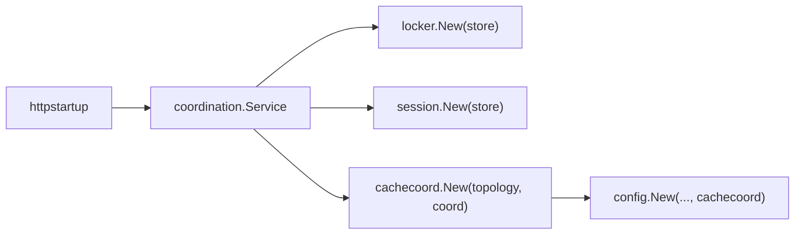

## Context

`locker.New()`返回空结构体，真正后端靠`ConfigureCoordination`改包内`processCoordinationLockStore`。`session.NewDBStore()`同样看进程全局。`cachecoord.Default()`是进程单例，启动后再补拓扑和 coordination。`config`在集群分支内部`cachecoord.Default(NewStaticTopology(true))`。这与`service-dependency-injection-governance`和缓存敏感实例规则冲突。

既有`distributed-cache-coordination`已规定集群修订走 Redis、不依赖`sys_cache_revision`做跨节点一致性。代码注释和未使用的 DAO 仍在说这张表。

本变更是纲领第二步，不处理工作台契约，不处理 host service catalog。

## Goals / Non-Goals

**Goals:**

- 锁、会话、缓存协调、配置修订在构造参数上就能看出单机还是集群后端。
- 删除生产路径上的事后`ConfigureCoordination` / `Default()`补丁。
- 注释和死表与运行路径一致。

**Non-Goals:**

- 不合并`locker`与`coordination.LockStore`为同一个包。
- 不删除`hostlock`，不强制 Redis 成为单机必选项。
- 不把会话「带数据权限的分页列表」从`Store`里拆走。
- 不引入通用 DI 容器。

## Decisions

### D1：组合根创建后端，构造函数接收接口

- **选择**：`httpstartup`在读完`cluster.enabled`后创建`coordination.Service`（或单机空实现），再`locker.New(lockStore)`、会话`New(hotStore, dbStore)`、`cachecoord.New(topology, coordinationSvc)`，把同一实例传给`config`和插件。
- **理由**：依赖写在签名上，测试不必依赖启动顺序。
- **替代**：保留`ConfigureCoordination`但加文档。否决，规则已禁止。

### D2：禁止生产路径进程单例补后端

- **选择**：删除或降为测试专用的`ConfigureCoordination`、`cachecoord.Default`生产用法。测试若需快捷装配，使用显式 helper 传入假后端，而不是先`New()`再改全局。
- **理由**：全局补丁会让后续`New()`继承脏状态。
- **替代**：`sync.Once`单例但构造仍无参。否决，签名仍看不出后端。

### D3：单机表锁是`LockStore`实现，不是另一套服务语义

- **选择**：`locker.Service`继续作为宿主锁门面，但内部唯一依赖是构造时注入的`LockStore`（SQL 或 coordination）。不再在方法里读包级变量。
- **理由**：单机无 Redis 时表锁需求真实；多余的是空结构和事后切换。
- **替代**：调用方直接依赖`coordination.LockStore`。会把 SQL 实现细节推到每个调用方。

### D4：会话热状态同样构造期绑定

- **选择**：集群传入 coordination 热存储 + DB 投影；单机传入 DB 存储。`NewDBStore()`不得在内部偷看进程全局。
- **理由**：与锁同一类后门。

### D5：死表与注释对齐既有规范

- **选择**：运行路径与`distributed-cache-coordination`一致：集群 Redis revision，单机进程内。若服务层确认无`dao.SysCacheRevision`调用，删除或停止维护该表的「现行实现」注释，并在本变更评估是否用 SQL 迁移删除表。
- **理由**：规范已写明不靠这张表做跨节点一致性；留下的是误导。
- **替代**：重新启用 SQL 表当集群事实源。否决，与已归档 Redis 方案冲突。

### D6：`config.New`必须拿到同一份 cachecoord

- **选择**：构造函数增加`cachecoord.Service`参数（或等价已存在但仍被内部 Default 绕过的参数），集群/单机由调用方传入。
- **理由**：这是后门的主要消费者之一。

## Risks / Trade-offs

- [构造函数签名变宽，启动装配与全部测试夹具都要改] → 这正是显式 DI 的编译门禁；用启动绑定测试覆盖。
- [测试依赖全局补丁会红] → 提供测试 helper 显式注入内存`LockStore`/假 coordination。
- [删`sys_cache_revision`影响已部署库] → 本仓库不保留已部署库兼容迁移；源码 SQL 从不创建该表，已有库按重新初始化处理。

## Migration Plan

1. 给 locker/session/cachecoord 增加带后端的构造函数。
2. 改`httpstartup`唯一装配。
3. 改所有生产`New()`调用点与单测。
4. 删除生产`ConfigureCoordination`/`Default`用法。
5. 对齐注释；确认后处理`sys_cache_revision`。
6. 回滚：恢复全局补丁会重新违反规范，应以功能开关或发布回退为单位，而不是留双轨。

## Open Questions

- `cachecoord.Default`是否完全删除，还是改名为测试专用且 panic 于生产。实现时优先删除生产符号。
- `sys_cache_revision`从源码 SQL 中删除，不另增 DROP 迁移文件。
