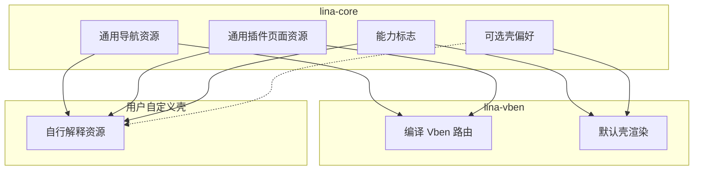

## Context

宿主`GET /menus/all`把菜单编译成 Vben 路由：`component`形如`#/views/system/user/index.vue`，`meta`含`hideInMenu`、`keepAlive`、`IFrameView`。`pluginhost.DynamicPageComponentPath`写死`system/plugin/dynamic-page`。`GET /user/info`另带一份`MenuTree`；`auth.ts`用 path/name 猜租户。工作台角色页其实已经有`resolveManagementCapabilityState()`。

纲领`simplify-host-framework`要求：换壳是硬约束；本仓一次迁完；布局偏好可留；图标唯一保留；源码页与动态页一起改完；约定目录发现，但产物必须是通用页面资源。

## Goals / Non-Goals

**Goals:**

- 宿主公开导航/页面/身份契约可被任意管理工作台消费。
- 默认工作台承担 Vben 路由编译。
- 组织/租户启用态变为明确标志。
- 插件菜单过滤使用投影，不再泄漏`SysMenu`。

**Non-Goals:**

- 不撤登录布局、侧栏导航模式、slogan、主题、水印等公开配置。
- 不取消菜单图标全局唯一。
- 不把树选择/已勾选集合改成「资源列表加前端拼树」。
- 不拆插件总门面，不改 host service catalog 生成。

## Decisions

### D1：导航启动接口改为通用资源，Vben 形状从宿主消失

- **选择**：当前用户可访问菜单返回通用节点，至少包含编号、父级、标题、路径、权限、图标、可见性、排序、打开方式、资源地址、i18n key。打开方式使用宿主通用枚举（页内、内嵌资源、iframe、外链），不是`IFrameView`组件名。
- **理由**：换壳硬约束。Vben`RouteRecord`是编译结果。
- **替代**：核心保留`/menus/all`当适配接口。用户否决，要求宿主 API 不得针对 Vben 设计。

### D2：默认工作台是唯一编译器

- **选择**：`lina-vben`读取通用资源，生成`#/views`、`hideInMenu`、`keepAlive`、动态页组件路径和 query。动态页组件名只存在于工作台。
- **理由**：壳才知道自己的路由和 SFC 约定。
- **替代**：宿主内 named adapter 包继续吐 Vben JSON。否决。

### D3：身份与导航分离，能力标志取代路径猜测

- **选择**：`GET /user/info`返回用户、角色、权限、`homePath`、组织/租户等能力标志，不再返回`menus`。`homePath`仍由宿主按可导航资源计算。工作台登录路径改用能力标志，删除`auth.ts`中`platform/tenants`/`Tenant*`启发式。
- **理由**：双投影已经浪费；路径猜测是正确性漏洞；角色页已有能力解析可复用。
- **替代**：保留`user/info.menus`只为猜租户。否决。

### D4：约定目录发现，产物必须通用

- **选择**：源码插件仍按`frontend/pages`约定发现页面文件；动态插件仍按前端资产约定发现入口。宿主同步到菜单/页面存储时只写通用字段（页面编号、路径、权限、打开方式、资源地址）。不写`#/views/...`，不写`system/plugin/dynamic-page`，不把`pluginAccessMode`做成宿主契约。
- **理由**：用户要求源码页和动态页一起改完，同时保留约定发现，降低插件作者迁移成本。
- **替代**：只认`plugin.yaml`声明。第一波更大，且打断现有源码插件习惯。

### D5：`pluginhost`去掉工作台组件常量

- **选择**：公开包只保留打开方式与资源地址语义。`DynamicPageComponentPath`及等价 Vue 路径常量移出`pluginhost`，由`lina-vben`持有。
- **理由**：插件作者契约不能出现默认壳的页面路径。

### D6：`FilterMenus`改吃投影

- **选择**：菜单模块与插件集成之间传递稳定菜单投影（至少 id、menuKey、pluginId、可见性所需字段），禁止`[]*entity.SysMenu`。
- **理由**：跨模块不得泄漏 Entity，且本变更本来就要改菜单装配。

### D7：菜单管理 CRUD 的`component`视为不透明资源地址

- **选择**：管理面仍可编辑「页面资源」字符串，宿主不当成 Vben 组件去补`#/views`前缀，也不补`BasicLayout`。默认工作台在编译时解释该字符串。
- **理由**：一次切断编译逻辑，不必先拆菜单表。
- **替代**：立刻把列改名为`resource`并做数据迁移。可在实现时视列语义决定是否改列名；行为上不得再做 Vben 补全。

### D8：无兼容双轨

- **选择**：本仓前端、E2E、夹具同时改消费新契约。旧 Vben 路由 JSON 不再由宿主产出。
- **理由**：用户明确不考虑兼容。

## Risks / Trade-offs

- [默认工作台与大量 E2E 同时抖动] → 任务按「宿主契约 → 工作台编译 → E2E」切片；先补编译器单测再改页面。
- [插件菜单同步期间资源地址含义变化] → 约定：写入通用资源地址；工作台用「源码页相对`frontend/pages`、动态页用托管资产 URL + 打开方式」解释。
- [能力标志遗漏第三方插件] → 第一波覆盖组织/租户两个已有能力 key；其他模块仍靠菜单可见性，不在本变更发明通用模块注册表。

## Migration Plan

1. 定义通用导航/页面 DTO 与打开方式枚举。
2. 菜单控制器停止 Vben 补全；插件同步写通用资源。
3. `lina-vben`增加编译器，改`getAllMenusApi`消费方。
4. 身份接口去掉`menus`，增加能力标志；删除路径猜测。
5. `FilterMenus`改投影。
6. 更新 E2E 与夹具。
7. 无法渐进回滚 HTTP 形状；回滚即恢复本变更前的契约与工作台编译器。

## Open Questions

- 通用导航 HTTP 路径是保留`/menus/all`只改 JSON，还是改名。实现时优先保留路径、改形状，以减少无意义的路由搬家。
- 页面资源地址是相对插件根的约定路径，还是逻辑 page id。实现时以「工作台能稳定解析到 SFC 或 ESM 入口」为准。
